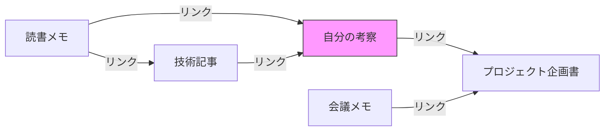
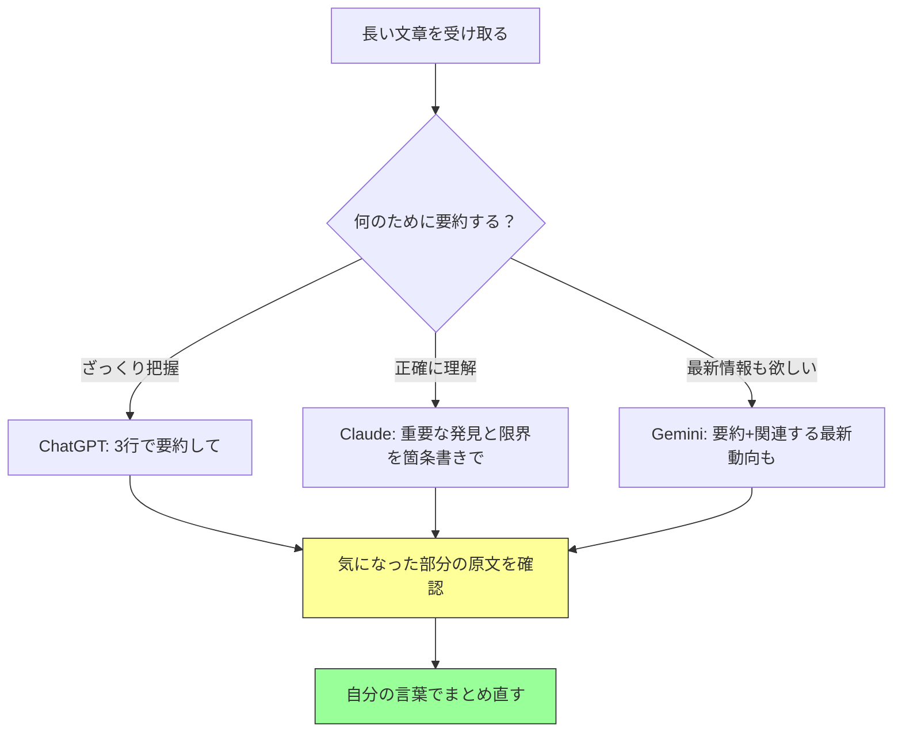
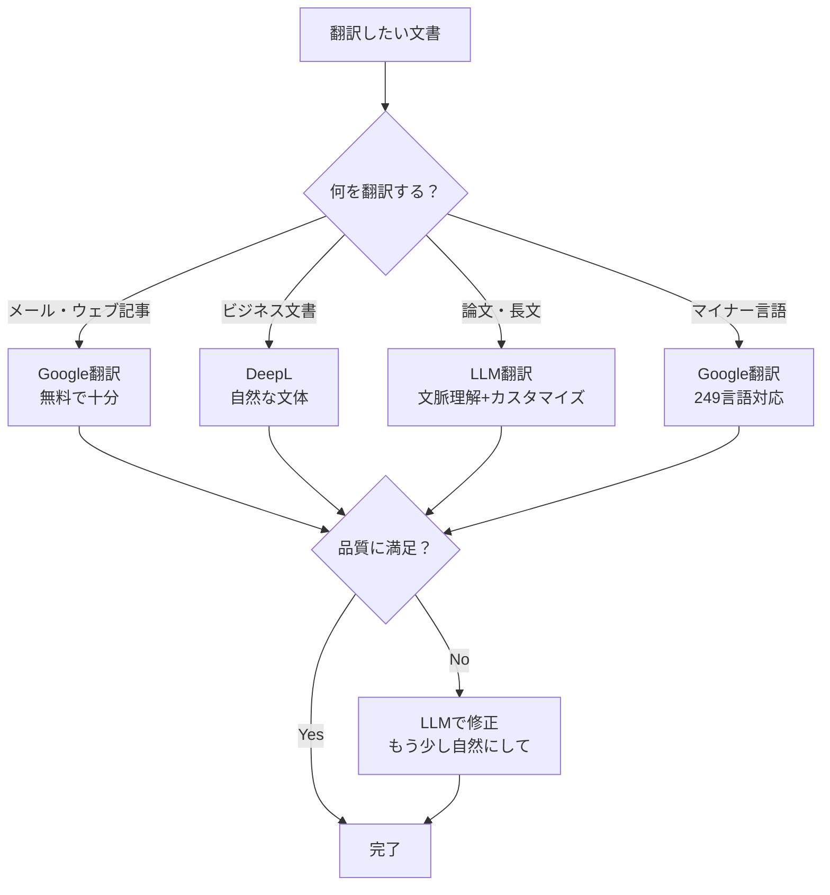
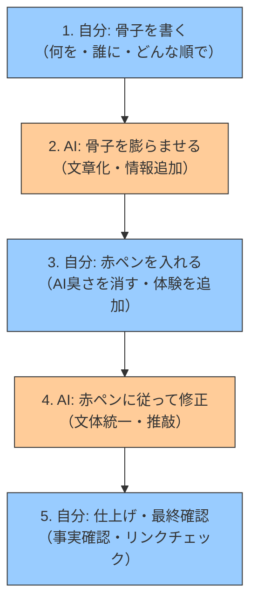
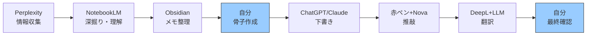

# S5: AI × ナレッジ管理・執筆 — 知的生産を加速する

> **AIツール活用講座（全8回）** — [深層生成モデルシリーズ](./00-index-theory.md)（本編46回）のスピンオフ
> 前回: [S4: AI × ビジネスツール](./ml-spinoff-04.md) | 次回: [S6: AI × 画像・動画・音声](./ml-spinoff-06.md)

---

## はじめに — 「書く」と「覚える」がAIで変わる

> **Note:** **この記事のゴール**: AIを使ったナレッジ管理・執筆ワークフローを1つ確立する

あなたは今、毎日どれくらいの情報を「読んで、忘れて」いるだろうか。

ニュース記事、技術ブログ、論文、SlackやTeamsのやりとり、YouTubeの解説動画。インプットの量は年々増え続けているのに、「あれ、あの話どこで読んだっけ？」「確かブックマークしたはず……」という経験は減らない。人間の脳は、情報を蓄積するようにはできていない。忘れるようにできている。

ここにAIが入ると、状況が一変する。

読んだ記事をAIが要約してくれる。散らばったメモをAIが横断検索してくれる。書きかけの文章をAIが推敲してくれる。外国語の論文をAIが自然な日本語にしてくれる。

ただし——ここが今回の核心なのだが——**AIに「任せきる」のと、AIと「一緒に考える」のでは、結果がまるで違う**。

AIに長文を要約させたら、きれいにまとまったものが出てくる。でもそれを読んで「よし、わかった」と思った瞬間、あなたは原文を読んだ人より**少ない情報で判断している**ことになる。何が削られたか、知る術がない。

AIに文章を書かせたら、流暢な日本語が出てくる。でもその文章には、あなたの経験も、あなたの視点も、あなたの「ここが面白いと思った」という感覚も入っていない。

この記事では、ナレッジ管理と執筆に使えるAIツールを片っ端から試しながら、「AIとの知的共同作業」の勘所を掴んでいく。扱うツールは以下のとおり。

| カテゴリ | ツール | ひとこと |
|:---------|:-------|:---------|
| ナレッジ管理（ローカル） | Obsidian + AIプラグイン | 自分のPC内で完結。データは自分のもの |
| ナレッジ管理（クラウド） | NotebookLM（Google） | ドキュメントを投げるだけでポッドキャスト化 |
| 共同執筆 | Prism（OpenAI） | LaTeX × AIの学術執筆ワークスペース |
| 要約 | ChatGPT / Claude / Gemini | 長文を一瞬で要約する |
| 翻訳 | DeepL / Google翻訳 / LLM翻訳 | 使い分けで精度が変わる |
| ライティング | 各種AIライティングツール | 下書き・推敲・校正のワークフロー |

それでは始めよう。

---

## Obsidian + AI — ローカル完結のナレッジ管理

### Obsidianとは何か

まずObsidianを知らない人のために。Obsidianは **Markdownベースのノートアプリ** だ。

「メモ帳アプリなんていくらでもある」と思うかもしれない。Obsidianが他と決定的に違うのは、**すべてのデータがあなたのPC上のテキストファイルとして保存される**こと。Notionのようにクラウドのデータベースに閉じ込められない。Evernoteのように独自フォーマットに縛られない。

<!-- screenshot: Obsidianのメイン画面 — サイドバーにファイル一覧、中央にMarkdownエディタ -->

10年後にObsidianというアプリが消えても、あなたのメモはただのテキストファイルとしてPCに残る。これが「ローカルファースト」の思想だ。メモ帳でもVSCodeでも、テキストが読めるアプリなら何でも開ける。

Obsidianの核となる機能は **ノート同士のリンク**。`[[ノート名]]` と書くだけでノート間に双方向リンクが張られ、知識がネットワーク構造になる。読書メモから自分の考察へ、プロジェクトのメモから参考資料へ——バラバラだった知識が繋がる感覚は、使ってみると病みつきになる。



Obsidianにはさらに「グラフビュー」という機能があって、ノート同士のリンク関係を**視覚的なネットワーク図**で表示できる。ノートが増えるほどグラフが成長していく様子は、まるで自分の「脳内マップ」が可視化されているようで面白い。

<!-- screenshot: Obsidianのグラフビュー — ノードとエッジでノート間の接続が視覚化されている -->

<https://obsidian.md/>

### Obsidianのセットアップ（10分）

Obsidianのインストールは簡単だ。

1. [obsidian.md](https://obsidian.md/) からダウンロード（Windows / Mac / Linux対応）
2. インストールして起動
3. 「新しいVaultを作成」→ 保存場所を選ぶ（自分のPC上のフォルダ）
4. 「ノートを作成」ボタンで最初のノートを書く

<!-- screenshot: Obsidian初回起動画面 — 「新しいVaultを作成」ボタンが表示されている -->

> **Note:** **Vault（ボルト）** とはObsidianの用語で「ノートの保管庫」のこと。実体はPC上の1つのフォルダ。その中にMarkdownファイル（.md）が保存される。

Markdownの書き方を知らなくても大丈夫。Obsidianにはリアルタイムプレビューがあるので、`# 見出し` や `**太字**` と書けば、すぐに整形された見た目で表示される。

基本的なMarkdown記法はこれだけ覚えればいい。

| 書き方 | 意味 | 表示 |
|:-------|:-----|:-----|
| `# 見出し` | 大見出し | 大きな文字 |
| `## 見出し` | 中見出し | やや大きい文字 |
| `**太字**` | 太字 | **太字** |
| `- 項目` | 箇条書き | ・項目 |
| `[[ノート名]]` | ノートへのリンク | クリックで移動 |

### ObsidianにAIを入れる

ここからが本題。Obsidianは **プラグインで機能を拡張できる** 仕組みになっていて、AI系のプラグインが充実している。2026年2月時点で、コミュニティプラグインの数は2,000を超えている。そのうちAI関連だけでも数十種類。

代表的なものを見ていこう。

#### Copilot for Obsidian — AIアシスタントの本命

**Copilot for Obsidian** は、Obsidianの中にAIチャットを統合するプラグインだ。（2026年2月時点）

<!-- screenshot: Obsidian Copilotのチャットパネル — サイドバーにAIとの会話が表示されている -->

何がすごいかというと、**あなたのVault（ノート全体）をAIが読める**ようになる。RAG（Retrieval-Augmented Generation = 検索拡張生成）という技術を使って、質問するとAIが関連するノートを自動的に探し出し、それを踏まえて回答してくれる。

ちょっと想像してみてほしい。

あなたは過去2年間、仕事の気づきや読んだ本の感想を300個のノートに書き溜めてきた。ある日、新しいプロジェクトの企画書を書くことになった。「前にも似たようなプロジェクトの反省メモを書いたはず……でも、どのノートだったか思い出せない」。

通常の検索なら、キーワードが一致するノートしか見つからない。「プロジェクト 反省」で検索しても、当時「振り返り」という単語で書いていたら引っかからない。

CopilotのVault QAなら、**意味的に関連するノートを見つけてくれる**。「過去のプロジェクトで学んだ教訓をまとめて」と聞けば、「反省」「振り返り」「失敗」「改善点」——いろんな言い回しで書いたノートを横断的に拾い上げて、要約してくれる。

**セットアップ手順（5分で完了）**:

1. Obsidianの設定画面を開く（左下の歯車アイコン）
2. 「コミュニティプラグイン」→「制限モードをオフにする」→「閲覧」をクリック
3. 「Copilot」と検索してインストール → 有効化
4. プラグイン設定でAIプロバイダーを選択
   - **完全ローカル**: Ollama + ローカルモデル（データがPCから一切出ない）
   - **クラウドAPI**: OpenAI / Anthropic / Google などのAPIキーを入力
5. Vault QA用のインデックスを構築（初回のみ、ノート数によって数分〜数十分）

<!-- screenshot: Copilotプラグイン設定画面 — AIプロバイダー選択ドロップダウン -->

> **⚠️ Warning:** **ローカル vs クラウドの選択は重要**。ローカル（Ollama等）ならデータは一切外部に出ないが、回答品質はクラウドAPIに劣る場合がある。逆にクラウドAPIを使えば高品質な回答が得られるが、ノートの内容がAPI経由で外部サーバーに送信される。機密情報を含むノートがある場合は慎重に。

<details><summary>Ollamaでローカル完全プライベート環境を作る方法</summary>

Ollamaは、AIモデルをあなたのPC上でローカルに実行するためのツールだ。インストール手順:

1. [ollama.com](https://ollama.com/) からOllamaをダウンロード・インストール
2. ターミナルで `ollama pull llama3.2` を実行（モデルのダウンロード、数GB）
3. Obsidian CopilotのAIプロバイダー設定で「Ollama」を選択
4. モデル名に `llama3.2` を入力
5. 埋め込みモデルとして `nomic-embed-text` を設定（`ollama pull nomic-embed-text`）

これで**一切のデータが外部に出ない**完全ローカル環境が完成する。ただし、ローカルモデルはクラウドの最新モデル（GPT-4o、Claude Opus等）と比べると回答品質は劣る。PCのスペックにもよるが、M1 Mac以上であれば十分実用的な速度で動作する。

</details>

**実際に使ってみた感想**として正直に書くと、「自分の過去のメモを横断検索してまとめてくれる」体験は、初めて使ったとき結構感動する。検索では引っかからないような関連性を見つけてくれることがある。

**Before / After — 検索の違いを体感する**

あなたのVaultに300個のノートがあるとしよう。「過去のプロジェクトの反省点」を探したい場合:

| | 通常の全文検索 | Copilot Vault QA |
|:--|:---------------|:-----------------|
| **クエリ** | 「プロジェクト 反省」で検索 | 「過去のプロジェクトで学んだ教訓を教えて」 |
| **結果** | 「プロジェクト」と「反省」が両方含まれるノート3件 | 「振り返りメモ」「失敗から学んだこと」「改善提案書」など意味的に関連するノート8件を横断的に要約 |
| **見逃し** | 「振り返り」「改善」「次回への教訓」等の別の言い回しで書いたノートは**全部ヒットしない** | 表現が違っても意味が近ければ拾う |

この違いは小さく見えて、実はかなり大きい。人間は同じことを毎回違う言葉で書く。過去の自分がどんな言葉を使ったかなんて、覚えていない。キーワード検索の限界はここにある。

一方でイマイチな点もある。ノートの量が少ないうちは恩恵を感じにくい。100ノートくらい溜まったあたりから「あ、これは便利だ」と実感が湧いてくる。また、ノートの書き方が雑だとAIの回答も雑になる（ゴミを入れればゴミが出てくる、の法則はここでも健在）。

**Copilotを最大限に活かすノートの書き方**:
- **1ノート1テーマ**: 大きなノート1つより、小さなノートを多く作る方がRAGの精度が上がる
- **見出しを使う**: `## 結論` `## 感想` のように構造化すると、AIがチャンク（区切り）を正確に認識しやすい
- **リンクを張る**: `[[関連ノート]]` のリンクが多いほど、AIがノート間の関係性を理解しやすくなる

<https://www.obsidiancopilot.com/en>

#### Nova — その場で書き換えるAIエディタ

**Nova** はチャットではなく、**テキストを選択してその場でAI編集する**タイプのプラグインだ。

使い方を具体的に見せよう。

**場面**: あなたはObsidianで読書メモを書いている。雑な箇条書きのメモがこんな感じで残っている。

```
- 第3章面白かった
- 著者は強化学習の報酬設計が人間の価値観と乖離する問題を指摘
- RLHF の限界について
- 結局人間のフィードバックも偏りがある
```

このテキストを選択して、Novaで「この箇条書きを、読みやすい文章にまとめて。原文のニュアンスを残して」と指示すると——選択部分がストリーミングで書き換わる。

```
第3章が特に興味深かった。著者は強化学習の報酬設計について、人間の
価値観との乖離という問題を指摘している。RLHF（人間フィードバック
による強化学習）にも限界があり、そもそも人間のフィードバック自体に
偏りが含まれている点を見逃せない。
```

チャットウィンドウを開く手間がない分、**執筆中の流れを止めない**。これがNovaの最大の利点だ。

Novaもローカル（Ollama / LM Studio）またはクラウドAPI（Claude / OpenAI / Gemini）に対応していて、**プラグインがデータを収集することはない**（ゼロトラッキング）。

**こんなときに便利**:
- 雑なメモ → きれいな文章に整形
- 日本語のメモ → 英語に翻訳（またはその逆）
- 長い段落 → 箇条書きに分解
- 文体変換 → 「もっとカジュアルに」「もっとフォーマルに」

#### Smart Connections — 「関連ノート」を自動で見つける

**Smart Connections** は、現在開いているノートに**意味的に関連するノート**をサイドバーに自動表示してくれるプラグイン。

「意味的に関連する」というのがポイントで、同じ単語が含まれていなくても、内容が近いノートを見つけてくれる。たとえば「Transformerの仕組み」というノートを開いていると、「Attention機構のメモ」「ChatGPTを試した感想」「自然言語処理の歴史」が関連ノートとして表示される。

このセマンティック検索（意味に基づく検索）は、Obsidianの通常の全文検索では実現できない。全文検索は「同じ単語が含まれるノート」しか見つけられないが、Smart Connectionsは「同じ概念について書かれたノート」を見つけられる。

**使い方のコツ**: 特に意識して使う必要はない。プラグインを入れて有効化するだけで、ノートを開くたびにサイドバーに関連ノートが表示される。「あ、こんなノート書いてたんだ」という再発見がしょっちゅう起きる。これがセレンディピティ（偶然の発見）だ。

<details><summary>数式で覗いてみる — セマンティック検索の仕組み（TF-IDF とコサイン類似度）</summary>

「同じ単語がなくても意味的に近いノートを見つける」——この仕組みを少しだけ覗いてみよう。

**従来のキーワード検索: TF-IDF**

全文検索の代表的な手法が TF-IDF（Term Frequency - Inverse Document Frequency）だ。

$$
\text{TF-IDF}(t, d) = \text{TF}(t, d) \times \text{IDF}(t)
$$

$\text{TF}(t, d)$ は「単語 $t$ がドキュメント $d$ に出てくる頻度」。$\text{IDF}(t)$ は「その単語がどれくらい珍しいか」を測る指標で、

$$
\text{IDF}(t) = \log\frac{N}{|\{d \in D : t \in d\}|}
$$

$N$ は全ドキュメント数。つまり、「そのノートで頻出する」かつ「他のノートではあまり出てこない」単語ほどスコアが高くなる。しかし TF-IDF は**単語の一致**にしか反応しない。「振り返り」と「反省」が同じ意味だとは判断できない。

**セマンティック検索: 埋め込みベクトル + コサイン類似度**

Smart Connections や Copilot の Vault QA では、各ノートを**埋め込みベクトル**（embedding）に変換する。テキストを数百〜数千次元の数値ベクトルに変換し、意味が近い文章は空間上で近い位置に配置される。

2つのノートの「意味的な近さ」は**コサイン類似度**で測る。

$$
\cos(\theta) = \frac{\vec{A} \cdot \vec{B}}{|\vec{A}|\,|\vec{B}|} = \frac{\sum_{i=1}^{n} A_i B_i}{\sqrt{\sum_{i=1}^{n} A_i^2}\,\sqrt{\sum_{i=1}^{n} B_i^2}}
$$

値は -1 から 1 の範囲で、1 に近いほど「意味が似ている」。これなら「振り返り」と「反省」のベクトルが近い位置にあるので、同じ単語がなくても関連ノートとして検出される。

Smart Connections が「入れておくだけ」で関連ノートを見つけてくれるのは、裏でこの計算が走っているから。数学的にはシンプルだが、実用上の効果は絶大だ。

もっと詳しい仕組みは本編 [Course II](./00-index-theory.md) で扱う。

</details>

#### Khoj — AIパーソナルアシスタント

**Khoj** は、Obsidian向けのAI搭載パーソナルアシスタントだ。CopilotやNovaとは少し毛色が違い、**セルフホスト**（自分のサーバーで運用）できる点が特徴。

技術的に詳しい人なら、自分のマシンにKhojサーバーを立てて、完全にプライベートなAIアシスタント環境を構築できる。クラウド版もあるので、セルフホストが面倒な人はそちらを使える。

機能としてはCopilotに近いが、自動化（特定のトリガーでAIが自動的にアクションを実行する）機能が充実している。

### Obsidian AIプラグイン比較

| プラグイン | 主な機能 | ローカルAI | 料金 | おすすめ度 |
|:-----------|:---------|:-----------|:-----|:-----------|
| **Copilot** | チャット + Vault QA（RAG） | Ollama対応 | 無料（APIキー自前） | ★★★★★ |
| **Nova** | インライン編集・書き換え | Ollama/LM Studio対応 | 無料（APIキー自前） | ★★★★☆ |
| **Smart Connections** | 関連ノート自動表示 | ローカル埋め込み可 | 無料（APIキー自前） | ★★★★☆ |
| **Khoj** | AI検索 + 自動化 | セルフホスト可 | 無料〜（クラウド版あり） | ★★★☆☆ |

> **Note:** **筆者のおすすめ**: まずはCopilotを入れて、Vault QAを試してみよう。「自分のノートにAIが答えてくれる」体験が一番インパクトがある。慣れたらNovaを追加して、執筆中のインライン編集を試す——という順番がスムーズ。Smart Connectionsは「入れておくだけ」でいい。意識しなくても勝手に関連ノートが出てきて便利。

### Obsidian Skills — 2026年の新機能

2026年に入り、Obsidianは **Skills** という新しい仕組みを公式に導入した。

Skillsはプラグインとは違い、**AIへの「ルールブック」**のようなもの。Claude Codeの標準に準拠していて、データを独自のアプリデータベースに移行する必要がない。

どういうことか。たとえば、「読書メモを書くときは、必ずこのフォーマットに従って、関連するノートへのリンクを提案して」というルールをSkillとして定義できる。プラグインが「AIの機能を追加する」ものだとしたら、Skillsは「AIの振る舞いをカスタマイズする」もの。

Obsidianの哲学——**人間が読めるテキストファイルで、あなたが管理する、オープンなフォーマット**——と完全に一致する設計。Skillsの定義ファイル自体もただのテキストファイルだ。AIの設定すら、あなたが所有するテキストファイルとして管理できる。

これは「AIプラグイン」の次の進化形と言える。今後のAIツール全体の方向性を示しているのかもしれない。

### Obsidian まとめ: こんな人におすすめ

| こんな人 | Obsidian + AI の恩恵 |
|:---------|:---------------------|
| メモを溜めているが活用できていない | Copilotで横断検索、Smart Connectionsで再発見 |
| 書く作業が多い（ブログ、レポート等） | Novaでインライン編集、雑メモを文章に変換 |
| データのプライバシーが重要 | ローカル完結。Ollamaで一切外部に出さない |
| 特定のサービスに縛られたくない | テキストファイルだから、いつでも他のアプリに移行可能 |

> **⚠️ Warning:** **⚠️ Obsidianの注意点**: Obsidianはローカルアプリなので、**PCが壊れたらデータが消える**。必ずバックアップを取ること。iCloud、Google Drive、Dropbox等にVaultフォルダを置けば自動バックアップになる。Obsidian公式のSync機能（$4/月）も選択肢の1つ。[NEEDS VERIFICATION: 2026-02]

---

## NotebookLM — ドキュメントが「対話」になる

### NotebookLMとは

**NotebookLM** はGoogleが提供する、ドキュメントベースのAIリサーチツールだ。

使い方は極めてシンプル。PDF、Googleドキュメント、Googleスライド、ウェブページのURLなどを「ソース」として投げ込むと、AIがその内容を理解して、質問に答えてくれる。

「それってChatGPTに貼り付けるのと同じでは？」と思ったかもしれない。鋭い。似ているが、**決定的に違う点が2つ**ある。

**違い1: ソースに縛られる（良い意味で）**

ChatGPTに質問すると、ChatGPTは**学習データ全体**から回答を生成する。だから、あなたの資料に書いていない情報も混ぜて回答することがある（ハルシネーション）。

NotebookLMは、**あなたが投げ込んだソースの中だけ**で回答する。ソースに書いていないことは「わかりません」と答える。だから信頼性が高い。回答には必ず原文への引用リンクが付く。

**違い2: Audio Overview**

これがNotebookLMの最大の特徴であり、世界中で話題になった機能だ。

### Audio Overview — ドキュメントがポッドキャストになる

<!-- screenshot: NotebookLMのAudio Overview生成画面 — 「Deep Dive」ボタンが表示されている -->

ボタンを1つクリックするだけで、**あなたが投げ込んだドキュメントの内容を、2人のAIホストが会話形式で解説するポッドキャスト**が自動生成される。

これは初めて聴くと本当に驚く。学術論文を投げ込むと、「今日は〇〇について話していきましょう」「面白いですよね、特に△△のところが——」と、まるで本物のポッドキャスターのように噛み砕いて解説してくれる。しかも音声のクオリティが高い。棒読みではなく、抑揚があり、相槌が入り、時には笑い声すら入る。

「あ、これポッドキャストとして普通に聴ける」——正直、最初はここまでの品質を期待していなかった。

**Audio Overviewの活用例**:

- **論文のポッドキャスト**: 読む時間がない論文を通勤中に「聴く」
- **会議資料の音声ブリーフィング**: 50ページのスライド、5分のポッドキャストで把握
- **教科書の概要**: 学生が教科書の章をAudio Overviewにして予習
- **英語ドキュメントの理解**: 英語の資料を日本語Audio Overviewで把握

### 2026年のNotebookLM — 進化がすごい

2026年に入って、NotebookLMは大幅にアップデートされた。

| 機能 | 説明 |
|:-----|:-----|
| **Join機能** | ポッドキャスト再生中に「参加」ボタンを押すと、AIホストに割り込んで質問できる。マイクを使ったリアルタイムの対話が可能に |
| **複数フォーマット** | 従来のポッドキャスト形式に加え、**ディベート形式**など複数のスタイルを選べるようになった |
| **80言語以上対応** | Audio Overviewが80以上の言語で生成可能に。日本語もOK |
| **Gemini 3ベース** | エージェント型リサーチ機能を搭載。ソースのギャップを自動検出し、ウェブ検索で情報を補完する「Deep Research Agent」を実装 |
| **スライド生成** | ソースからプレゼン用スライドを自動生成 |
| **ナレッジデータベース** | ソースを構造化されたデータベースとして管理可能に |

<!-- screenshot: Audio Overview再生中のJoin機能 — マイクボタンが光っている -->

Join機能は特に面白い。ポッドキャストを聴いていて「ん？ そこもう少し詳しく」と思ったら、マイクボタンを押して質問できる。AIホストがリアルタイムで「いい質問ですね、〇〇については——」と答えてくれる。従来の「受動的なポッドキャスト」が「対話的なセミナー」に変わった。

### NotebookLMを試してみよう（5分）

> **Note:** **ハンズオン**: 以下の手順で、NotebookLMのAudio Overviewを体験しよう。

**ステップ1**: [NotebookLM](https://notebooklm.google.com/) にアクセス（Googleアカウントでログイン）

<!-- screenshot: NotebookLMのトップページ — ログイン後の画面 -->

**ステップ2**: 「＋」ボタンでノートブックを新規作成

**ステップ3**: ソースを追加する。以下のどれかを試してみよう。
- **PDF**: 手元にある論文やレポートをアップロード
- **URL**: 気になるウェブ記事のURLを貼り付け
- **Googleドキュメント**: Google Driveのドキュメントを選択
- **テキスト**: テキストをそのまま貼り付け

> **Note:** **おすすめの最初の1本**: Wikipediaの「人工知能」の記事のURLを入れてみよう。長い記事なので、Audio Overviewの実力がよくわかる。

**ステップ4**: ソースが追加されたら、右側のパネルで質問してみる。「このドキュメントの要点を3つ教えて」など。

**ステップ5**: 「Audio Overview」（または「Notebook guide」）セクションにある「生成」ボタンをクリック。数分待つとポッドキャストが完成する。

<!-- screenshot: 生成されたAudio Overviewの再生画面 — 再生バーとJoinボタン -->

**ステップ6**: 再生して聴いてみよう。驚くはずだ。

<details><summary>Audio Overviewを最大限に活かすコツ</summary>

Audio Overviewは「聴くだけ」でも価値があるが、いくつかのコツでさらに効果が上がる。

**ソースの選び方が9割**:
- **「テーマが絞られた資料」を入れる**: 「AI全般」より「画像生成AIの著作権問題」のように絞り込んだ資料の方が、深い会話になる
- **複数の立場のソースを混ぜる**: 賛成派と反対派の記事を両方入れると、AIホストがディベート的に議論してくれることがある
- **自分のメモも入れる**: 既存の資料だけでなく、自分が書いた疑問点やメモも一緒に投げ込むと、それに言及したポッドキャストが生成される

**Join機能の活かし方**:
- ポッドキャスト再生中に「ん？」と思ったら即座にJoinボタン。タイミングが重要で、該当箇所の直後に質問すると文脈を正確に拾ってくれる
- 「その部分、もっと具体例を挙げて」「反論はないの？」のような**深掘り質問**が効果的
- 一度Joinした後も、会話は自然に続く。質問→回答→次のトピック、というテンポが崩れない

**使い分け: Audio Overview vs チャット**:
- **概要を掴みたい** → Audio Overview（受動的に聴くだけで全体像が入る）
- **特定の情報を探したい** → チャット（ピンポイントで質問・引用確認ができる）
- **ベストな流れ**: まずAudio Overviewで概要を聴く → 気になった部分をチャットで深掘り

</details>

> **⚠️ Warning:** **⚠️ Audio Overviewの生成には数分かかる**。生成中にページを離れても問題ない。完了するとノートブックに保存されている。無料プランでは1日3回まで。

### NotebookLMの料金（2026年2月時点）

Googleは2025年後半にNotebookLMの料金体系を4段階に再編した。

| プラン | 月額 | 主な制限 | おすすめの人 |
|:-------|:-----|:---------|:-------------|
| **Free** | 無料 | ノートブック100個、ソース50個/NB、Audio Overview 3回/日 | まず試したい人 |
| **Plus** | $20/月（Google One AI Premium） | 制限緩和。500件のソース等 | ヘビーユーザー |
| **Pro** | 要確認 | さらに上位 | チーム利用 |
| **Ultra** | $250/月 | 透かしなし、最大制限 [NEEDS VERIFICATION: 2026-02] | プロフェッショナル |

※ 米国の18歳以上の学生はPlus相当を$9.99/月（12ヶ月間）で利用可能。

> **⚠️ Warning:** **無料プランで十分始められる**。ノートブック100個、ソース50個/ノートブックという制限は、個人利用なら余裕がある。Audio Overviewの1日3回制限だけ注意——ただ、「試しに触ってみる」なら1日1回で十分だ。

### NotebookLMの「すごいところ」と「限界」

**すごいところ**:

- **ソースに基づいた回答**: ChatGPTと違い、投げ込んだドキュメントの範囲内で回答する。ハルシネーションが起きにくい。回答に必ず引用リンクが付くので、「本当にソースにそう書いてある？」をワンクリックで確認できる
- **Audio Overview**: 通勤中に「自分が集めた資料のポッドキャスト」を聴ける。インプットの形が変わる。読む時間がない資料も「聴く」ことで把握できる
- **複数ソースの横断**: 10個のPDFを投げ込んで「これらの資料に共通する論点は？」と聞ける。人間が10本読んでまとめるより遥かに速い
- **無料で始められる**: Google アカウントがあれば今すぐ使える

**限界**:

- **ソースの質に依存する**: ゴミを入れればゴミが出てくる。投げ込むドキュメントの選定が重要。「とりあえず全部投げ込む」より「これとこれを比較したい」と目的を持って使うほうが効果的
- **クラウド前提**: データはGoogleのサーバーに送信される。社外秘の文書、個人情報を含む資料は投げ込むべきではない
- **リアルタイム情報には弱い**: 投げ込んだソースが古ければ、回答も古い。Gemini 3のウェブ検索補完で多少改善されたが、基本的にはソース依存
- **Audio Overviewは要約である**: ポッドキャストは原文のすべてをカバーしているわけではない。「聴いた = 読んだ」ではない点に注意

<https://notebooklm.google.com/>

---

## Prism（OpenAI） — AI × LaTeXの学術執筆ワークスペース

### Prismとは

**Prism** は、2026年1月27日にOpenAIがリリースした **LaTeXネイティブの学術執筆ワークスペース** だ。GPT-5.2が統合されている。

<!-- screenshot: PrismのUI — 左にファイルツリー、中央にLaTeXエディタ、右にAIアシスタント -->

「学術論文を書く人向け」と聞くと、「自分には関係ない」と思うかもしれない。でも、Prismが提示した**「AIと一緒に書く」というワークフロー**は、学術論文に限らず、すべての「長い文章を書く人」に参考になる。

### Prismの何がすごいのか

従来のAI執筆支援の問題点は「文脈の断絶」だった。

ChatGPTに「この論文の第3章を改善して」と頼む場合、まず第3章をコピペし、必要なら第1-2章の文脈も説明しなければならない。長い文書になるほど、「文脈を伝える」作業が面倒になる。AIが使えるコンテキスト（文脈情報）には限りがあるし、何をどこまで伝えればいいかの判断も人間がやらなければならない。

Prismでは、AIが**プロジェクト全体の構造**にアクセスできる。章立て、数式、参考文献、前後の文脈——すべて。だから——

- 「第3章の議論を第2章の実験結果と整合性を取って改善して」
- 「この論文全体で用語の使い方を統一して」
- 「参考文献リストに基づいて、関連研究のセクションを充実させて」

こういった**文脈を踏まえた指示**が、コピペなしで通る。

### Prismの主な機能

| 機能 | 説明 |
|:-----|:-----|
| **文脈認識AI** | プロジェクト全体（章構造、数式、参考文献）を理解した上で回答 |
| **LaTeXネイティブ** | LaTeXのソースコードを直接編集。数式がきれいに表示される |
| **共同編集** | 複数人でリアルタイム同時編集（Google Docsのように） |
| **バージョン管理** | 変更履歴を管理。AIによる変更も追跡可能 |
| **参考文献管理** | BibTeXとの統合。AIが参考文献を提案 |

### Prismの料金

**無料**。ChatGPTアカウントがあれば誰でも使える。サブスクリプションもシート制限もない。（2026年2月時点）

これは結構驚くべきことで、OpenAIは明らかに「学術界のデファクト・スタンダードを獲りに行っている」。LaTeX執筆のスタンダードだったOverleafに真正面から挑んでいる形だ。

<https://openai.com/prism/>

### Prismの議論 — 「AI学術スロップ」問題

ただし、Prismの登場は学術界で議論を巻き起こしている。

AIが論文執筆を容易にすれば、質の低い論文が大量生産される——いわゆる**「AI学術スロップ（AI Slop）」**問題だ。すでに学術誌の編集者たちは、AI生成と思われる投稿の増加に警鐘を鳴らしている。MIT Technology Reviewは「vibe code science（ノリで科学をする）」という辛辣な表現でPrismを評した。

ここに「AIに書かせる」と「AIと書く」の本質的な違いが見える。

Prismを使って**自分の研究成果をより明瞭に表現する**のと、Prismに**研究成果自体を作らせる**のは全く違う。道具は使い方次第——この話は、この記事の後半「AIライティング」のセクションで深掘りする。

### 学術論文を書かない人にもPrismから学べること

Prismの「文脈を理解して支援する」アプローチは、一般的な長文執筆にも応用できるヒントがある。

- **ChatGPTに長い文書の一部を改善させたい** → 全体の構成と「今から見せる部分の位置づけ」をプロンプトで明示する
- **AIに文書全体の一貫性をチェックさせたい** → 目次＋各章の要約を先に作り、それを渡してチェックさせる
- **AIとの共同執筆でバージョン管理したい** → Google DocsやGitでこまめにバージョンを保存する

Prism自体は学術特化だが、「AIが文脈を理解すると、支援の質が上がる」という教訓は普遍的だ。

<details><summary>Prismの教訓を日常の執筆に応用する — 「文脈パス」テクニック</summary>

Prismが論文全体の構造にアクセスできるから支援の質が高い、という話をした。これを普通のChatGPTやClaudeでも擬似的に再現する方法がある。

**「文脈パス」の作り方**:

1. 文書全体の目次（見出し一覧）を作る
2. 各章の1行サマリーを書く
3. 「今から見せるのは第3章。全体の中での役割は〇〇」と明記する
4. 修正依頼時に、この文脈パスをプロンプトの冒頭に添付する

**実例**:
```
【文脈パス】
この文書は「AI翻訳ツール比較ガイド」（全6章）です。
- 第1章: 導入（翻訳ツールの選び方の重要性）
- 第2章: DeepL（品質重視のプロ向け） ← 前の章
- 第3章: Google翻訳（カバレッジ重視） ← 今ここ
- 第4章: LLM翻訳（柔軟性重視）
- 第5章: 比較表とおすすめ
- 第6章: まとめ

第3章の役割: 第2章のDeepLと対比し、無料＋多言語という
異なる強みを紹介する。カジュアルなトーンで書いている。

【依頼】
以下の第3章を、第2章との対比がより明確になるように改善して。
```

文脈パスを添えるだけで、AIの回答の的確さが格段に上がる。Prismのように「全体の構造を自動で把握する」のは今のところ専用ツールだけだが、手動で文脈を渡すことで同じ効果を得られる。

</details>

---

## AI要約 — 10ページを1段落にする魔法（と、その代償）

### 要約AIの使いどころ

AI要約は、間違いなく**今すぐ使える最も即効性の高いAI活用**の1つだ。

使いどころは無限にある。

- 長い論文 → 要点を3行で把握
- 会議の議事録 → アクションアイテムだけ抽出
- ニュース記事5本 → 見出しと結論を一覧表に
- 契約書 → 重要な条項をハイライト
- 英語の長文メール → 日本語で要点だけ
- 読みかけの小説 → 「前回のあらすじ」を生成

ChatGPT、Claude、Geminiのどれでも要約はできる。が、**やり方で品質が大きく変わる**。

### 要約プロンプトのコツ — Before / After

「要約して」だけだと、AIは「何を重視するか」がわからない。結果、当たり障りのない要約が返ってくる。

**Bad — 曖昧な指示**:
```
この文章を要約して。
```

AIの回答: 当たり障りのない、誰向けかわからない要約。重要なポイントが抜けているかもしれないし、不要な詳細が残っているかもしれない。

**Good — 具体的な指示**:
```
以下の論文を要約してください。
- 読者: AIに興味がある非エンジニア
- 長さ: 300字以内
- 重視: 実用的な発見と限界（数式・手法の詳細は不要）
- 形式: 箇条書き3〜5項目
- 各項目に、信頼度（高/中/低）を付けてください
```

AIの回答: 読者に合わせた粒度、適切な長さ、重要度順に整理された要約。しかも信頼度が付くので、「ここは原文を確認しよう」という判断ができる。

> **Note:** **S2（プロンプト設計）で学んだテクニックが、ここで活きる**。「誰向けに」「何を重視して」「どのくらいの長さで」「どんな形式で」を明示するだけで、要約の質が劇的に変わる。まだS2を読んでいない人は → [S2: プロンプト設計](./ml-spinoff-02.md)

### もっと使える要約プロンプト集

いくつか、すぐに使える要約プロンプトのテンプレートを紹介しよう。

**テンプレート1: エグゼクティブサマリー**
```
以下の文書のエグゼクティブサマリーを作成してください。
- 形式: 1段落（200字以内）+ 箇条書き3項目
- 段落: 結論ファースト（最も重要なメッセージを最初に）
- 箇条書き: 具体的な数字やファクトを含めて
- 最後に「次のアクション」を1つ提案して
```

**テンプレート2: 比較要約**
```
以下の3つの記事を比較要約してください。
- 共通点を3つ
- 相違点を3つ
- 各記事固有のユニークな主張を1つずつ
- 表形式でまとめて
```

**テンプレート3: 批判的要約**
```
以下の文章を要約してください。ただし、単なる要約ではなく:
- 著者の主張の中で、根拠が弱い部分を指摘して
- 反論がありうる点を挙げて
- 「この主張が正しいとしたら、何が言えるか」を1文で
```

### 3大AIの要約比較

同じ文章を3つのAIに要約させると、個性が出る。面白いので一度試してみてほしい。

| 特徴 | ChatGPT | Claude | Gemini |
|:-----|:--------|:-------|:-------|
| **スタイル** | バランス型。万人向けの読みやすさ | 長文に強い。原文のニュアンスや微妙な主張を残す | 簡潔。Google検索と連携し、最新情報を補足することも |
| **長さの忠実度** | 指示した長さに比較的忠実 | やや長めになりがち（丁寧に説明しようとする傾向） | 簡潔にまとまる傾向 |
| **ハルシネーション** | 低（改善が進んでいる） | 低（慎重な傾向。「わからない」と言える） | やや注意が必要 |
| **得意な対象** | 一般的な文章全般 | 学術論文、長文レポート、ニュアンスが重要な文書 | ウェブ記事、ニュース、最新情報を含む文書 |
| **不得意** | 非常に専門的な内容 | 端的にまとめることが苦手な場合がある | 長い論文の精密な要約 |

**実際に比較してみた例**: 同じ3,000字の技術記事を「300字で要約して」と3つに依頼した場合——

- **ChatGPT**: きれいにまとまるが、少し「教科書的」。角が取れている
- **Claude**: 少し長めになるが、著者の「主張のトーン」が残る。皮肉や問題提起も拾う
- **Gemini**: 短くまとまるが、ときどき記事に書いていない関連情報を付け足してくる

> **⚠️ Warning:** **⚠️ 要約のハルシネーションに注意**: 2026年のトップモデルでも、複雑な推論を含む文章では**要約内容の最大33%にハルシネーションが残る**という研究がある。「25%の要約に原文にない情報が混入していた」（CNN/Daily Mailデータセットでの研究）。特に数値・固有名詞・因果関係は要注意。「AIの要約は下書き」くらいの感覚で、重要な部分は必ず原文を確認すること。

<details><summary>数式で覗いてみる — 要約で「失われる情報」をシャノン情報量で考える</summary>

「10ページを1段落にする」とき、何が失われているのか。情報理論の祖クロード・シャノンの考え方を借りて考えてみよう。

**シャノン情報量（自己情報量）**

ある事象 $x$ の情報量は、その事象がどれくらい「意外か」で測る。

$$
I(x) = -\log_2 P(x)
$$

$P(x)$ はその事象が起こる確率。確率が低い（意外な）情報ほど情報量が大きい。「明日も太陽は昇る」は情報量が小さく、「明日隕石が落ちる」は情報量が大きい。

**エントロピー（平均情報量）**

文章全体の「情報の豊かさ」はエントロピーで測る。

$$
H(X) = -\sum_{x} P(x) \log_2 P(x)
$$

10ページの文章は、多くのトピック、具体例、ニュアンス、反論を含む。エントロピーが高い。それを1段落に要約すると、エントロピーが劇的に下がる。

問題は**何が消えるか**だ。AIの要約は「一般的に重要とされる情報」——つまり $P(x)$ が比較的高い（ありがちな）情報を残す傾向がある。逆に、$P(x)$ が低い情報——意外な発見、独自の視点、少数派の反論——こそ情報量 $I(x)$ が大きいのに、要約から消えやすい。

つまり**要約は、情報量が最も大きい部分を捨ててしまう可能性がある**。皮肉なことだが、数学的に考えると「珍しい情報ほど価値が高いのに、珍しいがゆえに要約から漏れる」のだ。

これが、「AIの要約を鵜呑みにしない」ことの数学的な根拠でもある。

</details>

### 要約AIの正しい使い方



ポイントは**最後の2ステップ**。AIの要約で終わらせず、「原文のどこをAIが削ったか」を確認し、最後に自分の言葉でまとめ直す。この作業を省くと、AIの判断基準で「重要」とされた情報だけが残り、**あなたにとって重要な情報が抜け落ちる**。

> **Note:** **要約の実験**: 1つのドキュメントを2回要約させてみよう（同じプロンプトで）。微妙に違う結果が返ってくるはずだ。AIの要約は「唯一の正解」ではなく、「1つの解釈」であることが体感できる。

---

## AI翻訳 — DeepL・Google翻訳・LLMの使い分け

### 翻訳AIの現状（2026年2月時点）

AI翻訳は、ここ数年で劇的に進化した。正直なところ、日常的な翻訳であれば「AIで十分」というレベルに達している。日本語と英語の間の翻訳であれば、プロの翻訳者でないと見分けがつかないレベルのものが出てくることも珍しくない。

ただし、**ツールによって得意分野が違う**。これを知っているかどうかで、翻訳の質が変わる。

### DeepL — 翻訳品質の王者

DeepLは翻訳に特化したAIサービスで、特に **ヨーロッパ言語の翻訳品質** で世界トップクラスの評価を得ている。ドイツのケルンに本社を置く会社が開発していて、ヨーロッパ言語の翻訳には圧倒的な強みがある。

| 項目 | 内容 |
|:-----|:-----|
| **得意** | ヨーロッパ言語間の翻訳。自然な文体。ビジネス文書 |
| **弱点** | 対応言語が30言語と少なめ。アジア・アフリカのマイナー言語は非対応 |
| **無料プラン** | ウェブ版: 1回5,000文字まで。月間文字数に上限あり |
| **Pro** | €8.99/月〜。文字数制限緩和、用語集機能、ドキュメント翻訳 [NEEDS VERIFICATION: 2026-02] |
| **API** | $5.49/月（基本料）+ $25/100万文字（従量課金） [NEEDS VERIFICATION: 2026-02] |

<https://www.deepl.com/en/pro>

DeepL自身が公表したベンチマークでは、同じ品質の翻訳を得るために**Google翻訳では2倍、ChatGPT-4では3倍の修正**が必要だったとしている。ただし、これはDeepL自身のテストである点は留意してほしい。「うちの製品が一番」と言うのは当然だ。

とはいえ、実際に使ってみると、**日本語↔英語の翻訳でDeepLの文体が一番自然**だと感じることが多い。特にビジネス文書やフォーマルな文章の翻訳では頭1つ抜けている。

**DeepLの便利機能**:
- **用語集（Glossary）**: 「この単語はこう訳す」というルールを事前に登録できる。社内用語の表記統一に便利
- **文書翻訳**: PDF、Word、PowerPointファイルをそのまま投げ込めて、レイアウトを保持したまま翻訳（Pro以上）
- **ブラウザ拡張**: ウェブページの文章を選択して即翻訳

### Google翻訳 — 圧倒的な言語カバレッジ

Googleの強みは **対応言語数**。249言語以上に対応しており、マイナー言語を含むカバレッジは圧倒的だ。ヒンディー語、スワヒリ語、タガログ語——DeepLでは対応していない言語でもGoogle翻訳なら対応できる。

日常的な翻訳であれば十分な品質。ただし、DeepLと比較すると文体の自然さでやや劣る場面がある。特に長文のビジネス文書や、微妙なニュアンスが重要な文学的表現では差が出やすい。

**Google翻訳の強み**:
- **完全無料**（ウェブ版。APIは有料）
- **ブラウザ統合**: Chromeでページ全体を自動翻訳
- **カメラ翻訳**: スマホのカメラで看板やメニューを撮影して翻訳（海外旅行で神ツール）
- **会話翻訳**: 2つの言語で交互に話すリアルタイム翻訳
- **オフライン翻訳**: 事前にダウンロードすればネットなしで翻訳可能

### LLM翻訳（ChatGPT / Claude / Gemini）— 柔軟性の勝利

2026年に入り、汎用LLM（大規模言語モデル）の翻訳品質はDeepLに急速に追いついてきた。

最新のGPT-4o、Claude Opus、Gemini 2.0 Proは、ブラインドテスト（どのツールの翻訳か伏せた状態での評価）でDeepLと同等またはそれ以上のスコアを出すケースがある。ドイツ語↔英語ではまだDeepLが有利だが、日本語↔英語ではLLMがDeepLを上回る場面も出てきた。

LLM翻訳の**圧倒的な強み**は、**文体のコントロール**ができること。

```
以下の英語を日本語に翻訳してください。
- 文体: カジュアルなブログ記事風
- 専門用語: 初出時に英語を括弧で併記（例: 注意機構（Attention Mechanism））
- 固有名詞: そのまま英語表記を維持
- 「we」は「私たち」ではなく「筆者ら」
- 「should」は「〜すべき」ではなく「〜するとよい」
```

こういった細かいニュアンスの指示が通るのは、DeepLやGoogle翻訳にはない強みだ。翻訳の「味付け」を自由にカスタマイズできる。

**もう1つの強み**: 翻訳と同時に**要約や解説を付けられる**。

```
以下の英語論文のAbstractを日本語に翻訳してください。
- 翻訳の後に、非専門家向けの解説を3行で追加して
- 論文の新規性（何がこれまでと違うか）を1文で
```

翻訳ツールにはできない、「翻訳 + α」の作業が1回のプロンプトで完了する。

### 翻訳ツール比較 — どれを使うべき？

| 用途 | おすすめ | 理由 |
|:-----|:---------|:-----|
| **日常的なウェブ翻訳** | Google翻訳 | 無料＋ブラウザ統合＋対応言語最多 |
| **ビジネス文書・フォーマル文書** | DeepL | 自然な文体。用語集で表記を統一できる |
| **学術論文** | Claude / ChatGPT | 長文処理＋文脈理解。専門用語のハンドリングが柔軟 |
| **クリエイティブ翻訳（小説等）** | Claude / ChatGPT | 文体指定・ニュアンスの調整が自由 |
| **マイナー言語** | Google翻訳 | 249言語対応。DeepLは30言語のみ |
| **海外旅行** | Google翻訳アプリ | カメラ翻訳＋オフライン対応 |
| **APIで自動化** | DeepL API or OpenAI API | DeepL=安定・高速・安い、OpenAI=柔軟・多機能 |



> **Note:** **筆者の使い分け**: 普段はDeepLで一発翻訳 → 気になる部分だけClaudeに「もう少し自然にして」「この文脈だとこういうニュアンスにして」と頼む、というハイブリッド運用。DeepLのスピードとLLMの柔軟性のいいとこ取りができる。

Gartnerの予測によると、2026年までに **企業の80%がハイブリッド翻訳システム**（用途に応じてエンジンを自動選択する仕組み）を導入するとされている。個人レベルでも、「1つのツールだけに頼らない」のがこれからのスタンダードだろう。

<details><summary>実験してみよう — 同じ文を3つのツールで翻訳比較</summary>

以下の英文を DeepL、Google翻訳、Claude に同じように翻訳させてみてほしい。

**原文**:
```
The model's performance degrades gracefully under distribution shift,
but catastrophic forgetting remains a concern when fine-tuning on
domain-specific data without replay buffers.
```

この文には「gracefully degrades（緩やかに性能が落ちる）」「catastrophic forgetting（壊滅的忘却）」「replay buffers（リプレイバッファ）」という専門用語が含まれている。

**結果の傾向**（筆者の観察）:
- **DeepL**: 技術用語をそのまま英語で残す傾向。文体は流暢だが、専門用語の日本語訳が不統一なことがある
- **Google翻訳**: 直訳寄り。「分布シフト下で性能が優雅に劣化する」のように、技術文脈では不自然な訳語が出ることがある
- **Claude**: 文脈を理解した意訳が得意。「壊滅的忘却」のように定訳がある用語は正しく使う。ただし「ここは原文と違う意味になってないか？」の確認は必要

この実験で面白いのは、**専門用語の扱い方にツールの「性格」が出る**ということだ。用途に合ったツールを選ぶ判断力が身につく。

</details>

<details><summary>翻訳AIの面白いエラー集（実例）</summary>

翻訳AIは優秀だが、まだ完璧ではない。面白い（そして注意すべき）エラーの実例:

- **「彼女はbanking on it」→ DeepL: 「彼女はそれを銀行にしている」** — 慣用句（=当てにしている）をうまく訳せないケース
- **「The patient is stable」→ 医療文書なら「患者は安定している」、厩舎の文脈なら「その患者は馬小屋にいる」** — 文脈がないと同音異義語を間違える
- **敬語レベルの不一致**: 同じメールの中で「です・ます」と「だ・である」が混在する

AIに翻訳させた後、少なくとも1回は人間の目で確認することを強くおすすめする。特に公式文書では。

</details>

---

## AIライティング — 「AIに書かせる」vs「AIと書く」

### AIライティングツールの現状

2026年現在、AIライティングの世界はざっくり2つに分かれる。

**汎用チャットAI**（ChatGPT、Claude、Gemini） — 何でも書ける。プロンプト次第で品質が変わる。無料〜$20/月。

**専用ライティングツール** — 特定の用途に最適化。マーケティング、フィクション、校正など。

| ツール | 得意分野 | 料金 | おすすめ度 |
|:-------|:---------|:-----|:-----------|
| **ChatGPT** | 万能。ブログ、メール、企画書、何でも | 無料〜$20/月 | ★★★★★ |
| **Claude** | 長文。論文、レポート、深い分析。文章の質が高い | 無料〜$20/月 | ★★★★★ |
| **Gemini** | Google連携。最新情報を含む文章。無料枠が太い | 無料〜$20/月 | ★★★★☆ |
| **Jasper AI** | マーケティングコンテンツ特化。テンプレート豊富 | $49/月〜 [NEEDS VERIFICATION: 2026-02] | ★★★☆☆ |
| **Sudowrite** | フィクション・小説特化。ストーリー構成支援 | $19/月〜 [NEEDS VERIFICATION: 2026-02] | ★★★★☆（小説家向け） |
| **Grammarly** | 英文の校正・文法チェック。リアルタイム修正 | 無料〜$12/月 [NEEDS VERIFICATION: 2026-02] | ★★★★☆（英語執筆） |
| **Notion AI** | Notionユーザー向け統合AI。文書管理と一体 | $10/月（Notion課金内） [NEEDS VERIFICATION: 2026-02] | ★★★☆☆ |
| **Rytr** | 予算重視。低価格でそこそこの品質 | $9/月〜 [NEEDS VERIFICATION: 2026-02] | ★★★☆☆ |

> **Note:** **筆者の正直な意見**: 専用ツールにお金を払う前に、まずChatGPTかClaudeの無料プランを試そう。8割のユースケースはこの2つでカバーできる。専用ツールは「その分野に特化した機能が本当に必要」と感じてから検討しても遅くない。

### 「AIに書かせる」の落とし穴

正直に言おう。「AIに丸投げで記事を書かせる」のは、やめたほうがいい。

なぜか。**丸投げで出力された文章は、訓練データの統計的平均値に回帰する**からだ。つまり「誰でも書ける凡庸な文章」になる。

問題は「AI側」ではない。**人間側が深掘りせず、推敲もせずに丸投げすること**だ。AIは道具として強力だが、思考を代行する魔法の箱ではない。

あなたも経験があるはず。ウェブで検索して、何かの記事を読み始めた瞬間に「これ、誰でも書ける内容だな」と感じたこと。何がその直感を生むのか。

AIの文章には特徴的な「クセ」がある。

- **接続詞が均一**: 「さらに」「加えて」「したがって」が等間隔で出現する。人間はもっと不規則
- **形容詞が大げさ**: 「画期的な」「革新的な」「包括的な」——AIは褒め言葉のインフレを起こしやすい
- **センテンスの長さが揃いすぎ**: 人間の文章はリズムが不規則。短い文。次はちょっと長い。こういう緩急がない
- **意見を避ける**: 「〜と言えるでしょう」「〜かもしれません」のヘッジング（断言を避ける表現）が多い。AIは怒られるのが怖い
- **体験がない**: 「実際に使ってみたところ」と書いているのに、具体的な日付も場所も感想もない。「使ったことがないのに使ったふりをしている」文章になる
- **パターンの反復**: 「〇〇は△△です。〇〇には××という特徴があります。〇〇を使うことで□□ができます」——主語が同じ文が連続する

<details><summary>AI文章の見分け方チェックリスト</summary>

以下の特徴が3つ以上当てはまったら、AI生成の可能性が高い:

- [ ] 段落の書き出しが毎回同じパターン（「〇〇は」で始まる段落が3つ以上連続）
- [ ] 具体的な体験談に固有名詞（日付、場所、人名、数字）がない
- [ ] 「いかがでしたか」「〜について解説しました」で記事が終わっている
- [ ] 「画期的」「革新的」「包括的」が3回以上出てくる
- [ ] 全体を通して意見が一方向すぎる（良い面しか書いていない、または批判しかない）
- [ ] 接続詞（さらに、加えて、したがって）が等間隔で配置されている
- [ ] すべての段落がほぼ同じ長さ
- [ ] 「〜することが重要です」が2回以上出てくる

</details>

### 「AIと書く」ワークフロー — 編集長モデル

では、AIをどう使えば質の高い文章が書けるのか。

筆者がおすすめするのは、**「自分は編集長、AIはライターの1人」** という役割分担だ。

編集長は自分で記事を書かない。構成を決め、方向性を指示し、上がってきた原稿に赤ペンを入れ、最終的な品質に責任を持つ。AIには「ライター」として原稿を書かせるが、何をどう書くかの**意思決定は自分がする**。



各ステップを詳しく見ていこう。

**ステップ1: 自分で骨子を書く（15分）**

箇条書きでいい。ここでは「何を伝えたいか」「どんな順番で」「読者に何を感じてほしいか」を決める。

```
テーマ: AI翻訳ツールの使い分け

1. 導入: 翻訳ツール、たくさんあるけどどれ使えばいい？
2. DeepL: 品質最強。ビジネス向き。ヨーロッパ言語に強い
3. Google翻訳: 無料。249言語。旅行に最適
4. LLM翻訳: 文体コントロールが自由。長文向き
5. 比較表: 用途別おすすめ
6. まとめ: 1つに絞らない。ハイブリッドが正解

トーン: カジュアル。友人に教える感じ
読者: AI初心者。翻訳ツール選びに迷っている人
```

この部分を**自分でやる**のが最も重要。ここをAIに任せると、「あなたの視点」が消えた、誰でも書ける記事になる。

**ステップ2: AIに膨らませてもらう**

骨子をAIに渡して「この構成で記事を書いて」と頼む。コツは**具体的なトーンを指定**すること。

```
以下の骨子に基づいて、ブログ記事を書いてください。
- トーン: カジュアル。友人に教えるような距離感
- 長さ: 3,000字程度
- 禁止: 「いかがでしたか」「〜について解説します」は使わない
- 各ツールの良い点だけでなく、イマイチな点も正直に書く
- 具体例を多く入れる（Before/Afterの翻訳例など）
```

**ステップ3: 自分で赤ペンを入れる（最重要）**

AIが出してきたドラフトを読み、**自分の言葉に書き直す**。これが品質を決定する。

具体的にやること:
- AI臭い表現（「画期的な」「包括的な」「〜と言えるでしょう」）を自分の言い回しに置き換え
- 自分の体験談や具体例を追加（「先週DeepLで契約書を翻訳したときに——」）
- 「本当にそう思うか？」と自問。AIが書いた評価に同意できない場合は修正
- 不自然なリズムを調整。短い文を挟む。体言止めを使う。句点の位置を変える

**ステップ4: AIに修正してもらう**

赤ペンを入れた部分をAIに渡して、「この方向性で全体の文体を統一して」と頼む。AIは文体の統一が得意なので、自分が書き換えた部分とAIが書いた部分の「つなぎ」を滑らかにしてくれる。

**ステップ5: 自分で仕上げる**

最後は自分の目で確認。

- 数字は正しいか？（料金、統計データ）
- 固有名詞は正しいか？（ツール名、会社名）
- リンクは生きているか？
- そして最も重要な質問: **「この文章に自分の名前を出して恥ずかしくないか？」**

> **Note:** **これは「効率化」ではなく「品質向上」の話**。AI無しで4時間かかっていた記事が、AIと書くことで4時間で**より良いものが書ける**。時間が半分になるのではなく、同じ時間で質が上がる——と考えるほうが正確だ。もちろん、慣れてくると時間の短縮にもなる。

<details><summary>「AI臭さ」を消す実践チェックリスト</summary>

ステップ3の「赤ペン」で何をチェックすればいいか、具体的なリストを用意した。AIが出してきたドラフトに対して、以下を順番にチェックしていくと効率がいい。

**文体チェック（5分）**:
- [ ] 「さらに」「加えて」「したがって」が3回以上連続していないか → 1つ残して他を削除するか、別の接続に変える
- [ ] 段落の書き出しが全部同じパターン（「〇〇は〜」）になっていないか → 体言止め、疑問文、引用を混ぜる
- [ ] 全段落がほぼ同じ長さになっていないか → 短い段落（1-2文）を意図的に挟む

**内容チェック（5分）**:
- [ ] 自分の体験や具体例が1つ以上入っているか → なければ追加
- [ ] 「〜と言えるでしょう」「〜かもしれません」が多すぎないか → 断言できるところは断言する
- [ ] 全体がポジティブ一辺倒になっていないか → デメリットや限界も書く

**仕上げ（3分）**:
- [ ] 数字と固有名詞は正しいか → 1つずつ確認
- [ ] 声に出して読んで不自然な箇所はないか → 音読は最強のチェック

このチェックリストを通すだけで、AI臭さは8割消える。

</details>

### AIライティングの実例 — Before/After

具体的にどう変わるか、見てみよう。

**AIに丸投げした場合（Before）**:
> AI翻訳ツールは近年大幅に進化しており、DeepL、Google翻訳、ChatGPTなどが代表的です。それぞれに特徴があり、用途に応じて使い分けることが重要です。DeepLは高品質な翻訳を提供し、Google翻訳は多くの言語をサポートしています。ChatGPTは柔軟な翻訳が可能です。

……読んでて眠くなる。誰が書いても同じ文章。

**AIと一緒に書いた場合（After）**:
> DeepLで取引先へのメールを訳したら、相手に「日本語が上手ですね」と返された。自分は1文字も書いてないのに。一方で、Geminiに同じメールを訳させたら、なぜか「拝啓」で始まった。手紙じゃないって。翻訳ツールは万能じゃない。場面に合わせて使い分けないと、こういう事故が起きる。

体験がある。具体性がある。笑える。読み続けたくなる。

---

## 実践: AI執筆ワークフローを作ってみよう

ここまで紹介したツールを組み合わせて、実際のワークフローを組んでみよう。

### ワークフロー例: 「調べて→整理して→書く」

**テーマ**: AIの最新動向についてブログ記事を書く

1. **情報収集** — Perplexity（[S2で紹介](./ml-spinoff-02.md)）で最新情報を検索。ソース付きで信頼できる情報を集める
2. **深掘り** — NotebookLMに集めた資料を投げ込む。Audio Overviewで「聴きながら理解」。チャットで疑問点を深堀り
3. **メモ整理** — Obsidianにメモを取る。Copilotで過去の関連ノートを検索。Smart Connectionsで意外なつながりを発見
4. **骨子作成** — **自分で**箇条書きの構成を作る。ここが一番重要
5. **下書き** — ClaudeまたはChatGPTに骨子を渡して膨らませる
6. **推敲** — 赤ペンを入れる→AIに文体統一させる。ObsidianのNovaでインライン編集も便利
7. **翻訳**（必要なら） — 英語ソースからの引用はDeepLで下訳→LLMで文体調整
8. **最終確認** — 数字・固有名詞・リンクをチェック。事実確認。自分の名前を出して恥ずかしくないか確認



### ミニマル版: まず2ツールから始める

「いきなり全部は無理」という人のために、最小構成。

**ツール2つだけ**: NotebookLM + ChatGPT（or Claude）

1. NotebookLMに資料を投げ込む → Audio Overviewで概要を聴く → チャットで深堀り
2. 箇条書きの骨子を自分で書く
3. ChatGPTに骨子を渡して記事に膨らませる
4. 赤ペンを入れて、自分の言葉にする
5. 完成

> **Note:** **全部使う必要はない**。最初はNotebookLM + ChatGPT の2ツールだけで十分。これだけでも、「AIなし」と比べて格段に効率が上がる。慣れたらObsidianを追加し、ゆくゆくは翻訳やインライン編集も組み込んでいく——という段階的な導入がおすすめ。

---

## 💡 好奇心の種: AIが要約した文章は「正確」か？

ここで1つ、実験をしてみよう。

長い文章——たとえばWikipediaの「人工知能」の記事（10ページ程度）をAIに要約させてみてほしい。

「歴史」「技術」「応用」「課題」「倫理」「展望」——原文にはいろんな側面が書かれている。でもそれを1段落に要約すると、**何が残って何が消えたか** を確認してみてほしい。

消えたのは「あまり重要でない情報」だろうか。本当に？

実は、AIが要約で残すのは **「一般的に重要とされる情報」** であって、**「あなたにとって重要な情報」** ではない。

AIの要約は、学習データ全体から「こういうトピックなら、こういう情報が重要とされることが多い」というパターンに基づいている。だから多数派にとっての「重要」が残り、少数派にとっての「重要」は消える。

たとえば、あなたが歴史的な経緯に個人的な興味があるのに、AIが「技術的な成果」を中心にまとめたとしたら——それは「正確な要約」だろうか？ あるいは、ある論文で最も重要なのは「この実験でうまくいかなかったこと」なのに、AIが「うまくいったこと」だけを要約に残したら？

もっと怖い話をすると、2026年の最先端モデルでも、**複雑な内容を含む文章の要約では最大33%にハルシネーションが含まれる**という研究がある。つまり、要約の中に**原文には書かれていない情報が紛れ込んでいる**ことがある。AIが「話を滑らかにするため」に、存在しない接続や因果関係を創作してしまうのだ。

> **10ページを1段落にするとき、要約AI は「要約」しているのではない。「再構成」している。**
>
> そこには、何を残し何を捨てるかという判断が含まれている。その判断基準は、あなたが設定したものではなく、AIの学習データに基づいている。

これは今すぐ確認できる実験だ。ぜひ試してみてほしい。同じ文章を3回要約させて、毎回同じ結果になるか確認する。3つの要約を原文と突き合わせて、「原文にない情報が混ざっていないか」確認する。

そして、「AIの要約を鵜呑みにする」のと「AIの要約を出発点にして自分で確認する」のとで、理解の深さがどう変わるか——体感してみてほしい。

> **Note:** この「なぜ？」の答えは、AIがどうやって文章を生成しているか——その**内部の仕組み**を知ると、すっきりわかるようになる。興味が湧いたら → [S8: ブラックボックスの中身](./ml-spinoff-08.md)

---

## 🔬 考察: ローカル vs クラウド — 知識は誰のものか？

ところで、ちょっと大きなことを考えてみたい。

この記事でObsidian（ローカル）とNotebookLM（クラウド）を並べて紹介した。両方ともナレッジ管理ツールだが、**データの所在が根本的に違う**。

| | Obsidian | NotebookLM |
|:--|:---------|:-----------|
| データの場所 | あなたのPC | Googleのサーバー |
| データの形式 | ただのテキストファイル（.md） | Googleの独自形式 |
| AIの処理場所 | ローカル or API経由で選べる | Googleのクラウド（選べない） |
| サービス終了時 | ファイルはそのまま残る | エクスポートできるか不明 |
| データの所有者 | 100%あなた | あなた……のはず。でも—— |

Obsidianがローカルファーストにこだわる理由は、**データ主権**（Data Sovereignty）という考え方にある。

自分のデータは自分で管理する。クラウドサービスが終了しても、値上げしても、規約を変更しても、自分のデータは自分の手元にある。テキストファイルだから、Obsidianが消えても、メモ帳で開ける。永遠に。

一方で、NotebookLMのような高度なAI機能——Audio Overview、エージェント型リサーチ、80言語対応の音声生成——これらは大量のコンピューティングリソースが必要だから、クラウドでしか提供できない。少なくとも現時点では。

便利さとデータ主権のトレードオフが、ここにある。

もう少しこの対比を掘り下げよう。ローカルとクラウドの違いは、単に「データがどこにあるか」だけではない。**情報のライフサイクル全体**が変わる。

| 観点 | ローカル（Obsidian） | クラウド（NotebookLM） |
|:-----|:---------------------|:----------------------|
| **保存** | 自分のPCに.mdファイル | Googleのサーバーに独自形式 |
| **検索** | ローカルインデックス + AI（Ollama可） | Googleの検索インフラ + Gemini |
| **バックアップ** | 自分で管理（iCloud等） | Google側で自動 |
| **エクスポート** | そのまま持ち出せる | 機能による。完全なエクスポートは保証されていない |
| **10年後** | テキストファイルは10年後も読める | サービスが存続しているか不明 |
| **AI処理** | 選べる（ローカル or クラウド） | Googleクラウドのみ |

「10年後」の行が意外と重要だ。テキストファイルは1970年代からフォーマットが変わっていない。50年前のテキストファイルは今でも開ける。一方、10年前に流行していたノートサービスの多くは消えたか、大幅に仕様が変わった。Evernoteの迷走を思い出してほしい。

もう一歩踏み込もう。**あなたがクラウドに預けたデータは、本当に「あなたのもの」だろうか？**

利用規約には「AIの改善のためにデータを使用する場合がある」と書かれていることがある。Googleは「NotebookLMのデータはAIトレーニングに使用しない」と明言しているが、利用規約は変更されうる。そして、あなたがNotebookLMに投げ込んだ資料は、少なくとも処理のためにGoogleのサーバーに送信される。

あなたの知識の整理、あなたの思考のプロセス、あなたの「ここが重要だと思った」というメモ。それらが——たとえ匿名化されたとしても——巨大AIモデルの学習データの「一滴」になる可能性を、あなたは受け入れているだろうか？

> **知識は誰のものか？**
>
> あなたが書いたメモ、あなたが集めた資料、あなたが考えた文章。それをクラウドに預けた瞬間、「完全に自分のもの」と言い切れるだろうか？
>
> Obsidianがローカルにこだわるのは、単に「オフラインで使える」からではない。**「知識の所有権」を手放さない** という思想的な選択なのだ。

これは正解のある問いではない。

便利さを優先するのも合理的だ。NotebookLMのAudio Overviewは、ローカルでは実現できない体験を提供してくれる。データ主権を優先するのも合理的だ。自分の思考のプロセスは、他の誰にも見せたくないかもしれない。

大事なのは、**自分がどちらを選んでいるか自覚すること**。「無料で便利だから」となんとなく使うのではなく、「このデータはクラウドに預けても問題ない」「このデータはローカルに置きたい」と意識的に判断する。

ちなみにこの問い——「データは誰のものか」「AIに預けた情報はどうなるか」——は、AI時代の知的所有権という大きなテーマにつながっている。次回S6では画像・動画の著作権問題を考えるし、S7ではAIエージェントの判断の信頼性を問う。根っこは同じだ。**あなたとAIの間にある「信頼」と「コントロール」のバランス**。

<details><summary>補足: データ主権に関する各社のスタンス（2026年2月時点）</summary>

- **Obsidian**: 公式に「Your data stays with you」を掲げ、ローカルファースト設計を貫いている。公式Syncサービスも「E2E暗号化でObsidian社もデータを読めない」と明言
- **Google（NotebookLM）**: NotebookLMのデータはGoogleのAIモデルのトレーニングに使用しないと明言している。ただし利用規約は変更されうる
- **OpenAI（Prism / ChatGPT）**: API経由のデータはモデルトレーニングに使用しないとしている。消費者向けChatGPTでは設定でオプトアウト可能
- **Apple**: 「Apple Intelligence」でデバイス上処理を強調。クラウド処理が必要な場合も「Private Cloud Compute」で暗号化を保証するとしている
- **Anthropic（Claude）**: 無料版・有料版ともに、ユーザーの会話をモデルトレーニングに使用しないと明言。API利用も同様

各社のスタンスは規約変更で変わりうるため、利用前に最新の規約を確認することをおすすめする。[NEEDS VERIFICATION: 2026-02]

</details>

---

## まとめ — 知的生産にAIを組み込む第一歩

この記事で紹介したことを振り返ろう。

| やったこと | 学んだこと |
|:-----------|:-----------|
| Obsidian + AIプラグインを知った | ローカルでAIナレッジ管理ができる。データは自分の手元に残る |
| NotebookLMを試した | ドキュメントをポッドキャストにできる。ソースベースで信頼性が高い |
| Prismを知った | AIと「一緒に書く」ワークフローの可能性。学術界の変化 |
| AI要約を比較した | プロンプト次第で品質が変わる。ハルシネーションに注意 |
| AI翻訳を使い分けた | DeepL=品質、Google=カバレッジ、LLM=柔軟性 |
| AIライティングの正しい使い方 | 「AIに書かせる」ではなく「AIと書く」。自分が編集長 |
| データ主権を考えた | ローカル vs クラウド。便利さと所有権のトレードオフ |

> **Note:** **今日のアクション（30分あればできる）**:
> 1. **5分**: NotebookLMに好きなPDFを投げ込んで、Audio Overviewを聴いてみよう。驚くはず
> 2. **10分**: ChatGPTかClaudeに長い文章を要約させて、「原文にない情報が混ざっていないか」チェックしてみよう
> 3. **15分**: 余裕があれば、ObsidianにCopilotプラグインを入れてVault QAを試してみよう

> **Note:** **この記事の「裏テーマ」を振り返ると**:
>
> AIツールは便利だ。でも、「便利さに流されると失うもの」がある。要約では「自分にとっての重要さ」が消える。ライティングでは「自分の声」が消える。クラウドでは「データの所有権」が揺らぐ。
>
> AIを使いこなすとは、「全部AIに任せる」ことではない。**「何をAIに任せ、何を自分でやるか」を意識的に選ぶこと**だ。

---

### 次回予告

次回 [S6: AI × 画像・動画・音声](./ml-spinoff-06.md) では、**生成AIの世界** に足を踏み入れる。

ChatGPTで画像を作り、Midjourneyで高品質なイラストを生成し、Sora 2で動画を生成し、Sunoで音楽を作る。クリエイティブAIの最前線を体験する回だ。

そして——AIが生成した画像で「指が6本」になるのはなぜか？ AIは「絵」を理解して描いているのか？ という問いを考える。

もっと深く知りたくなったら → [S8: ブラックボックスの中身](./ml-spinoff-08.md)
本編の数学的背景は → [本編Course II](./00-index-theory.md)

---

## ライセンス

本記事は [CC BY-NC-SA 4.0](https://creativecommons.org/licenses/by-nc-sa/4.0/deed.ja)（クリエイティブ・コモンズ 表示 - 非営利 - 継承 4.0 国際）の下でライセンスされています。

### ⚠️ 利用制限について

**本コンテンツは個人の学習目的に限り利用可能です。**

**以下のケースは事前の明示的な許可なく利用することを固く禁じます:**

1. **企業・組織内での利用（営利・非営利問わず）**
   - 社内研修、教育カリキュラム、社内Wikiへの転載
   - 大学・研究機関での講義利用
   - 非営利団体での研修利用
   - **理由**: 組織内利用では帰属表示が削除されやすく、無断改変のリスクが高いため

2. **有料スクール・情報商材・セミナーでの利用**
   - 受講料を徴収する場での配布、スクリーンショットの掲示、派生教材の作成

3. **LLM/AIモデルの学習データとしての利用**
   - 商用モデルのPre-training、Fine-tuning、RAGの知識ソースとして本コンテンツをスクレイピング・利用すること

4. **勝手に内容を有料化する行為全般**
   - 有料note、有料記事、Kindle出版、有料動画コンテンツ、Patreon限定コンテンツ等

**個人利用に含まれるもの:**
- 個人の学習・研究
- 個人的なノート作成（個人利用に限る）
- 友人への元記事リンク共有

**組織での導入をご希望の場合**は、必ず著者に連絡を取り、以下を遵守してください:
- 全ての帰属表示リンクを維持
- 利用方法を著者に報告

**無断利用が発覚した場合**、使用料の請求およびSNS等での公表を行う場合があります。
