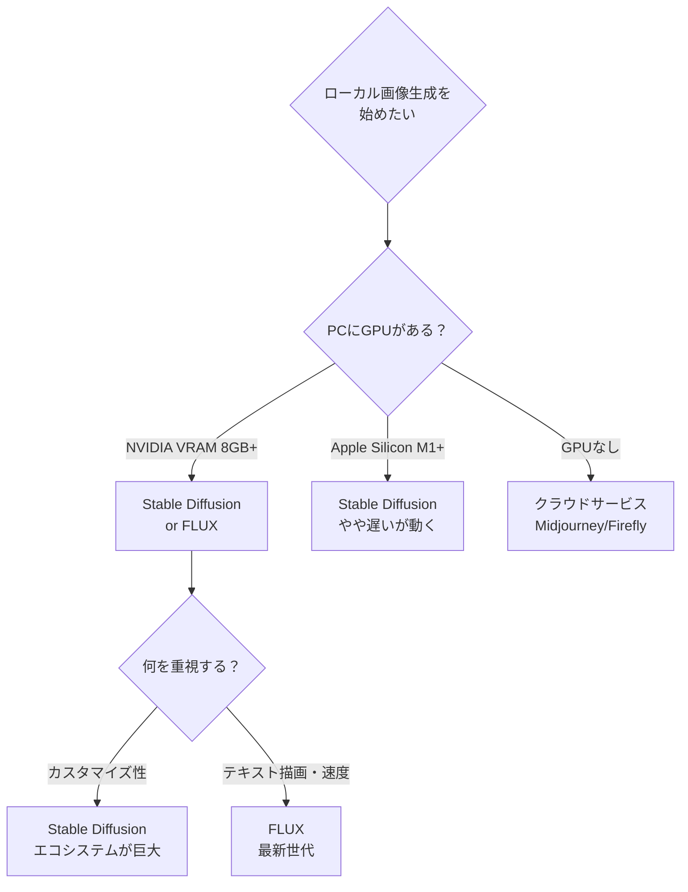
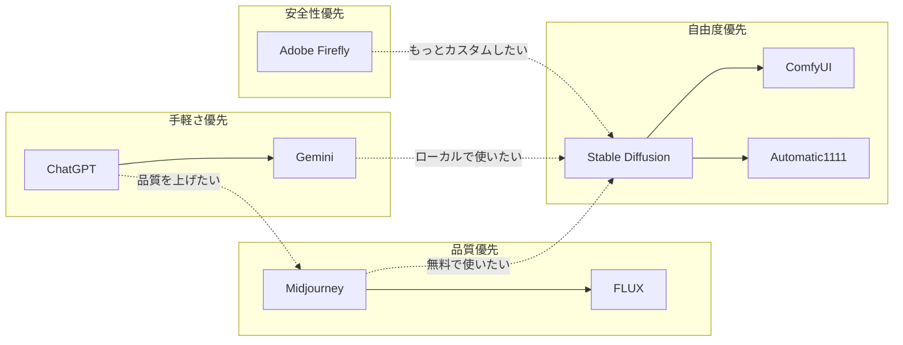
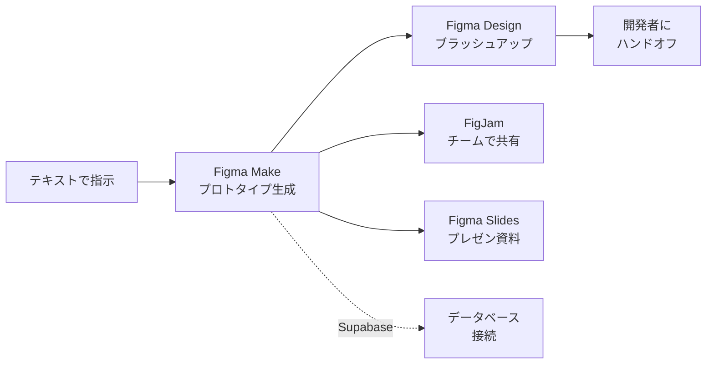
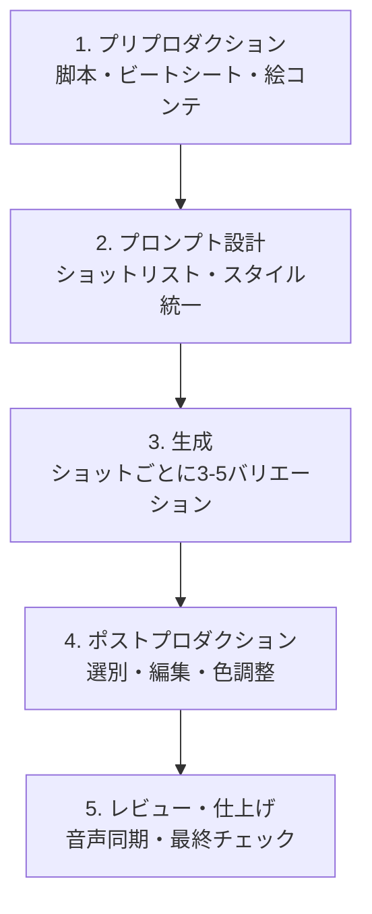
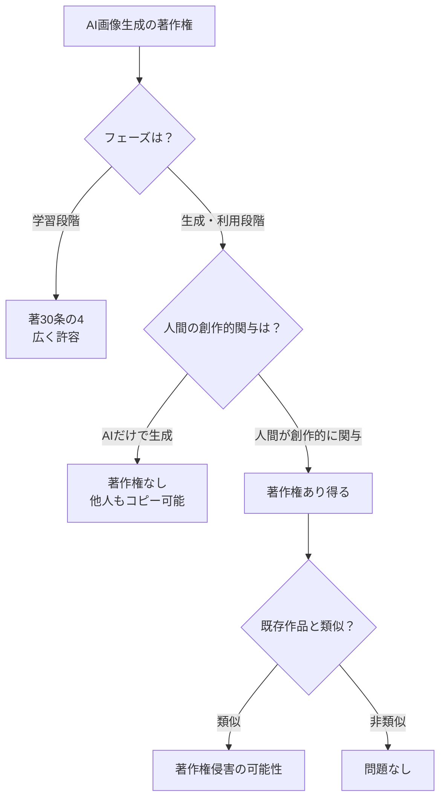

# S6: AI × 画像・動画・音声 — 生成AIを体験する

> **AIツール活用講座（全8回）** — [深層生成モデルシリーズ](./00-index-theory.md)（本編46回）のスピンオフ
> 前回: [S5: AI × ナレッジ管理・執筆](./ml-spinoff-05.md) | 次回: [S7: AIエージェント × データ分析](./ml-spinoff-07.md)

---

## はじめに — AIが「作る」時代

:::message
**この記事のゴール**: 3種類以上の生成AIで作品を作った状態にする
:::

S1からS5まで、AIは「文章を書く」「情報を探す」「翻訳する」といった**テキスト中心の仕事**をしてきた。

この記事では、AIの守備範囲が一気に広がる。

**画像を作る。動画を作る。音楽を作る。**

「プロンプトを書くだけで絵が出てくる」——文字で聞くと当たり前に聞こえるかもしれないが、実際にやってみると衝撃を受ける。頭の中のイメージを言葉にするだけで、数秒後にそれが画像として目の前に現れる。しかも、プロのイラストレーターが描いたかのようなクオリティで。

ただし、生成AIにはまだ「限界」がある。指が6本になる。文字が崩壊する。物理法則を無視した画像が生まれる。そして——「AIが作ったものは誰のものか？」という、答えが出ていない問いがある。

この記事では、画像・動画・音声の生成AIを実際に触りながら、**何ができて、何ができなくて、何に気をつけるべきか**を体感していく。

| カテゴリ | ツール | ひとこと |
|:---------|:-------|:---------|
| 画像生成（統合型） | ChatGPT（DALL-E）/ Gemini / Grok | チャットAIから直接生成。手軽 |
| 画像生成（高品質） | Midjourney | 品質特化。クリエイター御用達 |
| 画像生成（商用安心） | Adobe Firefly | 商用利用OKを保証。著作権クリア |
| 画像生成（ローカル） | Stable Diffusion / FLUX | 自分のPCで実行。完全無料 |
| デザインAI | Figma AI（Figma Make） | UIデザイン・プロトタイプ自動生成 |
| 動画生成 | Sora 2 / Runway Gen-4.5 / Veo 3.1 | テキストから動画を生成 |
| 音声・音楽 | TTS / Voice Clone / Suno | 読み上げ・声のクローン・作曲AI |

---

## 画像生成AI — 言葉が絵になる

### 統合型: ChatGPT / Gemini / Grok

最も手軽に画像生成を体験する方法は、**すでに使っているチャットAIで画像を作る**ことだ。

**ChatGPT（DALL-E 3搭載）**

ChatGPTに「猫がコーヒーを飲んでいる水彩画を描いて」と頼めば、数秒で画像が生成される。追加料金なし（有料プランの場合）。プロンプトの理解度が高く、複雑な指示にも対応する。

<!-- screenshot: ChatGPTで猫のコーヒー画像を生成した画面 -->

**Gemini（Google）**

Gemini 2.0ではネイティブの画像生成機能が搭載され、テキストと画像をシームレスに生成できる。Google検索との統合により、「最新のiPhoneのモックアップ画像を作って」のような現実世界の情報を踏まえた生成も可能。無料プランでも利用可能。

**Grok（xAI）**

Xの有料プランに付属。他のAIが避けがちな風刺画やパロディなども生成する傾向がある。品質はChatGPTやMidjourneyに劣るが、「自由度が高い」という意味で独自のポジション。

| ツール | 画像品質 | 手軽さ | 無料プラン | おすすめ度 |
|:-------|:---------|:-------|:-----------|:-----------|
| ChatGPT（DALL-E 3） | ★★★★☆ | ★★★★★ | 制限あり | ★★★★★ |
| Gemini | ★★★☆☆ | ★★★★★ | あり | ★★★★☆ |
| Grok | ★★★☆☆ | ★★★★☆ | なし（X有料プラン） | ★★☆☆☆ |

:::message
**まず試すならChatGPT**。すでにアカウントを持っていればすぐに試せる。「東京タワーとスカイツリーが握手しているイラスト」のような自由なプロンプトを投げてみよう。
:::

:::details ハンズオン: 3つのAIで同じ画像を作ってみよう
S1で「同じ質問を3つのAIに投げる」ことをやった。画像生成でも同じことをやってみよう。

**プロンプト（3つのAIに同じ文を入力する）**:
```
夕暮れの京都・伏見稲荷大社の千本鳥居、
オレンジ色の光が鳥居の間から差し込んでいる、
水彩画風、幻想的な雰囲気
```

**ChatGPT**: DALL-E 3が解釈した「水彩画風」は、やわらかいタッチで輪郭がにじむ表現になりやすい。構図のバランスが良く、「使いやすい」画像が出る

**Gemini**: テキスト指示への忠実度は高いが、「水彩画風」の解釈がChatGPTと異なることが多い。よりデジタルアートに近い仕上がりになる傾向

**Grok**: 独自の解釈が入りやすい。良く言えば個性的、悪く言えばプロンプトから逸脱しやすい

3つの結果を並べると、**「同じプロンプトでもAIごとに解釈が違う」** ことが一目でわかる。S1で学んだ「AIの多様性」が画像でも現れる。

<!-- screenshot: 3つのAIで同じプロンプトから生成した千本鳥居の比較 -->
:::

### Midjourney — 品質の頂点

**Midjourney** は画像生成AIの中で**品質が最も高い**と広く評価されているサービスだ。

2025年にリリースされたV7では、従来の弱点だった「手の描写」が劇的に改善された。以前は指が6本になったり、関節が不自然だったりしたが、V7では複雑な解剖学的構造もかなり正確に描ける。テクスチャの精細さ、光と影の表現、構図の美しさは他のサービスを一歩リードしている。

<!-- screenshot: Midjourney V7で生成した高品質なポートレート画像 -->

**Midjourneyの特徴**:

- **画像品質が圧倒的**: フォトリアル、イラスト、油絵風、どのスタイルでもトップクラス
- **Omni Reference**: キャラクターの一貫性を保つ機能。同じキャラクターを異なるシーンで描ける
- **Discordベース**: 当初はDiscordのbot経由のみだったが、現在はウェブUIも提供
- **独自の美学**: Midjourneyで生成した画像には独特の「Midjourneyっぽさ」がある。美しいが、それが好き嫌いの分かれるところでもある

**料金**（2026年2月時点）:

| プラン | 月額 | GPU時間 | 特徴 |
|:-------|:-----|:--------|:-----|
| **Basic** | $10/月（年払い$8/月） | 約3.3時間 | 入門用 |
| **Standard** | $30/月（年払い$24/月） | 約15時間 | Relaxモード（無制限キュー）付き |
| **Pro** | $60/月（年払い$48/月） | 約30時間 | Stealthモード（非公開生成）付き |
| **Mega** | $120/月（年払い$96/月） | 約60時間 | ヘビーユーザー向け |

:::message alert
**⚠️ Midjourneyに無料プランはない**。月$10〜の有料サブスクリプションが必要。ただし、BasicプランでもV7の品質を体験できるので、まずは$10から始めることをおすすめする。
:::

:::details Relaxモードとは？
StandardプランからはRelaxモードが使える。Relaxモードでは、生成リクエストがキューに入り、空きができたら処理される。待ち時間はあるが、**Fast GPU時間を消費しない**。つまり、時間を気にしなければ実質的に無制限に画像を生成できる。「今日中に100枚生成したい」みたいな使い方をするなら、StandardプランのRelaxモードが最もコスパが高い。
:::

### Midjourneyの上級プロンプト — パラメータを使いこなす

MidjourneyがChatGPTの画像生成と最も違うのは、**パラメータで画像の生成プロセスそのものを制御できる**点だ。ここからは中〜上級者向けの話になるが、知っておくと表現の幅が劇的に広がる。

#### パラメータ一覧

| パラメータ | 効果 | 値の範囲 | 使いどころ |
|:-----------|:-----|:---------|:-----------|
| `--ar` | アスペクト比 | 例: `16:9`, `9:16`, `3:2` | SNS投稿（1:1）、壁紙（16:9）、スマホ壁紙（9:16） |
| `--stylize` (`--s`) | AIの「味付け」の強さ | 0〜1000（デフォルト100） | 低い=プロンプトに忠実、高い=AIが自由に美化 |
| `--chaos` (`--c`) | 生成結果のバリエーション | 0〜100（デフォルト0） | 高い=4枚の結果がバラバラに。アイデア探し向き |
| `--style raw` | 最小限の美化 | on/off | 商品写真やUIモックなど、リアルさ重視の用途 |
| `--sref [URL]` | スタイル参照 | 画像URL | 参考画像の「雰囲気」を新しい画像に適用 |
| `--cref [URL]` | キャラクター参照 | 画像URL | 同じキャラクターを別のシーンで描く |
| `--no` | ネガティブプロンプト | テキスト | 「--no text, watermark」で文字・透かしを排除 |
| `--tile` | シームレスパターン | on/off | 壁紙やテクスチャ用の繋ぎ目なし画像 |

#### `--stylize` の使い分け

`--stylize`（略: `--s`）はMidjourneyにどれだけ「自分の美学」を発揮させるかを決めるパラメータだ。

- `--s 0`: プロンプトに最も忠実。「言った通りに描いてくれ」
- `--s 50〜100`: バランス型。ほどよくMidjourneyの美学が入る
- `--s 250〜500`: Midjourneyの美学が強く出る。ドラマチックで印象的な画像に
- `--s 750〜1000`: Midjourneyが全力で「盛る」。芸術的だが、プロンプトから逸脱する可能性も

正直なところ、`--s 100`前後が一番使いやすい。ただし「芸術作品として飾りたい」レベルの画像を作りたいなら`--s 500`以上を試す価値がある。

#### `--sref` と `--cref` — 一貫性の鍵

**`--sref`（Style Reference）** は、参考画像のスタイル（色調、雰囲気、画風）を新しい画像に反映させるパラメータ。たとえば、お気に入りの水彩画のURLを`--sref`に指定すれば、全く別の被写体をその水彩画の雰囲気で描いてくれる。

**`--cref`（Character Reference）** はさらに強力で、参考画像のキャラクターの外見を維持したまま別のシーンを描ける。漫画やストーリーボードなど、「同じキャラが違う場面に登場する」用途に最適だ。`--cw 100`を併用すると、キャラクターの再現度が最大になる。

#### マルチプロンプト — `::` でコンセプトを分離する

Midjourneyには**マルチプロンプト**という強力な機能がある。`::` でプロンプトを区切り、それぞれのコンセプトに重みをつけられる。

```
hot dog   → ホットドッグの画像が出る
hot:: dog → 「暑い」雰囲気の「犬」の画像が出る
```

重みをつける例:
```
fantasy castle::2 dark forest::1 moonlight::1.5
```

`::2`はデフォルト（`::1`）の2倍の重みを持つ。「ファンタジーの城」を最も強調し、次に「月光」、最後に「暗い森」という優先順位になる。

これを使うと「AIが1つの概念に引っ張られすぎる」問題を解決できる。たとえば「赤いドレスの女性が青い海にいる」と書くと、ドレスが海の色に影響されてしまうことがある。マルチプロンプトで分離すれば、各要素を独立に制御できる。

#### 実践プロンプト5パターン

**1. フォトリアリスティック**
```
Professional headshot of a Japanese businesswoman,
soft studio lighting, shallow depth of field,
35mm lens, neutral background --ar 3:4 --s 50 --style raw
```

**2. コンセプトアート**
```
Ancient temple floating above clouds at sunset,
concept art style, cinematic composition,
volumetric lighting, intricate details --ar 16:9 --s 500
```

**3. イラスト / アニメ風**
```
Cat café in Shimokitazawa, warm afternoon light
filtering through windows, Studio Ghibli inspired,
watercolor texture, pastel colors --ar 3:2 --s 300
```

**4. プロダクトデザイン**
```
Minimalist ceramic coffee mug, matte white finish,
product photography, clean white background,
soft even lighting --ar 1:1 --s 30 --style raw --no text
```

**5. テクスチャ / パターン**
```
Japanese wave pattern, indigo and white,
traditional woodblock print style, seamless texture
--tile --ar 1:1 --s 200
```

:::message
**V7のプロンプトのコツ**: V7は自然言語の理解力が大幅に向上している。キーワードの羅列より、文章として書く方が良い結果が出やすい。「morning sunlight filtering through forest canopy」は「morning, sunlight, forest, canopy」より効果的。ただし重要な要素はプロンプトの前半に置くこと——V7は先頭の単語により大きな重みを置く。
:::

### Adobe Firefly — 商用利用の安心感

**Adobe Firefly** は、Adobeが提供するAI画像生成サービスだ。画質ではMidjourneyに及ばない場面もあるが、**ビジネスで使うなら最も安心**という独自のポジションを持つ。

なぜ「安心」なのか。Firefly は**Adobe Stock、ライセンスされたコンテンツ、パブリックドメイン素材のみ**で学習されている。インターネットからスクレイピング（無断収集）した画像は一切使っていない。つまり、生成された画像が「誰かの著作物を無断で模倣している」リスクが極めて低い。

Adobeは**商用利用時の知的財産に関する免責保証（IP Indemnification）**も提供している。万が一、Firefly で生成した画像が著作権問題に発展した場合、Adobeが法的に補償する、という仕組みだ。

**料金**（2026年2月時点）:

| プラン | 月額 | クレジット | 特徴 |
|:-------|:-----|:-----------|:-----|
| **Standard** | $9.99/月 | 2,000クレジット | 動画20本、音声翻訳6分 |
| **Pro** | $19.99/月 | 4,000クレジット | 動画40本、音声翻訳13分 |

2026年2月現在、Runway Gen-4.5のビデオモデルがFirefly内で直接利用可能になっており、画像だけでなく動画生成もFireflyから行える。

@[card](https://www.adobe.com/products/firefly.html)

:::message
**商用利用するなら Firefly 一択**。ブログのアイキャッチ、SNS投稿用画像、プレゼン資料——「仕事で使う画像」を生成するなら、著作権のリスクが最も低いFireflyが安心だ。
:::

### Stable Diffusion / FLUX — ローカルで自由に

**Stable Diffusion** と **FLUX** は、**自分のPCで実行できるオープンソースの画像生成AI**だ。

「オープンソース」とは、ソフトウェアの設計図（ソースコード）が公開されていて、誰でも無料で使えること。クラウドサービスと違い、月額料金がかからず、生成枚数に制限がなく、データが外部に出ない。

ただし、**自分のPCにそれなりのスペックが必要**。特にGPU（グラフィックボード）の性能が重要で、NVIDIA製のGPU（VRAM 8GB以上）があると快適に動作する。AppleのM1/M2/M3チップでも動くが、速度はNVIDIA GPUに劣る。

| モデル | 特徴 | 必要スペック |
|:-------|:-----|:-------------|
| **Stable Diffusion 3.5** | 3年分のエコシステム。カスタムモデル・LoRAが豊富 | VRAM 6GB〜 |
| **FLUX.2** | テキスト描画が得意。4メガピクセルの高解像度。プロンプト忠実度が高い | VRAM 12GB〜推奨（FP8量子化で40%削減可） |



#### FLUX.2の新機能（2025年11月〜）

FLUX.2はBlack Forest Labsが2025年11月にリリースした最新モデルファミリーで、4つのバリエーションがある。

| バリエーション | 特徴 | ライセンス |
|:---------------|:-----|:-----------|
| **FLUX.2 [pro]** | 最高品質。API経由のみ | 商用（API） |
| **FLUX.2 [flex]** | 品質と速度のバランスを調整可能 | 限定公開 |
| **FLUX.2 [dev]** | 開発者・研究者向け。高品質 | 非商用 |
| **FLUX.2 [klein]** | 最速。サブ秒の推論速度 | Apache 2.0（完全オープン） |

FLUX.2の大きな進化ポイント:

- **マルチリファレンス編集**: 参考画像の顔やプロダクトのデザインを維持したまま、背景・照明・ポーズを変更可能。キャラクター一貫性が飛躍的に向上
- **テキスト描画**: 画像内にきれいなフォントでテキストを配置可能。従来のAI画像生成の最大の弱点を克服
- **多言語プロンプト**: 英語以外の言語でもプロンプトが自然に理解される
- **4メガピクセル出力**: NVIDIA RTX最適化により、FP8量子化でVRAM使用量を40%削減しつつ、パフォーマンスが40%向上

:::details Stable DiffusionとFLUXの関係
FLUXは、Stable Diffusionの開発に関わった研究者たちが設立したBlack Forest Labs が開発した次世代モデル。Stable Diffusionの後継的な位置づけだが、内部アーキテクチャは大きく異なる（UNetベースの拡散モデルからDiT=Diffusion Transformerベースへ）。Stable Diffusionの膨大なエコシステム（カスタムモデル、LoRA、ControlNet等）はFLUXでは直接使えないが、FLUX独自のエコシステムが急速に成長している。
:::

#### ControlNet、LoRA、img2img — カスタマイズの三種の神器

ローカル実行の最大の魅力は**カスタマイズの自由度**だ。Midjourney やFireflyでは不可能な、モデルの内部まで手を入れる制御ができる。

**ControlNet — 構図を精密に制御する**

ControlNetは、「こういう構図で」「こういうポーズで」と画像生成を精密に制御する技術。元の画像から抽出した「条件情報」を使って、生成画像をガイドする。

| ControlNetの種類 | 入力 | 効果 |
|:-----------------|:-----|:-----|
| **Canny Edge** | 輪郭線 | 元画像の輪郭を維持して別スタイルで生成 |
| **Depth** | 深度マップ | 前景/背景の配置を保持 |
| **OpenPose** | 人体のポーズ | 指定したポーズで人物を描写 |
| **Scribble** | 落書き | ラフスケッチから画像を生成 |
| **Normal Map** | 法線マップ | 表面の凹凸を保持 |

たとえば「自分が描いたラフスケッチ → ControlNet（Scribble）→ プロ品質のイラスト」という変換ができる。デザイナーが「AIアシスタント」として使う場合に最も威力を発揮するのがこのControlNetだ。

複数のControlNetを組み合わせることも可能で、「構図はDepthで」「ポーズはOpenPoseで」と段階的に制御をかけられる。

**LoRA — 画風・キャラクターを学習させる**

LoRA（Low-Rank Adaptation）は、AIモデルの一部だけを追加学習させる軽量な技術だ。モデル全体を再学習するのではなく、特定の画風やキャラクターだけを数MB程度のファイルとして学習する。

- **画風LoRA**: 特定のアーティストの画風、アニメスタイル、写真風などを学習
- **キャラクターLoRA**: 特定のキャラクターを一貫して描く
- **コンセプトLoRA**: 特定の服装、小物、背景の概念を学習

CivitAIなどのコミュニティサイトには数万のLoRAが公開されており、ダウンロードして`models/loras`フォルダに入れるだけで使える。

**img2img — 既存画像を出発点にする**

img2img（Image-to-Image）は、既存の画像を「出発点」にして新しい画像を生成する機能だ。「この写真をアニメ風に変換して」「この風景を夜に変えて」といった用途に使える。

「Denoising Strength」というパラメータで元画像からどれだけ変化させるかを0〜1で指定する。0に近いほど元画像に忠実で、1に近いほど大きく変わる。0.3〜0.5あたりがバランスがいい。

**ControlNet + LoRA + img2imgの組み合わせ**

これら3つは**同時に使える**。たとえば:

1. 自分のラフスケッチを用意する
2. ControlNet（Scribble）でスケッチの構図を維持
3. LoRA（アニメスタイル）で画風を指定
4. img2imgで元スケッチの色味を参考にする
5. Denoising Strength 0.7で「スケッチの構図は保つが、表現はAIに任せる」

この組み合わせが使えるのはローカル実行の最大の強みだ。MidjourneyやChatGPTでは不可能な、**きめ細かい制御と自由度の両立**。

:::message
**LoRA + ControlNetの「真の魔法」**: LoRAが「何を生成するか（スタイル、キャラクター、美学）」を制御し、ControlNetが「どう構成するか（ポーズ、構図、深度）」を制御する。この2つを組み合わせると、「このキャラクターを、このポーズで、この画風で」という3次元の制御が可能になる。
:::

#### ComfyUI vs Automatic1111 — どっちを使うべきか

ローカルでStable DiffusionやFLUXを動かすには、「フロントエンド」と呼ばれるUI（操作画面）が必要だ。2大フロントエンドの比較。

| | **Automatic1111** | **ComfyUI** |
|:--|:-------------------|:------------|
| **使いやすさ** | ★★★★★ 初心者向き | ★★★☆☆ 学習コスト高め |
| **柔軟性** | ★★★☆☆ 標準的 | ★★★★★ ノードベースで無限に拡張 |
| **FLUX対応** | △（特定フォーク要） | ◎（カスタムノードで対応） |
| **VRAM効率** | ★★★☆☆ | ★★★★★ 動的なモデルロード/アンロード |
| **生成速度** | 基準 | 平均15%高速 |
| **コミュニティ** | 成熟、安定 | 急成長中、プラグイン豊富 |
| **向いている人** | 手軽に始めたい人 | ワークフローを細かく組みたい人 |

2026年の時点で、初心者なら**Automatic1111**（またはその派生のForge）から始めて、慣れたら**ComfyUI**に移行するのが王道だ。ComfyUIのVRAM管理は優秀で、8GBのGPUでもSDXLが動く場面でAutomatic1111はクラッシュする、という報告が多い。

:::message
**ローカル実行のまとめ**: 「お金をかけずに、無制限に、プライバシーを守って画像生成したい」ならローカル一択。ただしセットアップの手間とPCスペックが必要。逆に「手軽さ優先」ならMidjourneyかChatGPTのクラウドサービスを使った方が圧倒的に楽。
:::

:::message alert
**⚠️ ローカル生成の注意**: オープンソースモデルには利用制限（ライセンス条件）がある。商用利用の可否はモデルごとに異なるため、必ずライセンスを確認すること。また、学習データにインターネットから収集した画像が含まれているため、生成物の著作権リスクはFireflyより高い。
:::

### 画像生成AI比較まとめ

| ツール | 品質 | 手軽さ | 商用安全 | 無料 | カスタマイズ | 最適な用途 |
|:-------|:-----|:-------|:---------|:-----|:-------------|:-----------|
| **ChatGPT** | ★★★★☆ | ★★★★★ | △ | 制限あり | ✕ | 日常使い・アイデア出し |
| **Midjourney** | ★★★★★ | ★★★☆☆ | △ | なし | ○ | 高品質なクリエイティブ作品 |
| **Firefly** | ★★★★☆ | ★★★★☆ | ◎ | 制限あり | △ | ビジネス・商用利用 |
| **Stable Diffusion** | ★★★★☆ | ★★☆☆☆ | △ | 完全無料 | ◎ | カスタマイズ・実験 |
| **FLUX** | ★★★★★ | ★★☆☆☆ | △ | 完全無料 | ◎ | テキスト描画・最新技術 |



:::message
**迷ったらこのフロー**: まずChatGPTかGeminiで「画像生成ってこんなもの」と体感 → 品質に不満ならMidjourney → カスタマイズしたくなったらStable Diffusion/FLUX → 仕事で使うならFirefly。段階的にステップアップしていくのが無理のない道筋だ。
:::

---

## プロンプトで画風・構図をコントロールする

画像生成AIで最も差が出るのは**プロンプト（指示文）の書き方**だ。

### 基本構造

良いプロンプトには共通のパターンがある。

```
[被写体] + [スタイル/画風] + [媒体/メディウム] + [照明/雰囲気] + [構図/カメラ] + [品質修飾語]
```

この6要素を意識するだけで、出力の品質が格段に上がる。各要素の役割を見てみよう。

| 要素 | 役割 | 例 |
|:-----|:-----|:---|
| **被写体** | 何を描くか | a Japanese garden in autumn |
| **スタイル/画風** | どんなテイストで | watercolor painting style |
| **媒体/メディウム** | 何の技法で | oil on canvas / digital art / photograph |
| **照明/雰囲気** | どんな雰囲気で | soft morning light / dramatic shadows |
| **構図/カメラ** | どう切り取るか | aerial view / close-up / 35mm lens |
| **品質修飾語** | 品質レベル | highly detailed / 8K resolution / masterpiece |

**例**:
```
A Japanese garden in autumn, watercolor painting style,
soft gouache texture, warm afternoon light,
aerial perspective, highly detailed foliage
```

### Before / After — プロンプトの質で変わる画像

**Bad — 曖昧なプロンプト**:
```
猫の絵を描いて
```
→ 「猫」の絵は出るが、スタイルもポーズも背景もAI任せ。意図通りにはならない

**Good — 具体的なプロンプト**:
```
白い子猫が窓辺で昼寝をしている、背景に暖かい午後の日差し、
スタジオジブリ風のアニメスタイル、パステルカラー、
被写界深度浅め、温かみのある雰囲気
```
→ 画風、構図、照明、雰囲気が明確に指定されているため、意図に近い画像が生成される

**Pro — プロフェッショナルなプロンプト**:
```
A white kitten napping on a wooden windowsill,
warm afternoon sunlight streaming through lace curtains,
Studio Ghibli art style, soft pastel color palette,
gouache and watercolor texture, shallow depth of field,
bokeh background with potted plants, cozy atmosphere,
masterpiece quality --ar 3:2 --s 300
```
→ 被写体の詳細、環境の具体描写、技法、品質指定まで含む。結果の再現性が高い

### プロンプトのコツ集

| テクニック | 例 | 効果 |
|:-----------|:---|:-----|
| **アーティスト名風** | 「in the style of Studio Ghibli」 | 特定の画風を再現 |
| **カメラ用語** | 「35mm lens, shallow depth of field」 | 写真的なリアリティ |
| **照明指定** | 「golden hour lighting, dramatic shadows」 | 雰囲気を制御 |
| **ネガティブプロンプト** | 「--no text, watermark, blurry」 | 不要な要素を排除 |
| **時代指定** | 「1970s color film aesthetic」 | レトロ/ビンテージ感 |
| **素材指定** | 「oil on canvas」「digital matte painting」 | メディウムを明確に |
| **構図ルール** | 「rule of thirds composition」 | バランスの取れた構図 |

:::message
**S2（プロンプト設計）で学んだ「具体的に指示する」原則がここでも活きる**。画像生成でも「AIに任せるところ」と「自分で指定するところ」の切り分けが重要。→ [S2: プロンプト設計](./ml-spinoff-02.md)
:::

---

## Figma AI（Figma Make） — デザインの民主化

**Figma Make** は、テキストからUIデザインを自動生成する機能だ。2026年にベータを卒業し、全ユーザーに開放された。

「コーヒーショップのモバイルアプリのホーム画面をデザインして」と書くだけで、ボタン配置、色使い、タイポグラフィまで含めたUIデザインが数秒で生成される。しかも、生成されたすべての要素はFigma上で編集可能。「このボタンをもう少し右に」「フォントを大きく」と、AIの出力を自分でカスタマイズできる。

<!-- screenshot: Figma Makeで生成されたモバイルアプリのUI — 編集可能な状態 -->

### Figma Makeの注目機能

**プロトタイプ埋め込み**

2026年1月のアップデートで、Figma Makeで生成したプロトタイプを**Figma Design、FigJam、Figma Slides**に埋め込めるようになった。「AIでプロトタイプを作る→デザイナーがブラッシュアップ→プレゼン資料に埋め込む」というワークフローがシームレスにつながる。

**編集可能なTo-Doリスト**

複雑なプロンプトを送ると、Figma Makeは実行前にリクエストを**ステップに分解したTo-Doリスト**を生成する。各ステップの進行状況を確認しながら、「ここはスキップして」「ここを変えて」と途中でガイドできる。AIが何をしようとしているか透明性があるのは良い設計だ。

**デザインライブラリ連携**

既存のFigmaライブラリをインポートして、自社のカラーパレット・タイポグラフィ・コアスタイルを反映したプロトタイプを生成できる。ブランドガイドラインに準拠した一貫性のあるデザインがAIで作れるようになった。

**Supabase統合 — バックエンド接続**

Supabaseとの統合により、データベースと接続されたリッチなプロトタイプやWebアプリケーションの生成も可能に。単なるモックアップを超えて、実際に動くプロトタイプを生成できる。

**Figma AIのその他の機能**:

- **AI画像生成**: テキストからの画像生成、スマートフィル、背景の除去・置換
- **レイヤー自動命名**: 散らかったファイルのレイヤー名をAIが一括リネーム
- **ビジュアル検索**: スクショやレイヤーをアップロードすると、ライブラリ内の類似コンポーネントを検索

:::message alert
**⚠️ Figma AIのクレジット制**: Figma AIの機能はクレジット制で、使用量に上限がある。管理者はダッシュボードからチームのAIクレジット消費を追跡可能。大量のプロトタイプを生成する場合はクレジット残量に注意。
:::

プログラマーでなくても、デザイナーでなくても、「こんなアプリが欲しい」と伝えるだけでプロトタイプが作れる時代になった。

:::details Figma Makeの実践: コーヒーショップアプリを作ってみる
1. Figmaにログイン → Figma Makeを開く
2. 「コーヒーショップの注文アプリ。メニュー一覧、カート、決済画面の3画面」と入力
3. Figma MakeがTo-Doリストを生成 → 各ステップを確認
4. 生成完了 → 色やフォントを手動で調整
5. Figma Designにエクスポート → チームに共有

<!-- screenshot: Figma Makeでコーヒーショップアプリを生成する流れ -->

**ポイント**: 最初のプロンプトで「ブランドカラーは#8B4513（ブラウン）」「フォントはNoto Sans JP」のように具体的に指定すると、後の修正が減る。デザインライブラリを事前にインポートしておくとさらに効率的。
:::

@[card](https://www.figma.com/make/)



---

## 動画生成AI — テキストが映像になる

### 動画生成の現在地（2026年2月）

2024年にOpenAIがSoraのデモを公開したとき、世界が震えた。テキストから映画のようなクオリティの映像が生成される。あれから2年、動画生成AIは急速に進化している。

ただし正直に言うと、**2026年現在の動画生成AIは「すごいけど、まだ完璧じゃない」**。物理法則を無視した動きが出たり、人物の顔がフレーム間で微妙に変わったり、因果関係がおかしかったり。「映画が作れるか？」と聞かれたら「まだ無理。でも、短いクリップなら十分使える」が正直な回答だ。

### Sora 2（OpenAI）

**Sora 2** はOpenAIが開発した動画生成AI。テキストから最大1080p（フルHD）の動画を生成できる。

**特徴**:
- **テキスト→動画**: 自然言語の説明から動画を生成
- **画像→動画**: 静止画を動かす。写真に命を吹き込む
- **音声同期**: セリフや効果音が映像と同期して生成される
- **1080pフルHD**: 標準画質

**料金**: ChatGPT Plus（$20/月）またはPro（$200/月）サブスクリプションが必要。2026年1月10日以降、無料ユーザーはSoraを利用できなくなった。Plusプランでは480p動画が無制限に生成可能。

:::message alert
**⚠️ Sora 2は無料では使えない**。ChatGPT Plus（$20/月）以上の有料プランが必要。
:::

#### Sora 2の上級テクニック — 映像制作ワークフロー

Sora 2を「おもちゃ」ではなく「制作ツール」として使うには、映像制作のプロと同じ5段階のワークフローで考えるのが効果的だ。



**Phase 1: プリプロダクション**

まず「ビートシート」を書く。Beginning / Middle / End の3幕構成で3〜5のマイクロシーンを定義し、各シーンの「ショットリスト」を作る。

ショットリストには以下を含める:
- レンズ（24mm, 50mm, 85mm...）
- カメラムーブ（dolly-in, pan, static, handheld...）
- 構図（低アングル, 俯瞰, 三分割法...）
- ライティング（golden hour, backlight, soft haze...）
- 動きの意図（被写体がフレーム左→右に横切る、など）

**Phase 2: 映画用語をプロンプトに使う**

Sora 2は映画用語への理解力が高い。普通の説明文より、映像制作の専門用語を使った方が意図通りの映像が生成される。

```
BAD:  夕焼けの海辺を歩く人
GOOD: 24mm low-angle dolly-in tracking a woman walking barefoot
      on a sandy beach, backlit by golden hour sun, soft haze,
      silk scarf billowing in gentle breeze, steady gimbal movement
```

素材の質感を物理的に書くのもコツ。「シルクのスカーフが5mphの風にたなびく」のように、素材と力を明示すると不自然な動きが減る。

**Phase 3-5: 反復と仕上げ**

1ショットにつき3〜5バリエーションを生成し、ベストを選ぶ。「一発で完璧」を狙わず、**変数を1つずつ変えて反復する**のがプロの手法だ。照明だけ変える、カメラアングルだけ変える、という形で試行錯誤する。

:::message
**Sora 2の音声**: Sora 2はネイティブで音声を生成する。セリフや効果音を明示的にプロンプトに書くと、映像と同期した音声が出力される。
:::

### Runway Gen-4.5

**Runway** はAI動画生成の先駆者で、Gen-4.5は2025年末にリリースされた最新モデル。

Artificial Analysisのベンチマークで**Eloスコア1,247を記録し、全動画生成モデルの中でトップ**。映像のリアリティ、動きの一貫性、キャラクターの安定性で業界最高水準とされている。

**特徴**:
- **画像→動画**: 実写・イラスト・スケッチ——どんな静止画からでも動画を生成
- **キャラクター一貫性**: Gen-4以降、同じキャラクターを複数シーンで一貫して描写
- **映画的なクオリティ**: 映像のリアリティと映画的な表現力に定評がある

#### Motion BrushとCamera Control

Gen-4.5の真骨頂は**Motion Brush**と**Camera Control**にある。これらは動画生成を「お任せ」から「演出」に変えるツールだ。

**Motion Brush**は、画像の特定の部分にブラシで塗ることで「ここだけ動かす」「この方向に動かす」と指定できる機能。2026年のアップデートで、画像の主要な要素を自動検出するようになり、塗る手間が大幅に減った。

**Multi-Motion Brush**では、1枚の画像に対して最大5つのエリアを別々の動きで設定できる。たとえば「人物は右に歩く」「背景の雲は左にゆっくり流れる」「手前の花は風で揺れる」を同時に指定可能。

**Camera Control**は仮想カメラの動きを制御する。パン、ズーム、ドリー、オービットなどの映画的なカメラワークを指定でき、Motion Brushと組み合わせると「被写体は静止、カメラだけがゆっくり回り込む」といった演出も可能。

**限界**:
- 因果関係の推論が弱い（「ボールを投げたら壁に当たって跳ね返る」のような因果的シーンが不安定）
- オブジェクトの永続性に問題がある（画面外に出たものが消えたり変わったりする）
- 成功バイアス（アクションが不自然に成功しやすい）

@[card](https://runwayml.com/)

### Veo 3.1（Google）

**Veo 3.1** はGoogleが2026年1月にアップデートした動画生成AI。

**最大の特徴は4K解像度（3840x2160）対応**。主流のAI動画生成モデルで4K出力に対応したのはVeo 3.1が初めてだ。

| 機能 | 説明 |
|:-----|:-----|
| **4K出力** | 3840x2160の高解像度。AI動画生成で初。Sora 2の1080pの4倍 |
| **縦型動画** | 9:16のネイティブ縦型出力。YouTube ShortsやTikTok向け。クロップなし |
| **Ingredients to Video** | 参考画像（最大4枚）を基にした動画生成。キャラクター一貫性が向上 |
| **シーン拡張** | 既存の動画の最後のフレームから続きを生成。1分以上の長尺動画が可能 |
| **ネイティブ音声** | 自然な会話と同期した効果音。ダイアログ（対話）もネイティブ生成 |
| **表現力の向上** | キャラクターの表情、ジェスチャーの自然さが大幅に改善 |

Veo 3.1はGeminiアプリ、YouTube Shorts、Flow、Gemini API、Vertex AI、Google Vidsなど複数のプラットフォームから利用可能。

:::details ハンズオン: Veo 3.1でショート動画を作ってみよう
1. Geminiアプリ（またはgemini.google.com）にアクセス
2. 以下のようなプロンプトを入力:
```
カフェでラテアートを作っている手元のクローズアップ動画。
湯気が立ち上り、ミルクのハート模様が描かれていく。
暖かい照明、浅い被写界深度、ASMR的な雰囲気。
縦型（9:16）、5秒間。
```
3. 生成を待つ（数十秒〜数分）
4. 結果を確認 — ミルクの流体の動きは自然？湯気の物理は？手の指は何本？
5. 気に入ったら4Kにアップスケール

**チェックポイント**:
- 液体の動き（ミルクの注ぎ方）は自然か？
- 手の指は正しい本数か？
- 湯気の動きは物理的に正しいか？
- フレーム間で一貫性はあるか？（手の位置が急に変わったりしないか）

動画生成AIの「すごさ」と「限界」の両方を1つの動画で体験できるはずだ。
:::

:::details Veo 3.1の「Ingredients to Video」とは？
「Ingredients to Video」は、最大4枚の参考画像を「材料」としてアップロードし、それらを組み合わせた動画を生成する機能。たとえば「キャラクターの顔写真」「背景の風景」「衣装の参考」「照明の参考」を4枚セットで入れると、それらの要素を統合した動画が出てくる。写真から動画を作るだけでなく、複数の写真の要素を融合する点が新しい。
:::

### 動画生成AI比較

| ツール | 解像度 | 品質 | 独自機能 | 料金 |
|:-------|:-------|:-----|:---------|:-----|
| **Sora 2** | 1080p | ★★★★☆ | ネイティブ音声同期 | $20/月〜（ChatGPT Plus） |
| **Runway Gen-4.5** | 1080p | ★★★★★ | Motion Brush / Camera Control | $12/月〜 [NEEDS VERIFICATION: 2026-02] |
| **Veo 3.1** | **4K** | ★★★★☆ | 4K / 縦型 / Ingredients to Video | 無料〜（Gemini経由） |

:::message
**まず試すなら**: Gemini経由でVeo 3.1を試すのが最も手軽。Googleアカウントがあれば無料で始められる。Runwayは品質トップで映像クリエイター向け。Sora 2はChatGPTユーザーにとってアクセスしやすい。
:::

---

## 音声・音楽生成AI — AIが歌い、語る

### テキスト読み上げ（TTS）

TTS（Text-to-Speech = テキスト読み上げ）は、AIの中でも最も成熟した分野の1つだ。

2026年のTTS技術は、**人間の声と区別がつかないレベル**に到達している。抑揚、感情表現、間の取り方——すべてが自然だ。

**代表的なTTSサービス**:

| サービス | 特徴 | 料金 |
|:---------|:-----|:-----|
| **ElevenLabs** | 品質最高クラス。29言語対応。感情表現が自然 | 無料〜$5/月〜 [NEEDS VERIFICATION: 2026-02] |
| **OpenAI TTS** | ChatGPT API経由。安定した品質 | API従量課金 |
| **Google Cloud TTS** | 多言語対応。Googleエコシステム統合 | 無料枠あり |
| **VOICEVOX** | 日本語特化。無料。キャラクターボイス | 完全無料 |

:::message
**日本語のTTSなら**: VOICEVOXが無料で高品質。ずんだもん等のキャラクターボイスでYouTube動画のナレーションにもよく使われている。英語含む多言語ならElevenLabsの品質が頭一つ抜けている。
:::

:::details TTSの意外な活用法
TTSは「読み上げ」だけのツールではない。

- **プレゼンのリハーサル**: 自分の発表原稿をTTSで読み上げさせ、聞いてみる。「長すぎる部分」「わかりにくい表現」が客観的にわかる
- **アクセシビリティ**: ブログ記事やドキュメントに音声版を添付。視覚に障害がある方、「ながら聴き」したい方に対応
- **語学学習**: ネイティブの発音でテキストを読み上げさせ、シャドーイングの素材にする
- **ポッドキャスト**: ElevenLabsで生成した自然な音声でポッドキャストを制作。実際にAI音声ポッドキャストが増えている
- **動画ナレーション**: VOICEVOXのキャラクターボイスは「解説系YouTube」で定番。ずんだもんの声は一種のブランドになっている

2026年のTTSで最も驚くのは**感情制御**だ。ElevenLabsでは「悲しそうに」「興奮して」「落ち着いた口調で」と指定するだけで、感情のこもった読み上げになる。テクノロジーの進化を実感する瞬間だ。
:::

### Voice Clone — 声のコピー

Voice Clone（ボイスクローン）は、**特定の人の声を学習して再現する技術**だ。

数分間の音声サンプルから、その人の声の特徴を学習し、任意のテキストをその声で読み上げることができる。「自分の声で別の言語を話す」「故人の声を再現する」といった応用がある。

:::message alert
**⚠️ ボイスクローンの倫理的リスク**: 他人の声を無断でクローンすることは、プライバシー侵害や詐欺（オレオレ詐欺の進化版）に悪用される可能性がある。多くのサービスでは本人の同意確認が必須。自分の声のクローンや、明確に許可された声のみ使用すること。
:::

### Suno — AIが作曲する

**Suno** は、テキストから楽曲を丸ごと生成するAI作曲サービスだ。

「夏の海辺をドライブしている気分のJ-POP、女性ボーカル」——こんなプロンプトを入力すると、数十秒で**歌詞・メロディ・伴奏・ボーカル**が揃った楽曲が生成される。ボーカルの声も自然で、「これAIが歌ってるの？」と疑うレベル。

<!-- screenshot: Sunoの生成画面 — プロンプト入力と生成された楽曲の波形 -->

#### Suno V5 — スタジオグレードの進化

Suno V5（2025年9月リリース）では、音楽生成の品質が根本的に変わった。

- **44.1kHz スタジオグレード音質**: CD品質と同等のサンプリングレート
- **最大8分の楽曲生成**: 従来の制限を大幅に拡大
- **楽器分離の精度向上**: 各パートがクリアに聞こえるミックス
- **ボーカルエンジン改良**: フレージングと音節のアラインメントが改善。より自然な歌唱

#### Sunoの上級テクニック

**ジャンル・ムードの詳細指定**

Style欄にはできるだけ具体的に書く。「ジャンル + ムード + テンポ + 楽器 + ボーカル + 制作品質」の6要素を意識する。

```
BAD:  ポップス
GOOD: J-POP, uplifting and nostalgic, 120 BPM,
      acoustic guitar lead, piano backing,
      female vocal with soft vibrato, studio-grade mix
```

**歌詞制御**

Suno V5では歌詞をCustomモードで直接書ける。ポイントは:

- **1行あたり6〜12音節**。長すぎると早口になり、短すぎるとロボットっぽくなる
- **構造タグ**で曲構成を明示する: `[Verse]` / `[Pre-Chorus]` / `[Chorus]` / `[Bridge]` / `[Outro]`
- **母音の引き延ばし**で感情表現: 「Loooove」「Ohhhh」と書くと、持続音になる。ダイナミクスマーキングのような効果
- **多言語対応**: 英語、日本語、韓国語、フランス語、スペイン語、中国語で歌唱可能

**リミックスとステム分離**

Suno V5はプロ向け機能も充実している:

- **ステム分離**: 生成した楽曲を最大12トラック（ボーカル、ドラム、ベース、ギター等）に分解し、WAVファイルとしてエクスポート。AbletonやLogicなどのDAWで個別編集が可能
- **MIDI書き出し**: ステムをMIDIファイルに変換可能
- **カバー＆ペルソナ**: 別のボーカルスタイルで同じ曲をリミックス
- **無限のステムバリエーション**: コード進行に自動追従するベースラインや、メロディを補完するハーモニーを自動生成

**料金**（2026年2月時点）:

| プラン | 月額 | クレジット | 商用利用 |
|:-------|:-----|:-----------|:---------|
| **Basic（無料）** | 無料 | 50クレジット/日（約10曲） | 不可 |
| **Pro** | $10/月（年払い$8/月） | 2,500/月（約500曲） | 可能 |
| **Premier** | $30/月（年払い$24/月） | 10,000/月（約2,000曲） | 可能。優先キュー |

:::details Sunoの著作権と最新動向
2026年、Warner Music GroupがSunoとの訴訟を和解し、ライセンスパートナーシップを発表した。これにより、ライセンスされたAIモデルへの道が開かれた。一方、無料ユーザーはストリーミング/共有のみに制限され、ダウンロードは有料プランが必要に。有料ユーザーにも月間ダウンロード上限が設定されるなど、権利保護に向けた動きが加速している。
:::

:::message
**まず無料プランで試してみよう**。「こんなに簡単に曲ができるのか」と驚くはず。YouTubeのBGM、ポッドキャストのジングル、プレゼンのBGM——身近な用途は意外と多い。
:::

:::details ハンズオン: Sunoで「自分のテーマソング」を作ってみよう
1. [suno.com](https://suno.com/) にアクセスし、アカウントを作成
2. 「Create」をクリック
3. 「Custom Mode」を選択（歌詞とスタイルを分けて入力できる）
4. Style欄に以下を入力:
```
J-Pop, cheerful and energetic, 128 BPM,
synth lead, bass guitar, female vocal,
catchy chorus, studio quality
```
5. Lyrics欄にサビの歌詞を書く（日本語OK）:
```
[Chorus]
走り出せ 明日へ
振り返るな 今を生きろ
心の声が 叫んでいる
ここから始まる ストーリー
```
6. 「Create」をクリック → 数十秒で2パターンの楽曲が生成される
7. 好きな方を選んで再生。「え、これAI？」と驚くはず

**失敗しやすいポイント**:
- Style欄に歌詞を混ぜると品質が落ちる → 必ず分けて入力
- 歌詞の1行が長すぎると早口になる → 6〜12音節を目安に
- 「すべてお任せ」より、少なくともジャンルとBPMは指定した方が良い
:::

### 音楽生成AIの全体像

Sunoだけが音楽生成AIではない。代表的なサービスを比較しておこう。

| サービス | 強み | 弱み | 料金 |
|:---------|:-----|:-----|:-----|
| **Suno** | ボーカル品質トップ。歌詞制御。ステム分離 | インスト曲はやや弱い | 無料〜$10/月〜 |
| **Udio** | 楽曲構成が自然。リミックス機能 | ボーカルはSunoに劣る | 無料〜$10/月〜 [NEEDS VERIFICATION: 2026-02] |
| **AIVA** | クラシック/映画音楽に強い。著作権クリア | ボーカルなし | 無料〜€11/月〜 [NEEDS VERIFICATION: 2026-02] |

:::message
**用途別おすすめ**: ボーカル入りの楽曲 → Suno。BGMやインスト → AIVA。実験的・アート寄り → Udio。正直、2026年時点ではSunoが頭一つ抜けている。
:::

---

## 生成AIの品質を「見る目」を養う

ここからは**受け手として**の話。AIが生成したコンテンツを見分ける力は、この時代に必須のリテラシーだ。

### 画像の破綻パターン

AIが生成した画像には、特徴的な「破綻」がある。知っておけば見分けられるようになる。

| 破綻パターン | 説明 | 見分け方 |
|:-------------|:-----|:---------|
| **指が多い/少ない** | 指が6本になったり、関節がおかしくなる | 手を拡大して指を数える |
| **文字の崩壊** | 看板やロゴの文字が読めない・存在しない文字になる | テキスト部分をチェック |
| **左右の非対称** | 顔や体の左右が微妙に違う | ピアスや髪型の左右を比較 |
| **背景の不整合** | 背景の建物や風景に矛盾がある | 遠景のディテールを確認 |
| **テクスチャの反復** | 同じパターンが不自然に繰り返される | 広い面（壁、床）を観察 |
| **物理法則の無視** | 影の方向が矛盾、液体の挙動が不自然 | 光源と影の一貫性を確認 |

:::message
**2026年のモデル（Midjourney V7、FLUX.2等）では手の破綻が大幅に改善された**が、完全には解消されていない。特に複数の人物が手を絡ませるシーンでは依然として破綻が起きやすい。
:::

### 動画の破綻パターン

動画では画像よりもさらに多くの破綻が起きやすい。なぜなら、動画は「時間方向にも整合性を保つ」必要があるからだ。1枚の画像を正しく生成するだけでも難しいのに、連続する数十〜数百フレームすべてで一貫性を保つ必要がある。

| 破綻パターン | 説明 | 見分け方 |
|:-------------|:-----|:---------|
| **顔の変動** | フレーム間で人物の顔が微妙に変わる | 特定のフレームで一時停止して比較 |
| **手足の消失** | 手や足が突然消えたり、不自然に出入り | スローモーションで確認 |
| **物理的な矛盾** | 重力無視、液体の不自然な動き | 「現実でこう動くか？」と自問 |
| **オブジェクトの消失** | 画面外のものが消える/変わる | カメラ移動時に注目 |
| **背景のワープ** | カメラ移動時に背景が歪む | 固定的な建物やオブジェクトを追跡 |
| **テンポラル・フリッカー** | 明るさや色がフレーム間でちらつく | 全体をぼんやり見ると気づく |

:::message
**動画の破綻を見つけるコツ**: 全体を「ぼんやり見る」のではなく、「1つのオブジェクトだけを追跡して見る」と破綻が見えやすい。人物の右手だけを追う、背景の建物だけを追う——焦点を絞ると、一貫性の問題が浮かび上がる。
:::

### なぜ破綻が起きるのか？

ここで疑問に思いませんか。「なぜAIは指が描けないのに、顔は描けるのか？」

AI画像生成モデルは、大量の画像を学習して「パターン」を覚えている。顔は正面・横顔・笑顔・怒り顔——膨大なバリエーションが学習データにある。だからパターンの再現精度が高い。

一方、「手」は構造が複雑（5本の指、複数の関節、様々な角度）で、学習データにおける「手の正確な構造」のパターンが相対的に少ない。さらに、手は写真の中で小さく写っていることが多く、高解像度の学習データが不足している。

**AIは「理解して」描いているのではない。「パターンを再現して」描いている。** パターンが豊富な要素（顔、風景）は正確に描けるが、パターンが不足している要素（手、テキスト）は破綻する。

この「AIは理解しているのか、模倣しているのか」という問いは、S3の好奇心の種ともつながる。そしてS8で回収する。

:::details 補足: なぜ2026年でも手の破綻は完全に消えないのか
2025年のMidjourney V7やFLUX.2は、手の描写を劇的に改善した。でも「完全に解消」はしていない。なぜか。

技術的な理由は3つある:

1. **解像度の問題**: 学習データの多くの写真で、手は画像の小さな領域にしか写っていない。顔は正面のクローズアップ写真が大量にあるが、手のクローズアップは相対的に少ない

2. **自由度の問題**: 手は5本の指がそれぞれ独立に曲がり、回転し、重なる。組み合わせの数が膨大で、あらゆるポーズのパターンを網羅することが統計的に難しい

3. **アーキテクチャの問題**: 拡散モデルは画像全体をぼんやりと生成してから徐々に詳細化する。手のような「小さいが構造が複雑」な部位は、大域的な生成プロセスの中で整合性を保つのが難しい

V7やFLUX.2が改善できたのは、手に特化した学習データの追加や、生成プロセスの改良によるもの。しかし根本的な限界——「構造を理解していない」——はそのまま残っている。

この根本的限界を突破するには、AIが「手には5本の指がある」という**構造的知識**を持つ必要がある。それは現在の拡散モデルの枠組みを超えた話で、本編 [Course IV](./00-index-theory.md) で議論する。
:::

:::details 数式で覗いてみる — 拡散過程
画像生成AIの多くは「拡散モデル（Diffusion Model）」という仕組みを使っている。数学的には、きれいな画像にノイズを段階的に加えていく「拡散過程」と、そのノイズを除去して画像を復元する「逆拡散過程」からなる。

**拡散過程**（きれいな画像 → ノイズだらけの画像）:

$$
x_t = \sqrt{\bar{\alpha}_t} \cdot x_0 + \sqrt{1 - \bar{\alpha}_t} \cdot \epsilon
$$

$x_0$ が元のきれいな画像、$\epsilon$ がランダムなノイズ、$\bar{\alpha}_t$ がタイムステップ $t$ でのノイズの量を制御するスケジュール。$t$ が大きくなるほど $\bar{\alpha}_t$ は0に近づき、画像はノイズに埋もれていく。

AIは「逆方向」を学ぶ。ノイズだらけの画像から、元のきれいな画像を推測する。

**逆拡散過程**（ノイズだらけ → きれいな画像）:

$$
x_{t-1} = \frac{1}{\sqrt{\alpha_t}}\left(x_t - \frac{1-\alpha_t}{\sqrt{1-\bar{\alpha}_t}} \epsilon_\theta(x_t, t)\right) + \sigma_t z
$$

$\epsilon_\theta$ がAIが学習した「このノイズを取り除けばきれいになるはず」という予測。$z$ はランダム性を加える項（だから同じプロンプトでも毎回違う画像が出る）。

指が6本になるのは、この逆過程で細部の整合性を保つのが数学的に難しいから。ノイズを除去するたびに各ピクセルを独立に修正するため、「指は全体で5本」という大域的な構造制約を保証する仕組みがない。顔は学習データが豊富なので統計的に正しい構造に収束しやすいが、手はそうならない。

本編 [Course IV](./00-index-theory.md) で拡散モデルの数学を詳しく扱う。
:::

:::details 数式で覗いてみる — CLIPとプロンプト
「テキストを書くと画像が出てくる」のはなぜか。ここにCLIP（Contrastive Language-Image Pre-training）という技術がある。

$$
\text{score} = \cos(\text{text\_embedding}, \text{image\_embedding})
$$

CLIPは、テキストと画像を**同じベクトル空間**にマッピングする。「猫が寝ている」というテキストのベクトルと、実際に猫が寝ている画像のベクトルが、空間上で近い位置に配置される。

コサイン類似度（cos）は2つのベクトルの方向の一致度を測る指標で、-1〜1の値を取る。1に近いほど「テキストが画像をよく説明している」。

画像生成のとき、モデルは「このテキストのベクトルに最も近い画像を生成するように」ノイズを除去する。つまりプロンプトは「検索クエリ」ではなく「目標地点の座標」。だからプロンプトの書き方で結果が変わる——テキストベクトルの位置が変わり、到達すべき画像空間上の地点が変わるから。

S2で「プロンプトは検索ではなく文脈の設計」と書いたのは、まさにこの仕組みがあるからだ。
:::

---

## ⚠️ AI生成物の著作権 — 作ったものは誰のもの？

生成AIで作品を作ったとき、避けて通れない問いがある。**「これは誰の著作物か？」**

### 各国の法的状況（2026年2月時点）

| 国/地域 | AI生成物の著作権 | AI学習のための著作物利用 |
|:---------|:-----------------|:------------------------|
| **日本** | AI単独の生成物→著作権なし。人間が創作的に関与→著作権あり得る | 著30条の4: AI学習のための情報分析は商用・非商用とも広く許容 |
| **米国** | AI単独の生成物→著作権なし。AIをツールとして使い人間が創作的に貢献→著作権あり得る | 明確な法律なし。フェアユースの議論が進行中 |
| **EU** | 同様の方向性 | テキスト・データマイニング例外あり。権利者のオプトアウト権あり。AI Act（2026年施行開始） |

### 日本の著作権法 — 文化庁ガイドラインの詳細

日本は世界でも**AI学習に最も寛容な法制度**を持っている。ここをもう少し深掘りしよう。

文化庁は著作権法をAIとの関係で**2つのフェーズ**に分けて整理している。

**フェーズ1: AI開発・学習段階**

著作権法第30条の4は、著作物の「表現の享受」を目的としない利用（情報分析等）を広く許容している。つまり、AIの学習のために既存の著作物を読み込むこと自体は、商用・非商用問わず基本的に許される。これは世界的に見ても非常に寛容な規定だ。

ただし、以下の場合は例外:
- 「著作権者の利益を不当に害する」場合（特定の作家のスタイルを意図的に再現するサービスなど）
- 「表現の享受」が目的の場合（学習ではなく、既存作品を閲覧するための複製など）

**フェーズ2: 生成・利用段階**

AIが生成したものを公開・販売する段階では、人間が作った著作物と同じルールが適用される。既存の著作物と「類似」していれば著作権侵害になり得る。ここでは「寛容さ」は消えて、通常の著作権法がフルに適用される。



:::message alert
**⚠️ 要注意ポイント**:
- **AIが100%生成した画像には著作権がない**（日本・米国・EU共通の方向性）。つまり、他人がコピーしても法的に文句を言いにくい
- **人間が創作的に関与**（プロンプトの工夫、手動での修正、構成の設計等）していれば、著作権が認められる可能性がある
- **学習データの問題**: AIが学習に使った画像の著作権者が訴訟を起こすケースが増えている
- **日本は学習段階が寛容でも利用段階は厳格**。「AIが作った → 何でもOK」ではない
:::

### 実務判断フロー — 「使っていいか」の判断

実際に仕事でAI生成物を使うとき、どう判断すればいいか。以下のフローを参考にしてほしい。

| 判断ポイント | YES | NO |
|:-------------|:----|:---|
| 個人利用か？ | → ほぼ問題なし | → 次の判断へ |
| 商用利用か？ | → リスクを確認 | → 個人利用の範囲で使う |
| 特定の作家のスタイルを明示的に指定したか？ | → 著作権リスク高い | → 次の判断へ |
| 生成物を手動で加工したか？ | → 著作権主張できる可能性 | → 著作権がない可能性 |
| 他人の著作物と類似しているか？ | → 使用を避ける | → 問題なさそう |

| 用途 | リスク | おすすめツール |
|:-----|:-------|:---------------|
| **個人ブログのアイキャッチ** | 低 | 何でもOK |
| **会社のSNS投稿** | 中 | Firefly（IP保証あり） |
| **商品パッケージデザイン** | 高 | Firefly。または人間デザイナーと併用 |
| **書籍の表紙** | 高 | Firefly + 人間の修正 |
| **クライアントワーク** | 高 | 契約でAI利用の可否を確認 |

@[card](https://www.bunka.go.jp/seisaku/chosakuken/aiandcopyright.html)

:::details 知っておくべき判例・事例
**米国: Thaler v. Perlmutter（2023年）**
AIが自律的に生成した画像は著作権登録できないとの判決。「著作権は人間の創造性を保護するもの」という原則を確認。

**米国: Kris Kashtanova のZarya of the Dawn（2023年）**
MidjourneyとChatGPTで作成したグラフィックノベル。米著作権局は、テキスト部分と全体の構成には著作権を認めたが、Midjourneyで生成した個々の画像には著作権を否定。「プロンプトの工夫だけでは人間の創作的関与として不十分」と判断。

**日本: 文化庁ガイドライン（2024年3月）**
法的拘束力はないが、AI著作権問題の解釈指針として広く参照されている。今後の判例形成に影響を与えると予想される。

**重要なポイント**: 2026年2月現在、日本ではAI生成物に関する確定判例はまだ少ない。法的解釈は今後の判例蓄積で変わる可能性がある。商用利用する場合は、最新の法的動向を定期的にチェックすることを推奨。
:::

### ディープフェイクへの防衛

生成AIのもう1つの暗い側面が**ディープフェイク**だ。他人の顔や声をAIで合成して、偽の動画や音声を作る技術。

**自衛のポイント**:
- **SNSに高解像度の自分の写真を不用意に公開しない**（ディープフェイクの素材になる）
- **「本人の動画/音声」だからといって無条件に信用しない**
- **ビデオ通話でも注意**: リアルタイムのディープフェイク技術は進化している
- **公式チャンネル経由の情報を確認**: 「著名人がこう言っている」動画は公式チャンネルを確認

:::message alert
**⚠️ ディープフェイクは犯罪に使われ始めている**。有名人の偽動画で投資詐欺に誘導するケース、知人の声を合成して電話詐欺（ボイスフィッシング）を行うケースが報告されている。「動画や音声があるから本物」という前提は、もう通用しない。
:::

---

## 💡 好奇心の種: 指が6本、文字が崩壊 — AIは「絵」を理解して描いているのか？

ここで立ち止まって考えてみよう。

ChatGPTに「5本指の手を描いて」と頼む。するとAIは「5本」という指示を理解して……5本指の手を描く。ときどき。でもときどき6本になる。

なぜ？

「5本の指を描いて」という指示を**言語として**は理解している（プロンプトの解釈は正確だ）。でも、**「手には5本の指がある」という物理的な構造を理解しているわけではない**。

AIは膨大な数の「手の画像」を見て、「手というのはだいたいこういう形のもの」というパターンを学んでいる。多くの画像で指は5本だが、画像によっては指が重なっていたり、一部が隠れていたり、角度によって本数が曖昧だったりする。AIはその「曖昧さ」の中から「もっともらしい」画像を生成する。

文字が崩壊するのも同じ理由だ。AIは「A」という文字の**意味**を知らない。「こういうパターンの線の集まり」として学習しているだけ。だから、文字の形は再現できても、**読める文字として正しいかどうか**の判断ができない。

ちなみに、FLUX.2はこの問題をかなり克服している。テキスト描画の精度が高いのは、アーキテクチャレベルでテキスト情報の処理を強化しているからだ。でもそれは「AIが文字を理解した」のではなく、「文字のパターンをより正確に再現できるようになった」に過ぎない。本質的な違いはないが、実用上は大きな進歩だ。

> **AIは「見た目のパターン」を再現している。「意味」を理解して描いているわけではない。**
>
> 顔は正確に描けるのに手が苦手なのは、顔のパターンが豊富で手のパターンが少ないから。AIにとっては「顔」も「手」も、同じ「ピクセルの配列パターン」でしかない。

ここに興味深い問いがある。**パターンの再現は、理解と同じだろうか？**

人間が手を描くとき、「手には5本の指があり、各指に3つの関節があり……」という**構造の知識**を使っている。AIにはその知識がない。でも結果として、人間が描いた手とAIが描いた手は（ほとんどの場合）区別がつかない。

「理解していないのに正しく描ける」——これは「理解」の定義を揺るがす問いだ。

:::message
この問いの答え——AIの内部で何が起きているのか——を知りたくなったら → [S8: ブラックボックスの中身](./ml-spinoff-08.md)
:::

---

## 🔬 考察: 「創造」とは何か？

最後に、この記事の最も深い問いに向き合おう。

AIが生成した画像、動画、音楽。**これらは「アート」だろうか？**

「アート」を定義するのは難しいが、少なくとも多くの人が「アートには創造性が必要だ」と考えている。では、**AIに「創造性」はあるか？**

AIは、膨大な数の既存の作品を学習して、そのパターンから「新しい」画像を生成する。この「新しい」は本当に「新しい」のか。それとも、既存のパターンの組み合わせに過ぎないのか。

ちょっと考えてみてほしい。人間のアーティストも、全くの無から創造しているわけではない。過去に見た作品、受けた教育、人生経験——これらの「学習データ」を基に、新しい作品を生み出している。美大の学生は偉大な画家の作品を模写して学ぶ。音楽家は膨大な楽曲を聴いて影響を受ける。

**人間の「学習→創造」プロセスとAIの「学習→生成」プロセスは、本質的に同じだろうか？ それとも、決定的に何かが違うのか？**

ここでヴァルター・ベンヤミンの「複製技術時代の芸術作品」（1936年）を思い出す。写真が発明されたとき、「絵画は死ぬ」と言われた。写真は現実を完璧に複製できるのだから、絵を描く意味がなくなると。しかし実際には、写真の登場は絵画を殺すどころか、印象派やキュビズムといった「写真にはできない表現」を追求する運動を生んだ。

ベンヤミンは、複製技術が芸術作品の「アウラ」（一回性、ここにしかない存在感）を消失させると論じた。写真は「いま・ここ」の体験を複製可能にする。では、AIが生成した画像に「アウラ」はあるか？

興味深いことに、MidjourneyやStable Diffusionの`--seed`値を変えれば、同じプロンプトから無限のバリエーションが生まれる。つまりAI画像は**原理的に唯一無二**だ。でも同時に、**同じプロンプトで再現可能**でもある。「唯一無二だが再現可能」——これは写真とも絵画とも違う、新しいカテゴリーの創作物かもしれない。

ここで著作権の問題がさらに複雑になる。

AIが「ゴッホ風の絵」を生成できるのは、ゴッホの作品を学習したからだ。ゴッホはすでに亡くなっているので著作権の問題は生じない。でも、AIが「現役のイラストレーターAさん風の絵」を生成したら？ Aさんの作品を無断で学習して、Aさんのスタイルを「模倣」している。これは「インスピレーション」か「盗作」か？

人間のアーティストBが「Aさんに影響を受けた」と言って似たスタイルで描くのはOKだ。でもAIがAさんの全作品を学習してAさんのスタイルを即座に再現するのはどうか。**スケールの問題**だ。人間は数十年かけて影響を受ける。AIは数秒で模倣する。同じ行為でも、スケールが変わると質的に異なるものになるのではないか？

もう1つ考えてみよう。**「意図」の問題**だ。

人間のアーティストが作品を作るとき、そこには意図がある。「この色で怒りを表現したい」「構図で孤独を伝えたい」——作品は意図の結晶だ。AIには意図がない。AIは「統計的にもっともらしい画像」を生成しているだけだ。

でも、AIに指示を出す人間には意図がある。プロンプトに込められた意図。生成された100枚から「この1枚」を選ぶ判断。AIの出力を加工する創意工夫。

だとすれば、AI時代の「創造」は——AIが作るのではなく、**AIと人間の協働の中に**存在するのかもしれない。カメラマンがカメラを「道具」として使うように、クリエイターがAIを「道具」として使う。道具は変わっても、意図を持つのは人間だ。

ただし、カメラとAIには決定的な違いがある。カメラは目の前の現実を記録する。AIは**存在しないものを生成する**。この違いが、著作権の議論をこれほどまでに複雑にしている。

> **「創造」とは何かを問うとき、答えは簡単には出ない。**
>
> でも、この問いに向き合うことは重要だ。AIが「人間と同じように」作品を作る時代に、「人間だけが持つ創造性」とは何かを考えることは、AIを使いこなすための——そしてAIに使われないための——最も根本的な知的作業だ。

S5で「知識は誰のものか」を考えた。S6では「創造は誰のものか」を考えた。S7では「判断は誰のものか」を考える。そしてS8で、これらの問いがすべてつながる。

:::details 補足: アーティストの声
AI画像生成に対するアーティストの反応は二極化している:

**肯定的な声**:
- 「AIはブレインストーミングのツール。アイデアの視覚化が速くなった」
- 「AIで大量のバリエーションを試してから、手で仕上げる。ワークフローが変わった」
- 「ControlNetで自分のスケッチを高品質に仕上げられるようになった」

**否定的な声**:
- 「AIは無断で私たちの作品を学習した。これは搾取だ」
- 「クライアントが『AIで十分だから安くして』と言い始めた」
- 「スタイルを模倣されても法的に保護されない。不公平だ」

両方の声を知っておくことが重要だ。そして「自分はどう考えるか」を持つことが、AIを受動的に使う消費者と、主体的に使うクリエイターの分かれ目になる。
:::

---

## まとめ — 生成AIとの向き合い方

この記事で体験したことを振り返ろう。

| やったこと | 学んだこと |
|:-----------|:-----------|
| チャットAIで画像を生成した | プロンプト1つで画像が作れる。手軽さに驚く |
| Midjourneyの上級パラメータを知った | `--sref`, `--cref`, `--stylize`で表現の幅が劇的に広がる |
| ローカル生成の世界を知った | ControlNet + LoRA + img2imgで無限のカスタマイズ |
| Fireflyの商用安全性を知った | 学習データの出所が商用利用の安全性を左右する |
| Figma Makeの進化を見た | テキストからUIプロトタイプ。Supabaseでバックエンド接続も |
| 動画生成AIを深掘りした | Sora 2の映像制作フロー、RunwayのMotion Brush、Veo 3.1の4K |
| Sunoの上級作曲を試した | ステム分離、歌詞制御、MIDI書き出し。プロ用途にも対応 |
| AIの破綻パターンを学んだ | 指、テキスト、物理法則——見分ける目を養った |
| 拡散モデルの数式を覗いた | 指が6本になる理由が数学的にわかった |
| 著作権の詳細を理解した | 日本の2段階フレーム。学習は寛容、利用は厳格 |

:::message
**今日のアクション（30分あればできる）**:
1. **5分**: ChatGPTで好きな画像を3枚生成してみよう（6要素のプロンプト構造を使って）
2. **10分**: Gemini経由でVeo 3.1の動画生成を試してみよう
3. **5分**: Sunoで1曲作ってみよう（Style欄に6要素を書いて）
4. **10分**: 生成した画像と動画の「破綻」を探してみよう。指は何本？文字は読める？
:::

:::message
**この記事の「裏テーマ」**:

AIは「作る」ことができる。でもAIは「理解して」作っているのか？ パターンの再現と創造は同じか？ そしてAIが作ったものは誰のものか？

ベンヤミンは写真の時代に「アウラの消失」を論じた。AI生成の時代に消失するのは何か。あるいは、何かが新たに生まれるのか。

これらの問いに正解はない。でも問いを持つことが、AIに「使われる」のではなく「使いこなす」ための第一歩だ。
:::

---

### 次回予告

次回 [S7: AIエージェント × データ分析](./ml-spinoff-07.md) では、AIに「やらせる」世界に踏み込む。

GensparkやManusといったAIエージェントが自律的にリサーチや分析を行う時代。ChatGPTのCode Interpreterでデータ分析をノーコードで実行する。

そして——AIエージェントの「判断」は信用できるのか？ という問いを考える。

もっと深く知りたくなったら → [S8: ブラックボックスの中身](./ml-spinoff-08.md)
本編で画像生成の裏側（拡散モデルの数学）を知る → [本編Course IV](./00-index-theory.md)
プロンプト設計をもっと深く学ぶ → [S2: プロンプト設計](./ml-spinoff-02.md)

---

## ライセンス

本記事は [CC BY-NC-SA 4.0](https://creativecommons.org/licenses/by-nc-sa/4.0/deed.ja)（クリエイティブ・コモンズ 表示 - 非営利 - 継承 4.0 国際）の下でライセンスされています。

### ⚠️ 利用制限について

**本コンテンツは個人の学習目的に限り利用可能です。**

**以下のケースは事前の明示的な許可なく利用することを固く禁じます:**

1. **企業・組織内での利用（営利・非営利問わず）**
   - 社内研修、教育カリキュラム、社内Wikiへの転載
   - 大学・研究機関での講義利用
   - 非営利団体での研修利用
   - **理由**: 組織内利用では帰属表示が削除されやすく、無断改変のリスクが高いため

2. **有料スクール・情報商材・セミナーでの利用**
   - 受講料を徴収する場での配布、スクリーンショットの掲示、派生教材の作成

3. **LLM/AIモデルの学習データとしての利用**
   - 商用モデルのPre-training、Fine-tuning、RAGの知識ソースとして本コンテンツをスクレイピング・利用すること

4. **勝手に内容を有料化する行為全般**
   - 有料note、有料記事、Kindle出版、有料動画コンテンツ、Patreon限定コンテンツ等

**個人利用に含まれるもの:**
- 個人の学習・研究
- 個人的なノート作成（個人利用に限る）
- 友人への元記事リンク共有

**組織での導入をご希望の場合**は、必ず著者に連絡を取り、以下を遵守してください:
- 全ての帰属表示リンクを維持
- 利用方法を著者に報告

**無断利用が発覚した場合**、使用料の請求およびSNS等での公表を行う場合があります。
