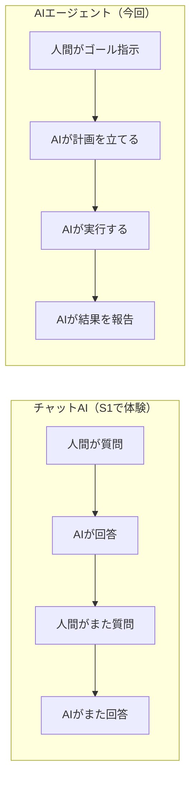
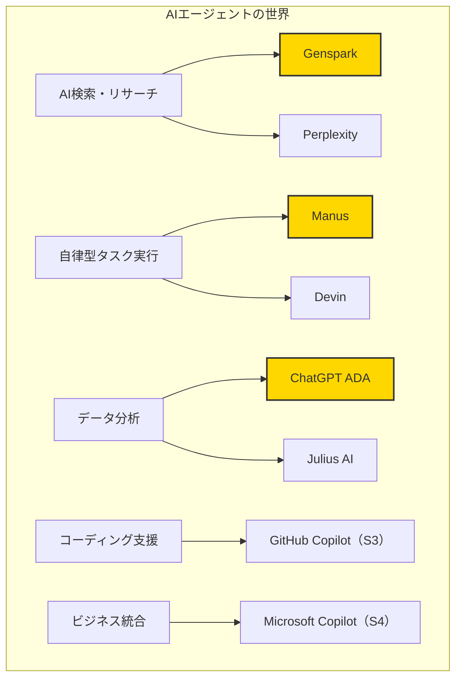
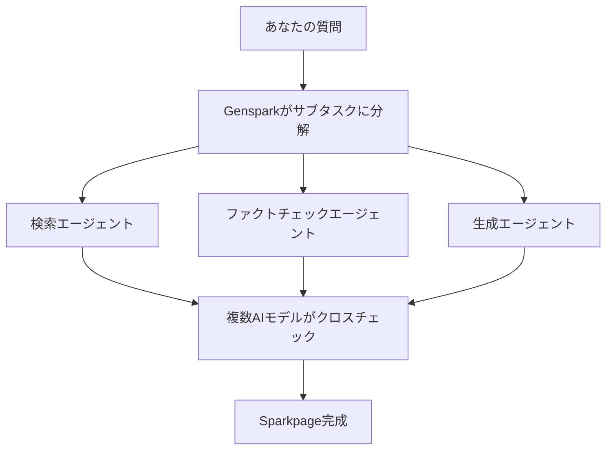
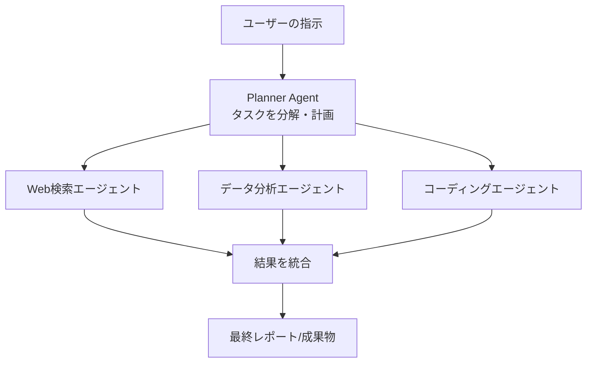
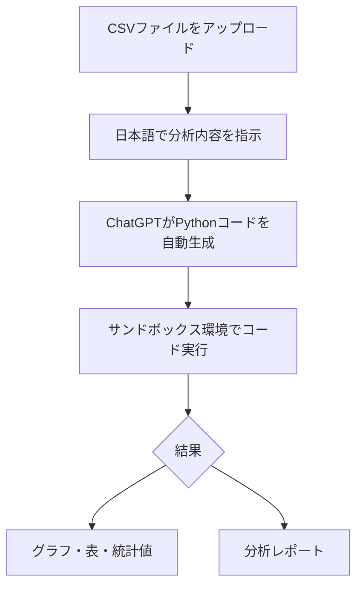
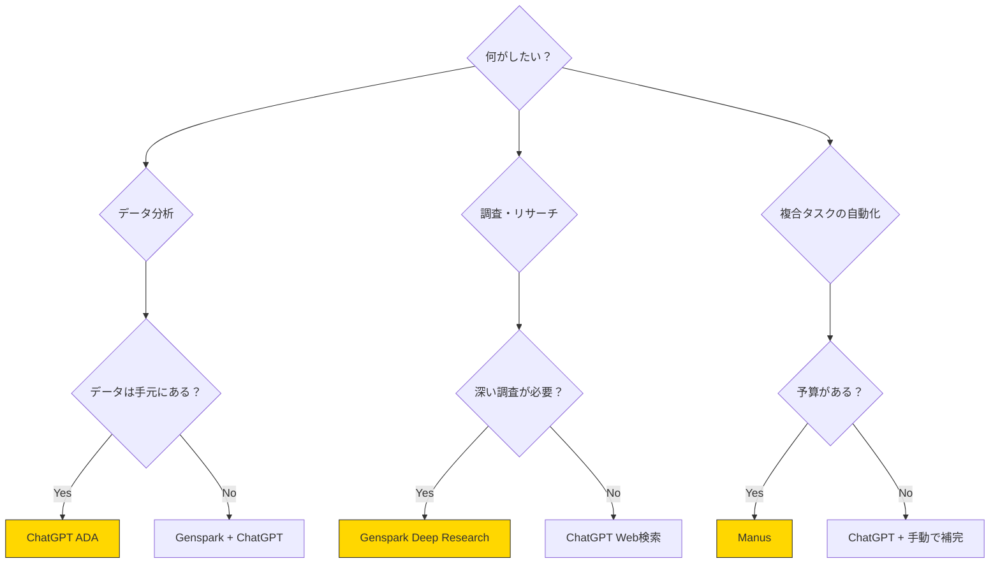
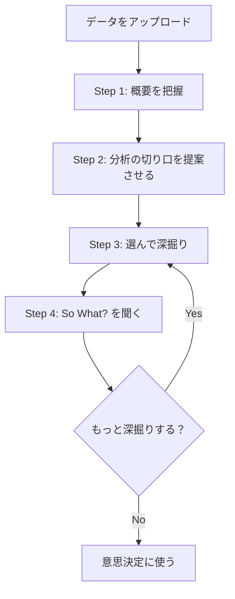
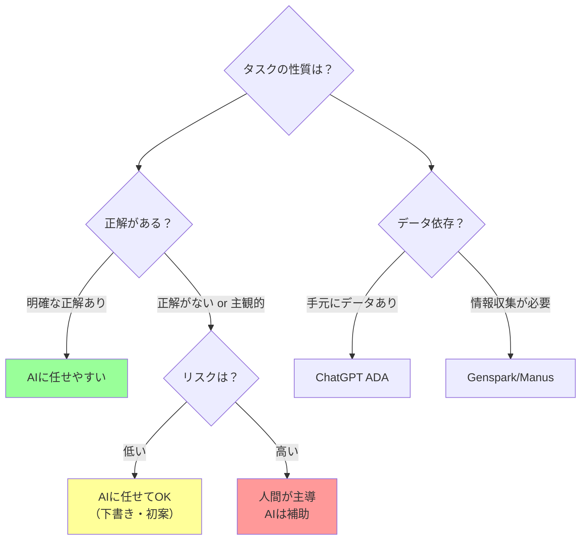

# AIエージェント × データ分析 — AIに「やらせる」時代の歩き方

> **Note:** **この記事のゴール**: AIエージェントに調査・分析タスクを実際に任せて、「指示する側」の視点を身につける。

## はじめに — 「お願い」と「丸投げ」の違い

[S1](./ml-spinoff-01.md)でChatGPTやClaudeに質問してみたとき、こんな感覚があったはずだ。

「質問したら答えが返ってきた。便利だ」

でも考えてみてほしい。あのとき僕らがやっていたのは**会話**だ。質問して、答えをもらって、また質問して……。つまり、常に人間が主導権を握っていた。

ところが最近、AI界隈でよく聞くようになった言葉がある。

**AIエージェント**。

これは「会話するAI」とは根本的に違う。エージェントは**自分で考えて、自分で動く**。ゴールだけ伝えれば途中のステップを自分で組み立てて実行してくれる。

- **チャットAI** → 図書館の司書。「この本ある？」と聞くと探してくれる。でも聞かなければ動かない
- **AIエージェント** → 調査チームのリーダー。「この市場について調べて報告書にまとめて」と言えば、勝手に情報を集めて、分析して、レポートを作ってくれる

> **Note:** **前提知識**: [S1（AI概論）](./ml-spinoff-01.md)と[S2（プロンプト設計）](./ml-spinoff-02.md)を読んでいるとスムーズ。特にS2の「プロンプトの書き方」はデータ分析でも直接使える。

---

## チャットAI vs AIエージェント — 何が違うのか？

[S1](./ml-spinoff-01.md)で触れたChatGPTやClaudeは、基本的に**リアクティブ**（受動的）なシステムだ。一方、AIエージェントは**プロアクティブ**（能動的）。ゴールを与えると、自分でサブタスクに分解し、必要なツールを選び、Webを検索し、コードを書き、ファイルを操作する。

| | チャットAI | AIエージェント |
|:--|:--|:--|
| **動き方** | 1問1答 | ゴール→計画→実行→報告 |
| **人間の関与** | 毎ターン指示が必要 | 最初のゴール指示だけ |
| **ツール利用** | 限定的 | Web検索・ファイル操作・API連携・コード実行を自律的に組み合わせる |
| **失敗時** | 人間が修正指示 | 自分でリトライ・別手段を試す |
| **代表例** | ChatGPT（通常会話）、Claude | Genspark、Manus、ChatGPT+Code Interpreter |

> **Note:** **ポイント**: チャットAIは「便利な相談相手」、AIエージェントは「仕事を任せられる部下」。ただし、「部下」の判断力をどこまで信用するかは別問題。

### ただし、完璧ではない

2026年2月時点のAIエージェントは**まだ発展途上**だ。

- 指示の解釈を間違えることがある
- 途中で止まることがある（ネットワークエラーや処理タイムアウト）
- 古い情報を最新として返すことがある
- 「分かりました」と言いながら実は分かっていないことがある

「万能の部下」というよりは、「優秀だけど入社3ヶ月目の新人」くらいのイメージが近い。仕事は速い。アウトプットの見た目はきれい。でも、ときどき根本的な理解が欠けている。

**AIエージェントは使うべきだが、信じすぎてはいけない**。「信頼するが、検証する」。この姿勢が最も合理的だ。

この「Trust but verify（信頼するが検証する）」は、元々は冷戦時代の核軍縮交渉で使われた原則だ。相手を信用しないと物事は進まない。でも、検証しないと大事故が起きる。AIエージェントとの付き合い方は、まさにこの原則そのものだ。

### AIエージェントの全体マップ

黄色いボックスが今回詳しく扱うツール。今回のGenspark・Manus・ChatGPT ADAは、「調べる」「分析する」「まとめる」という知的作業全般を自動化してくれる**汎用的**なエージェントだ。

「エージェント」という言葉の歴史

「エージェント」（agent）は英語で「代理人」を意味する。AI分野では1990年代から使われてきた言葉だが、2023年以降の文脈では特に「自律的にツールを使いこなすAIシステム」を指す。

「AIエージェント」が「チャットAI」と決定的に異なるのは**ツール使用**（tool use）の能力だ。Web検索、ファイル操作、コード実行、API呼び出し——これらの「道具」を**自分で選んで使える**のがエージェント。

ちなみに、人間も「道具を使えること」が他の動物との決定的な違いの1つ。AIが道具を使えるようになったのは、ある意味で大きな転換点だ。

---

## Genspark — AI検索を超えた「スーパーエージェント」

Genspark（ジェンスパーク）は、元Baidu幹部が設立したAI企業が開発する**オールインワンAIワークスペース**だ。最大の特徴は**Sparkpage** — 質問を投げると、**専用のWebページが自動生成**される。見出し、要約、引用元、関連情報が構造化されて並ぶ、あなた専用のリサーチレポートだ。

Gensparkは**マルチエージェントシステム**を使っている。情報収集・ファクトチェック・テキスト生成をそれぞれ別のエージェントが担当し、互いにクロスチェックする。

これは新聞社の編集部に似ている。記者（情報収集）が記事を書き、校正担当（ファクトチェック）が事実確認し、デスク（生成）が最終稿を整える。1人の記者に全てを任せるより、分業した方が品質が上がる。AIの世界でも同じ発想が使われている。

### Perplexity・Google AI Overviewとの違い

| | Google AI Overview | Perplexity | Genspark |
|:--|:--|:--|:--|
| **出力形式** | 検索結果上に要約 | テキスト回答+ソースリンク | 専用Webページ（Sparkpage） |
| **深さ** | 浅い（数行） | 中程度 | 深い（構造化レポート） |
| **ファクトチェック** | なし | ソース引用あり | マルチモデルクロスチェック |
| **エージェント性** | なし | 低い | 高い |

### 料金プラン（2026年2月時点）

| プラン | 月額 | 主な特徴 |
|:--|:--|:--|
| **Free** | $0 | 基本的な検索・Sparkpage生成 |
| **Plus** | $24.99（年払いで$19.99） | 10,000クレジット/月、画像・動画モデル利用可 |
| **Pro** | $249.99 | ヘビーユーザー向け・大容量 |

[NEEDS VERIFICATION: 2026-02 — 料金は変動する可能性あり]

<https://www.genspark.ai/>

### ハンズオン — Gensparkで調査タスクを任せてみよう

**ステップ1**: [genspark.ai](https://www.genspark.ai/) にアクセスしてアカウント作成（Google連携で一瞬）

<!-- screenshot: Gensparkサインアップ画面 -->

**ステップ2**: 検索バーに調査テーマを入力。例: 「2026年の生成AI市場規模と主要プレイヤー」

**ステップ3**: Sparkpageが自動生成されるのを待つ（通常30秒〜2分）

**ステップ4**: 完成したSparkpageを確認。見出し構成、引用元、データの信頼度をチェック

<!-- screenshot: 完成したSparkpage -->

### Gensparkを使うコツ

Gensparkは「検索ワード」を入れるよりも、「リサーチの目的」を伝えた方が良い結果が出る。[S2](./ml-spinoff-02.md)で学んだプロンプト設計がここで活きる。

**重要な原則: エージェントへの指示は、人間への指示と同じ精度が必要。**

相手が優秀な人間であっても、「いい感じにやって」と言ったら結果はバラバラになる。AIエージェントも同じ。

**あまり良くない指示:**
> 「AI エージェント 比較」

**良い指示（目的を明示）:**
> 「中小企業のマーケティング部門がAIエージェントを導入する場合、どのサービスが最適か検討するためのレポートを作成してほしい。予算は月3万円以内、主な用途は市場調査とレポート作成」

**さらに良い指示（制約と出力形式を明示）:**
> 「以下の条件で、2026年に利用可能なAIエージェントサービスの比較レポートを作成してほしい。
> - 対象: Genspark、Manus、ChatGPT、Perplexity、Claude
> - 比較軸: 料金、日本語対応、データ分析能力、セキュリティ
> - 出力形式: 比較表 + 各サービスの強み弱みを3行以内で
> - 対象読者: IT部門の意思決定者」

[S2](./ml-spinoff-02.md)の「制約条件を明示する」テクニックそのもの。ツールが変わっても、プロンプトの原則は同じ。

### リサーチワークフローの実例

Gensparkの真価が発揮されるのは、**段階的なリサーチ**だ。

**ステップ1（広域スキャン）**: 「2026年の生成AI市場の全体像を教えて」
→ Sparkpageで市場規模、主要プレイヤー、トレンドの概観が出る

**ステップ2（深掘り）**: Step1のSparkpageを見て、気になったトピックをさらに掘る。「Sparkpageで触れていた○○について、もっと詳しく調べて」
→ フォローアップ質問で、ピンポイントの深掘りが可能

**ステップ3（比較・評価）**: 「Step1とStep2の情報を踏まえて、A社とB社のどちらが市場でリードしているか、根拠付きで評価して」
→ 複数のSparkpageの情報を統合した分析

この**3ステップ・リサーチ**は、人間がGoogleで手動検索するよりも圧倒的に速い。ただし、結果の**ファクトチェック**は人間の仕事だ。Sparkpageの引用元を必ず確認する。

### Gensparkの弱点

- **日本語の情報源が弱い**: 英語ソースが中心。日本語ローカルの情報（地方自治体の施策、日本固有の法規制など）は弱い
- **リアルタイム性に限界**: 超最新情報（直近数日のニュース）はGoogle検索の方が速い
- **深い専門知識には限界**: 医学、法律などは必ず人間の専門家が確認すべき
- **バイアスの透明性**: どの情報を「重要」と判断したかの基準が見えない
- **情報の鮮度が不明**: Sparkpageに載っている情報がいつのものかが分かりにくい

### Gensparkの結果を検証する方法

Sparkpageは便利だが、「できたSparkpageをそのまま信用する」のは危険だ。以下の検証プロセスを推奨する。

1. **引用元のリンクを3つクリックして確認** — リンク切れや内容の不一致がないか
2. **数値データは原典に当たる** — 「市場規模○○億ドル」と書いてあったら、元のレポートを探す
3. **日付を確認** — 2023年のデータを「最新」として提示していないか
4. **反対意見を検索** — Sparkpageは一方的な見方になっていないか、Google検索で反対意見を探す

この検証に15分かける価値がある。検証しない分析は、分析ではなく**推測**だ。

Gensparkの裏側 — どんなAIモデルが動いているか

GensparkはGPT-4、Claude、Geminiなど複数のモデルを内部で使い分けている（公式に明言されているわけではないが、出力の特徴から推測されている）。

「マルチエージェント」と銘打っているのは、情報収集・ファクトチェック・テキスト生成をそれぞれ別のAIが担当しているため。1つのAIに全てをやらせるより、役割分担した方が精度が上がる——これは[S7の🔬考察](#考察-エージェントの判断は信用できるか)にもつながる話。

ただし、マルチエージェントだからといって「100%正確」ではない。クロスチェックにも限界がある。

---

## Manus — 「丸投げ」できる自律型AIエージェント

Manus（マヌス）は、シンガポール発の**完全自律型AIエージェント**だ。「リサーチしてレポートにまとめて」だけでなく、「コードを書いて」「ファイルを整理して」まで、**マルチステップのワークフロー全体を自律的に実行**する。

2025年12月、MetaがManusを**約20億ドル（約3,000億円）で買収**。WhatsApp BusinessやInstagram Directへの統合が2026年中盤に予定されている。

この買収は、AIエージェントが「実験的な技術」から「主流のビジネスインフラ」に移行していることの象徴だ。Metaは30億人のユーザーベースにManusの技術を統合しようとしている。

Manusの面白いところは**単一のAIモデルに依存しない**点。タスクの性質に応じて、ステップごとに最適なモデルを選ぶ。検索にはGPT系、データ処理にはClaude系——のように、「エージェントが別のAIを道具として使う」構造だ。

これは人間のプロジェクトマネージャーに似ている。PM自身が全ての作業をするのではなく、「この作業はAさん」「あの作業はBさん」と適材適所で振り分ける。

### Gensparkとの違い — 「検索」vs「実行」

| | Genspark | Manus |
|:--|:--|:--|
| **核心** | 情報を集めてまとめる | タスクを計画して実行する |
| **たとえ** | 優秀な図書館司書+ライター | 優秀なプロジェクトマネージャー |
| **得意** | リサーチ、レポート、比較分析 | 複数ステップの作業、コード実行 |
| **苦手** | コード実行、ファイル操作 | 単純な検索（オーバースペック） |

### 料金プラン（2026年2月時点）

| プラン | 月額 | クレジット |
|:--|:--|:--|
| **Free** | $0 | 300クレジット/日 |
| **Standard** | $20 | 4,000 |
| **Customizable** | $40 | 8,000 |
| **Extended** | $200 | 40,000 |

[NEEDS VERIFICATION: 2026-02 — Meta買収後にプラン変更の可能性あり]

> **⚠️ Warning:** **クレジットの罠に注意**: Manusのクレジット消費量は**タスクの複雑さに比例**し、事前に見積もりが表示されない。まずは無料クレジットで感触をつかんでから課金を検討すべき。

<https://manus.im/>

### ハンズオン — Manusに「丸投げ」してみよう

**ステップ1**: [manus.im](https://manus.im/) にアクセスしてアカウント作成

**ステップ2**: タスクを入力。例: 「日本の主要都市（東京、大阪、名古屋、福岡）の平均家賃を調べて、比較表とグラフを作成してほしい」

> **Note:** **プロンプトのコツ**: [S2](./ml-spinoff-02.md)の原則がここでも使える。「比較表を作って」より「以下の項目を含む比較表を作って: 都市名、1LDK平均家賃、前年比変動率、データの出典」の方が良い結果が出る。**出力形式を明確に指定する**のがManusを使いこなすコツ。

**ステップ3**: Manusがタスクを分解して実行。**リアルタイムで進捗が見える**

ここがManusの面白いところ。画面上に「今何をしているか」がリアルタイムで表示される。「Webを検索中」「データを抽出中」「グラフを生成中」——まるで優秀なアシスタントの作業を後ろから見ているような体験。

**途中で介入もできる。** 明らかに間違った方向に進んでいたら、指示を追加できる。

**ステップ4**: 完成した成果物を確認

<!-- screenshot: Manus完成レポート -->

### Manusを使うときの注意点

1. **タスクの粒度を適切にする** — 「30分〜2時間で終わる」レベルが最適
2. **機密情報に注意** — クラウドで実行される。[S4](./ml-spinoff-04.md)のプライバシー原則はここでも適用
3. **結果を必ず検証する** — 完成した成果物を「信用する前に確認する」を習慣に

### Manusの成功パターンと失敗パターン

成功しやすいタスク:
- **定型リサーチ**: 「○○業界の主要10社を調べて、売上・従業員数・設立年の比較表を作って」
- **データ変換**: 「このCSVをExcelのピボットテーブル形式に変換して」
- **構造化レポート**: 「○○について、課題・原因・対策の3部構成でレポートを書いて」

失敗しやすいタスク:
- **曖昧な指示**: 「いい感じのレポートを作って」→ Manusは「いい感じ」を解釈できない
- **超長時間タスク**: 100ステップ以上のワークフロー → 途中で止まりやすい
- **最新情報が必要**: 「今日のニュースをまとめて」→ リアルタイムデータのアクセスに限界
- **創造的な判断**: 「どちらのデザインがいいか選んで」→ 美的判断は苦手

> **Note:** **筆者の実感**: Manusは「指示を明確にするほど良い結果が出る」ツール。曖昧さを排除して、ゴール・手順・出力形式を具体的に書くのがコツ。

### Manusの弱点

- **クレジット消費が不透明**: 同じ指示でもバラつきがある。事前に見積もりが出ない
- **日本語対応は改善途中**: 日本語ソースの調査力は英語に比べて弱い
- **長時間タスクの安定性**: 30分以上のタスクは途中で止まることがある
- **結果の再現性が低い**: 同じ指示で2回実行しても、違う結果が返ってくることがある
- **エラー時のリカバリーが弱い**: 途中でエラーが発生すると、最初からやり直しになることがある

### Genspark vs Manus — どちらを選ぶ？

迷ったときの判断基準:

| 条件 | おすすめ |
|:--|:--|
| 「〇〇について調べて」| Genspark — リサーチ特化 |
| 「〇〇を作って」| Manus — 実行特化 |
| 予算が限られている | Genspark（無料枠が太い）|
| 複数ステップの作業 | Manus（タスク分解が得意）|
| 日本語の情報が中心 | どちらも弱い（ChatGPT ADA推奨）|
| データ分析 | ChatGPT ADA一択 |

結論: **「調べる」ならGenspark、「作る」ならManus、「分析」ならChatGPT ADA**。この使い分けが2026年2月時点のベストプラクティスだ。

---

## ChatGPT Advanced Data Analysis — データを投げてAIに分析させる

ChatGPTの**Advanced Data Analysis**（旧Code Interpreter）は、CSVやExcelファイルをアップロードすると、AIが**自動的にPythonコードを書いて実行**し、分析・可視化をしてくれる機能だ。

**コードを一切書かなくていい。** 「このCSVの売上データで月別のトレンドをグラフにして」と日本語で頼むだけ。

ここが他のAIエージェントとの決定的な違い。GensparkやManusは「テキストレポート」を生成するが、ChatGPT ADAは**実際にPythonコードを実行して、計算結果やグラフを返す**。つまり、AIの「推測」ではなく、コードの「計算結果」を得られる。

ただし、注意点がある。**AIが書いたコードが正しいかどうかは別問題**。コードは実行されるが、「正しいコード」が実行されたかどうかを判断するのは人間だ。「コードを見せて」と指示して、処理内容を確認する習慣をつけよう。

### 料金とアクセス方法（2026年2月時点）

| プラン | 月額 | Advanced Data Analysis |
|:--|:--|:--|
| **Free** | $0 | GPT-4o-miniベース、基本的なファイル分析可能（制限あり） |
| **Go** | $5 | GPT-5.2 Instant、Freeの10倍のメッセージ量 |
| **Plus** | $20 | GPT-5フルアクセス、高度な推論・大量データ対応 |

[NEEDS VERIFICATION: 2026-02 — Goプランは新設されたばかりで仕様変更の可能性あり]

<https://chatgpt.com/>

### ハンズオン — CSVファイルをChatGPTに分析させよう

**ステップ1**: ChatGPTを開く（無料アカウントでOK）

**ステップ2**: 📎（クリップ）アイコンからCSVファイルをアップロード

**ステップ3**: 分析指示を入力

> 「このCSVファイルを分析してください。以下をお願いします:
> 1. データの概要（行数、列数、欠損値の有無）
> 2. 月別売上の推移グラフ
> 3. カテゴリ別の売上比率（円グラフ）
> 4. 最も売上が伸びている月と、その要因の仮説」

**ステップ4**: ChatGPTがPythonコードを生成・実行し、結果が返ってくる

<!-- screenshot: ChatGPT分析結果（グラフ付き） -->

**ステップ5（推奨）**: フォローアップで深掘りする

> 「使ったPythonコードを全て見せてください。特にデータの前処理で行ったことを説明してください」

これで、AIが勝手にやったデータ処理（欠損値の補完、型変換、外れ値の除去など）を確認できる。**この確認をするかしないかで、分析の信頼度が劇的に変わる**。

> **⚠️ Warning:** **重要**: ChatGPTにアップロードするデータには**機密情報を含めないこと**。[S4](./ml-spinoff-04.md)で触れたプライバシーの問題はここでも同様。

### 実践: データ分析プロンプトテンプレート集

コピーして使えるテンプレートを3つ用意した。

**テンプレート1: 初回分析（概要把握）**

> このCSVファイルを分析してください。
> 1. データの概要（行数、列数、データ型、欠損値の有無と件数）
> 2. 各数値列の基本統計量（平均、中央値、標準偏差、最小、最大）
> 3. 日付列がある場合、期間の範囲
> 4. 注意が必要なデータの特徴があれば指摘してください
> ※ まだ分析は始めないでください。概要を見てから指示します。

**テンプレート2: 仮説検証型**

> 仮説: [具体的な仮説を書く]
> この仮説をデータから検証してください。
> - 支持する証拠と反証する証拠の両方を示すこと
> - 統計的有意性（p値）を示すこと。ただしp値の解釈に関する注意も添えること
> - サンプルサイズが統計検定に十分か判断すること
> - 結論は「支持/不支持/判断保留」の3択で

**テンプレート3: アクション提案型**

> この分析結果を踏まえて、来月取るべきアクションを提案してください。
> - 「確度が高い施策」と「検証が必要な施策」を分けること
> - 各施策の期待効果と実現の難易度を高/中/低で示すこと
> - 「やらない方がいいこと」も1つ挙げること

> **Note:** **テンプレートの使い方**: そのまま使ってもいいが、**自分の文脈に合わせてカスタマイズ**する方が圧倒的に良い結果が出る。テンプレートは「出発点」であって「正解」ではない。

### ChatGPT Advanced Data Analysisの限界

- **大きなファイルは苦手**: 数十万行超はエラーになりやすい。大量データはBigQueryやDatabricksなど専用ツールを使うべき
- **リアルタイムデータは扱えない**: アップロードしたファイルのみ。ストリーミングデータは不可
- **高度な統計手法には限界**: ベイズ統計や高度な時系列モデルは精度が怪しい。結果を統計の専門家に確認すべき
- **グラフのデザインは最低限**: 見た目にこだわる場合はExcelやTableauで再加工
- **データの前処理を勝手にやる**: 欠損値の処理やデータ型の変換を、説明なしに行うことがある
- **セッションが切れるとデータが消える**: 長時間の分析セッションでタイムアウトすると、アップロードしたデータが失われる。重要な分析結果はこまめにダウンロードする

### 他のデータ分析ツールとの比較

ChatGPT ADA以外にも、AIデータ分析ツールは存在する。

| ツール | 特徴 | 向いている人 |
|:--|:--|:--|
| **ChatGPT ADA** | 自然言語で指示できる。コード不要 | 非エンジニア、初心者 |
| **Julius AI** | データ分析特化。可視化が美しい | マーケター、ビジネスアナリスト |
| **Jupyter + Copilot** | Pythonコードを書きながらAI支援 | エンジニア、データサイエンティスト |
| **Tableau + AI** | BIツール+AI分析 | 企業のデータチーム |

非エンジニアがデータ分析を始めるなら、**ChatGPT ADAが最もハードルが低い**。ゼロからPythonを学ぶ必要がない。

ただし、**「最初の分析」としてはこれで十分すぎる**。

どのツールをいつ卒業するか

ChatGPT ADAは「入口」として最強。でも、データ分析を本格的にやるなら、いずれは限界にぶつかる。

**ChatGPT ADAの限界が見えてくるタイミング:**
- 10万行以上のデータを日常的に扱うようになったとき
- 同じ分析を毎日自動実行したくなったとき
- 複数のデータソースを結合して分析したくなったとき
- チームで分析結果を共有・再現したくなったとき

**次のステップの選択肢:**
- データ量の問題 → BigQuery、DuckDB
- 自動化の問題 → Python + pandas（Jupyterノートブック）
- チーム共有の問題 → Tableau、Looker Studio
- 全部の問題 → Python本格学習（本編Course Iの数学知識が活きる）

今は気にしなくていい。ChatGPT ADAで十分な間は、ChatGPT ADAを使い倒そう。

### 分析の質を上げるテクニック

ChatGPT ADAで「それなりの分析」ではなく「使える分析」を引き出すコツがある。

**1. 分析の目的を先に伝える**

> 「このCSVは飲食店の売上データです。目的は『来月の仕入れ量を決めるため』です。その目的に最適な分析をしてください」

目的を伝えるだけで、AIが「売上トレンド」ではなく「曜日別・メニュー別の需要予測」に焦点を当てた分析をしてくれる。

**2. 「なぜ？」を聞き続ける**

AIが「8月の売上が最高です」と返したら、「なぜ8月が最高なのか、仮説を3つ挙げて」と聞く。さらに「その仮説を検証するためにどんなデータが必要か」と聞く。

1回の分析で終わらせない。**AIとの対話で深掘りする**。

**3. 可視化の形式を指定する**

> 「折れ線グラフではなく、月別×カテゴリ別のヒートマップで表示して。色は売上が高いほど濃い赤にして」

ChatGPT ADAは可視化の指示にかなり忠実に応える。具体的に指定すれば、プレゼン資料にそのまま使えるグラフが出てくる。

**4. 複数の切り口を自動で試させる**

> 「このデータを5つの異なる切り口で分析して、最も面白い発見を教えて」

「面白い」は曖昧な指示だが、ChatGPTはそれなりに「統計的に有意な相関」や「予想外のパターン」を見つけてくれる。発見の質は人間がジャッジする。

🧮 数式で覗いてみる: 期待値と分散 — AIの統計的誤りを見抜く

AIがデータ分析で出す数字を「見抜く」ために知っておくべき武器。**期待値**と**分散**だ。

$$
E[X] = \sum_i x_i P(x_i), \quad \text{Var}(X) = E\left[(X - E[X])^2\right]
$$

| 概念 | 直感 | 具体例 |
|:--|:--|:--|
| **期待値** $E[X]$ | データの「重心」 | 「平均年収は500万円」 |
| **分散** $\text{Var}(X)$ | データの「ばらつき」 | 「年収のばらつきが大きい」 |

AIに「このデータの特徴を教えて」と聞くと、平均値を中心に説明してくることが多い。でも、**平均だけ見ると騙される**。

例: チームAは毎月ほぼ100万円（分散小）、チームBはある月0円・ある月200万円（分散大）。どちらも平均は100万円だが、ビジネス上の意味は全然違う。

対策: AIにデータ分析をさせたら、必ず「**ばらつき（標準偏差や分散）も出して**」と指示する。

本編Course Iの確率・統計パートで詳しく扱う。

---

## 3つのツールを比較する

| | Genspark | Manus | ChatGPT ADA |
|:--|:--|:--|:--|
| **得意分野** | AI検索・リサーチ | 自律タスク実行 | データ分析・可視化 |
| **自律度** | 中〜高 | 高 | 中 |
| **データ分析** | △ | ○ | ◎ |
| **リサーチ** | ◎ | ○ | △ |
| **無料枠** | あり | あり（日300クレジット） | あり |
| **有料最安** | $24.99/月 | $20/月 | $5/月（Go） |
| **日本語対応** | 弱い | 弱い | 強い |
| **筆者おすすめ度** | ★★★★☆ | ★★★☆☆ | ★★★★★ |

> **Note:** **筆者の本音**: データ分析ならChatGPT ADAが圧倒的にコスパがいい。リサーチ+レポートならGenspark。Manusは「自律性」のコンセプトは素晴らしいが、クレジットの不透明さが難点。
>
> **初心者へのおすすめ**: まずChatGPT ADA（無料枠あり）から始めて、データ分析の感覚をつかもう。その後にGensparkでリサーチを試す。Manusは「2つとも使いこなしてからでいい」。

### 使い分け早見チャート

---

## AIに「何を聞けばいいか」を聞く — 分析の問いの立て方

ツールの使い方よりもっと大事なことがある。**何を分析するか。何を聞くか。**

### 「分析して」は最悪のプロンプト

良い分析は**良い問い**から始まる。そして面白いことに、**AIに問いの立て方自体を相談できる**。

**ステップ1**: 「このCSVのデータの概要を教えて」— いきなり分析に入らない

**ステップ2**: 「このデータから分かりそうな、ビジネス上の意思決定に役立つ分析の切り口を5つ提案して」— **AIに「何を分析すべきか」自体を考えさせる**

**ステップ3**: 提案から自分の文脈で判断して選ぶ

**ステップ4**: 「この分析結果から、来月の戦略としてどんなアクションが考えられる？」

**ステップ5（オプション）**: 「今の分析結果に反論するとしたら？」— [S2](./ml-spinoff-02.md)のDevil's Advocateテクニックの応用

### 「分析の問い」の良い例・悪い例

| 悪い問い | 良い問い | なぜ良いか |
|:--|:--|:--|
| 「このデータを分析して」 | 「売上が下がっている原因の仮説を3つ、データから検証して」 | ゴールが明確で、数量も指定 |
| 「トレンドを教えて」 | 「過去12ヶ月で最も変化率が大きかった指標はどれか」 | 「トレンド」より具体的 |
| 「予測して」 | 「現在の傾向が続いた場合の3ヶ月後の売上を、過去データの季節性を考慮して予測して」 | 条件と手法を明示 |
| 「面白い発見は？」 | 「他のカテゴリと比べて異常に高い/低い値を持つカテゴリはあるか」 | 「面白い」を定義 |

問いの質 = 分析の質。これはAI時代にますます重要になる。

> **Note:** **これがメタスキル**: ツールの操作方法は変わる。でも「良い問いを立てる力」は、どんなツールを使っても通用する。

### 「So What?」の連鎖 — 分析を意思決定に変える

データ分析で最も多い失敗は、「分析して満足する」こと。きれいなグラフができた。相関が見つかった。でも——**だから何？**

**「So What?」（だから何？）を3回繰り返す**のが、分析を意思決定に変えるテクニックだ。

例:
1. 分析結果: 「8月の売上が最高」→ **So What?** → 「夏に需要が増える」
2. → **So What?** → 「7月から仕入れを増やすべき」
3. → **So What?** → 「7月のキャッシュフローに余裕を持たせるために、6月に資金計画を立てる」

3回目の「So What?」で初めて**具体的なアクション**に到達する。AIは1回目の分析（数字の発見）は得意だが、3回目（ビジネスアクションへの変換）は苦手。ここは人間の領域だ。

「So What?」テンプレート

ChatGPT ADAで分析した後に、このプロンプトを追加する:

> この分析結果から:
> 1. 最も重要な発見は何か（1つだけ）
> 2. その発見が意味すること（So What?）
> 3. 具体的に来週やるべきアクション（1つだけ）
> 4. そのアクションを取らなかった場合のリスク

AIの回答を「たたき台」として、自分のビジネス文脈で修正する。

---

## 数字を鵜呑みにしない — AIの統計的誤りを見抜く

AIにデータ分析をさせると、もっともらしい数字とグラフが返ってくる。しかし、その結果を鵜呑みにすると痛い目を見る。

### AIが犯しやすい統計的な間違い

**1. 相関と因果の混同**

「相関係数0.82」と返っても、因果関係があるとは限らない。AIはこの区別を明示的には教えてくれないことが多い。

有名な例: 「アイスクリームの売上と溺死事故の件数には強い相関がある」— でもアイスクリームが溺死の原因ではない。どちらも「夏」という共通の原因で増える（交絡変数）。

AIに「この2つの変数に相関がある」と言われたら、必ず「因果関係はあるのか？交絡変数はないか？」と問い返す。

**2. サンプルサイズの無視**

30件のデータで「統計的に有意」と言われたら要注意。AIに「サンプルサイズは統計検定に十分か？」と聞くと、正直に「不十分かもしれない」と答えてくれることもあるが、聞かないと教えてくれない。

**3. 欠損値の自己判断処理**

AIは勝手に「平均値で埋める」「その行を削除する」などの処理をし、**何をしたか説明しないまま結果だけ返す**ことがある。

対策: 「欠損値をどう処理したか、全て説明して。処理前と処理後のデータ件数も教えて」と最初に聞く。

**4. 平均の罠**

「全店舗の平均売上は前年比5%増」でも、超大型店舗1つが伸びただけかもしれない。平均は**外れ値に引っ張られる**。

対策: 「平均だけでなく、中央値と標準偏差も出して。外れ値があるか確認して」と追加指示する。

**5. 生存者バイアス**

「AI導入企業の売上は平均20%増」は「成功した企業だけ」のデータかもしれない。AIはデータに含まれている情報しか分析できない。**データに含まれていない情報（失敗した企業のデータ）は見えない**。

**6. 外れ値の自動除去**

AIが「外れ値として除外しました」と言うことがある。統計的には正しい処理のように見えるが、その「外れ値」がビジネス上最も重要なデータポイントかもしれない。例えば、異常に高い売上日が実はキャンペーンの大成功日だった場合、それを「外れ値」として除去したら、キャンペーンの効果が見えなくなる。

**7. 時系列のトレンド誤認**

AIに時系列データを分析させると、短期的な変動を「トレンド」と誤認することがある。3ヶ月分のデータで「上昇トレンド」と言われても、それが本当のトレンドなのか、季節変動の一部なのかは分からない。

対策: 「このトレンドは季節性を考慮しているか？ 前年同期比も出して」と追加指示する。

### 防衛策 — 3つの習慣

| 習慣 | 具体的なアクション |
|:--|:--|
| **「どうやって計算した？」と聞く** | 「使ったコードを全部見せて」「欠損値をどう処理したか説明して」 |
| **サンプルサイズを確認する** | 「データは何行？統計検定に十分なサンプルサイズか判断して」 |
| **逆の仮説をぶつける** | 「この結果と矛盾するデータの解釈はある？」 |

> **⚠️ Warning:** **⚠️ 統計の「嘘」はAIのせいではない**: AIは指示されたことを実行しているだけ。問題は、結果を**検証せずに意思決定に使う人間の側**にある。

### 実例 — AIの分析がミスリードした場面

**シナリオ**: 飲食店の月次売上データをChatGPTに分析させた。

**AIの分析結果**: 「8月の売上が最高。夏季キャンペーンが効果的。来年も同時期にキャンペーンを強化すべき」

**一見正しそう。でも……** 実際には8月の売上が高い理由は「お盆の帰省客増加」と「近隣のイベント開催」であり、キャンペーンの効果ではなかった。ChatGPTはCSVの数字しか見ていないので、**データに含まれていない文脈（外部要因）を考慮できない**。

**教訓**: AIは「データに書いてあること」は分析できるが、「データに書いていないこと」は分析できない。文脈を持っている人間が、AIの分析結果に文脈を重ねて初めて、正しい意思決定ができる。

### もう1つの落とし穴 — 「もっともらしいグラフ」の罠

ChatGPT ADAが出すグラフは、見た目がきれいだ。色も配置もプロっぽい。これが罠。

**きれいなグラフは説得力がある。** でも、グラフの見た目と分析の正しさは別の話。

例えば:
- Y軸の範囲が操作されていて、微小な差が大きく見えている
- 相関関係のグラフなのに、因果関係があるかのようにキャプションが付いている
- 欠損値を補完した部分と実データの部分が区別されていない

対策: AIが出したグラフについて、以下を必ず確認する。
1. 「このグラフのY軸の範囲を変えて、0から始めたバージョンも見せて」
2. 「データの欠損値はどう処理した？」
3. 「この相関は因果関係を示しているわけではない、という注釈を加えて」

実例: Y軸の操作でどれだけ印象が変わるか

同じデータでも、Y軸の範囲を変えるだけで印象が劇的に変わる。

例: 月間売上が98万→102万に推移した場合
- Y軸を0〜200万にすると → ほぼ横ばいに見える（実態に近い）
- Y軸を96万〜104万にすると → 急激な成長に見える（ミスリーディング）

ChatGPT ADAはデフォルトで「データに合わせたY軸」を設定するので、後者のようなグラフが生成されやすい。数字を見ずにグラフの「形」だけで判断すると、4%の変動を「急成長」と誤解する。

**習慣**: グラフを受け取ったら、まずY軸のスケールを確認する。

### 「再現性」を確認する — 同じ分析を2回やる

ChatGPT ADAの分析結果には**再現性の問題**がある。同じデータ、同じ指示でも、**2回目に異なるコードが生成される**ことがある。

これはバグではなく、AIの確率的な性質の帰結だ。でも、意思決定に使う分析であれば、再現性の確認は必須。

**確認方法:**
1. 同じCSVと同じ指示で、別セッションでもう一度分析させる
2. 主要な数値（平均値、相関係数、トレンドの方向）が一致するか確認
3. 一致しない場合、どちらが正しいかを「使ったコードを見せて」で確認

一致していれば信頼度が高い。不一致なら、コードを見て**どちらの処理が適切か自分で判断する**。

> **Note:** **この記事の核心メッセージ**: AIエージェントは「分析」してくれる。でも「判断」するのは人間。この2つは別物。

---

## 🔬 考察: エージェントの「判断」は信用できるか？

ちょっと立ち止まって考えてみたい。

今回紹介したツール、特にGensparkやManusは「自律的に判断して動く」ことを売りにしている。便利だ。間違いなく便利だ。

でも、**その判断は信用できるのだろうか？**

### 自律性のパラドックス

GensparkのSparkpageはきれいに構造化されていて、引用元も付いている。でも、**情報の取捨選択を誰がしたか**を考えると、少し不安にならないだろうか。

人間がGoogleで検索するとき、検索結果の一覧を見て「これは信頼できそう」「これは広告っぽい」と自分でフィルタリングする。GensparkのSparkpageは、この**フィルタリングをAIが代行している**。

便利だ。でも、AIのフィルタリング基準は不透明だ。「なぜこの情報を選んだのか」「なぜあの情報を除外したのか」は、ユーザーには見えない。

これが**自律性のパラドックス**。AIに多くを任せるほど便利になるが、判断のプロセスが不透明になり、結果の検証が難しくなる。

### 「根拠を説明して」と言ってみると

AIエージェントに「なぜその判断をしたのか」と聞くと、面白いことが起きる。

- もっともらしい説明が返ってくる
- だが、その説明が**後付けっぽい**ことが多い
- 同じ質問を別の聞き方で投げると、**違う根拠が返ってくる**

これは[S2](./ml-spinoff-02.md)の考察で触れた「AIは本当に考えているのか？」につながる。AIの「判断」は、**トレーニングデータのパターンから最も確率の高い出力を選んでいるだけ**かもしれない。

### 「説明」と「理解」は違う

人間が説明するとき、そこには**理解**が伴っている。AIが説明するとき、そこにあるのは**パターンマッチング**だ。外から見ると両方とも「AだからB」と言っている。**出力は同じ**。でも**内部のプロセスは全然違う**。

これを確かめる方法がある。**反実仮想（counterfactual）の質問**をすることだ。

「もし○○だったとしたら、この判断は変わる？」

人間なら、理解に基づいて「はい、こう変わります。なぜなら〜」と**一貫性のある**回答ができる。AIは、新しいプロンプト（反実仮想の条件）に基づいて、**別のもっともらしい文章を生成する**。結果的に、元の判断と矛盾する回答が返ってくることがある。

この矛盾が出やすいのが、AIの「判断」が理解に基づいていない証拠だ。

> **Note:** **反実仮想テスト**: AIの回答を検証したいとき、「もし前提が逆だったら結論は変わるか？」と聞いてみる。人間なら一貫性を保てるが、AIは保てないことがある。

これが、AIエージェントの判断を「信用しすぎてはいけない」最も根本的な理由だ。

### 具体例 — AIエージェントの「判断」を検証してみる

面白い実験がある。AIエージェント（例えばManus）に「この3つの投資先から最適なものを選んで理由を説明して」とタスクを投げる。

1回目: 「A社を推奨します。理由は市場シェアが高く、成長率が安定しているため」
2回目（まったく同じ指示）: 「B社を推奨します。技術力が高く、競争優位性が明確なため」

AIは「A社が最善」と**判断**したのではなく、「A社を推奨する場合のもっともらしい文章」を**生成**しただけ。判断と生成は違う。

この検証を一度やってみると、AIの「判断」に対する自分のスタンスが根本的に変わる。

### 「信頼するが検証する」の実装方法

概念は分かった。じゃあ具体的にどうするか。

**レベル1（最低限）**: AIの分析結果に含まれる数字を1つ、原典で確認する
**レベル2（推奨）**: 同じタスクを2回投げて、結果を比較する。一致していれば信頼度が上がる
**レベル3（業務利用）**: AIの出力を「ドラフト」として扱い、人間がレビュー・編集してから使用する

レベル1すらやっていない人が多い。でも、**数字を1つ確認するだけで、信頼度の判断精度が劇的に上がる**。

🧮 数式で覗いてみる: ベイズ推定 — AIの「信念」はどう更新されるか

$$
P(\theta | \text{data}) = \frac{P(\text{data} | \theta) \cdot P(\theta)}{P(\text{data})}
$$

| 記号 | 読み方 | 直感 |
|:--|:--|:--|
| $P(\theta)$ | 事前確率 | 「データを見る前のAIの思い込み」 |
| $P(\text{data} \| \theta)$ | 尤度 | 「もしθが正しいなら、このデータが出る確率は？」 |
| $P(\theta \| \text{data})$ | 事後確率 | 「データを見た後の、更新された信念」 |

AIの場合、この更新プロセスが**人間にとって不透明**。だから「根拠が曖昧に見える」。

ベイズ推定自体は、本編Course Iの確率パートで扱う。

### 自律性と制御のトレードオフ

- **自律性を上げる** → 人間は楽になる → でも判断ミスのリスクが上がる
- **制御を残す** → 人間の確認コストがかかる → でも判断の質は担保できる

| レベル | 説明 | 例 |
|:--|:--|:--|
| 完全手動 | 全て人間が操作 | Google検索で手動調査 |
| 部分自動化 | AIが提案、人間が判断 | ChatGPT対話での分析 |
| 監視付き自律 | AIが実行、人間が監視 | Manus（途中介入可能） |
| 完全自律 | AIに丸投げ | 全自動で任せる |

2026年の今、多くの企業が「Human on the Loop」に移行しつつある。ただし、**きれいに整った出力を見ると、人間は「よさそうだ」と思ってしまう** — これが**オートメーション・バイアス**だ。

実例: オートメーション・バイアスの恐ろしさ

2025年、ある企業がAIエージェントに市場調査を任せた。レポートは完璧に見えた。グラフも美しく、引用も付いていた。

問題は、引用元の1つが**存在しない論文**だったこと。AIが「もっともらしい」論文名と著者名を生成していた。レポートはそのまま経営会議に提出され、その「存在しない論文」のデータを根拠に投資判断が行われそうになった。

偶然、チームメンバーの1人が引用を確認して発覚した。もし誰も確認しなければ——。

これがオートメーション・バイアスの実害。「AIが作ったから正しいだろう」という思い込みは、具体的な金銭的損害につながりうる。

対策はシンプルだが厳しい。**必ず1つの数字を原典で確認する**。**「もし逆だったら？」と考える**。**他の人にレビューさせる**。

### 自律度を自分でコントロールする

同じAIエージェントでも、使い方で自律度を調整できる。

**自律度を下げたい場合（リスクの高いタスク）:**
- 中間ステップごとに確認を入れる: 「まずデータの概要だけ教えて。その後の分析は私が指示する」
- 出力形式を厳密に指定する: 「箇条書き5項目、各項目に信頼度（高/中/低）を付けて」
- 判断を求めない: 「A案とB案のメリット・デメリットを並べて。選択は私がする」

**自律度を上げてもいい場合（低リスクのタスク）:**
- 初期リサーチ: 「この分野の全体像をまとめて」
- データの前処理: 「このCSVのクリーニングをして」
- 定型レポート: 「先月と同じフォーマットで今月のレポートを作って」

ポイントは、**タスクのリスクに応じて自律度を調整する**こと。全てを丸投げする必要はないし、全てを手動でやる必要もない。

🧮 数式で覗いてみる: 報酬関数 — エージェントの「判断基準」

$$
R(s, a) = \sum_{t=0}^{T} \gamma^t r_t
$$

| 記号 | 意味 | 直感 |
|:--|:--|:--|
| $s$ | 現在の状態 | 「今、何が起きている？」 |
| $a$ | 取る行動 | 「何をする？」 |
| $r_t$ | 時刻tでの報酬 | 「その行動の結果、良いことがあった？」 |
| $\gamma$ | 割引率（0〜1） | 「将来の報酬をどれだけ重視する？」 |

エージェントはこの $R(s, a)$ を**最大化する行動**を選ぶ。$\gamma = 0$ なら超短期思考、$\gamma = 0.99$ なら長期思考。

エージェントの「判断ミス」は、多くの場合**報酬関数の設計ミス**。AIが悪いのではなく、「何を良しとするか」の基準が不完全なのだ。これが「アライメント問題」の数学的な核心。本編Course IIIで詳しく扱う。

> AIエージェントは「優秀だが信用しすぎてはいけない部下」だ。仕事は任せる。でも結果は自分で確認する。

## 💡 好奇心の種

**AIが「自律的に判断した」— でもその判断の根拠を説明させると曖昧になる。なぜ？**

AIの「判断」と人間の「判断」は本質的に違うものだ。人間は「経験」と「価値観」に基づいて判断する。AIは「データのパターン」に基づいて出力する。外から見ると同じに見える。でも中身は全然違う。

この「違い」の正体は何か？ 気になった人は、[S8: ブラックボックスの中身を知りたくなったら](./ml-spinoff-08.md)で、もう少しだけ深く掘る。

### Before / After — AIエージェント導入でどう変わる？

実際にAIエージェントを業務に導入すると、何がどう変わるか。

**Before（手動リサーチ）:**
1. Google検索で10件のページを開く（15分）
2. 各ページを読んで要点をメモ（30分）
3. メモを整理してレポートにまとめる（45分）
4. 上司にレビューを依頼（翌日）
- **合計**: 約1.5時間 + 翌日のレビュー

**After（Genspark + ChatGPT ADA）:**
1. Gensparkに「○○についてリサーチして」と投げる（2分）
2. Sparkpageが完成するのを待つ（3分）
3. Sparkpageの引用元を3つ確認する（15分）
4. ChatGPT ADAに「このSparkpageの内容を基に、社内レポートの形式でまとめて」と指示（5分）
5. 出力を確認・微修正して提出（15分）
- **合計**: 約40分

**75%の時間短縮**。ただし、Step 3の「引用元の確認」は絶対に省いてはいけない。ここを省くと「速いけど信頼できないレポート」になる。

---

## ⚠️ AIエージェントを使う上での注意点

### プライバシーとデータの取り扱い

> **⚠️ Warning:** **絶対にやってはいけないこと:**
> - 顧客の個人情報を含むデータをそのままアップロードする
> - 社内の機密文書をエージェントに分析させる
> - 他社の非公開データをエージェントに調査させる

機密データを分析したい場合は: **匿名化** → **マスキング** → **ローカル環境（ChatGPT EnterpriseやローカルLLM）**の順で検討する。

匿名化の具体的な手順

1. **直接識別子を削除**: 名前、メールアドレス、電話番号、住所
2. **間接識別子をマスキング**: 生年月日→年代に変換、郵便番号→都道府県に変換
3. **テスト**: 匿名化後のデータで、特定の個人を推定できないか確認
4. **ダミーデータで代替**: 可能であれば、統計的な分布を保ったまま完全なダミーデータを生成して分析に使う

「匿名化したつもり」が最も危険。例えば「30代・男性・○○市・△△業」の組み合わせで特定可能になることがある（**再識別リスク**）。

### 情報の正確性に対する責任

AIエージェントが作ったレポートを社外に公開する場合、**情報の正確性に対する責任は使った人間にある**。「Gensparkが調べた結果です」は言い訳にならない。

特に気をつけるべきケース:
- **数値の引用**: AIが生成した数値がそもそも正しいか確認が必要。特に市場規模や統計データは、AIが「もっともらしい数字」を生成しただけの場合がある
- **人名・企業名**: AIが実在しない人物の名前や、実在しない企業を「もっともらしく」生成するケースがある（ハルシネーション）
- **法的な記述**: 法令の条文番号や判例の引用は、必ず原典を確認する。AIが条文を「創作」することがある

### コスト意識を持つ

AIエージェントは「無料」に見えても、実際にはコストが発生する。

| コスト | 具体的に |
|:--|:--|
| **金銭的コスト** | 有料プランの月額、クレジット消費、APIコール料金 |
| **時間的コスト** | エージェントの待ち時間（ManusのOXは数分〜数十分かかる） |
| **品質リスク** | 検証にかかる人間の時間。検証しないと品質リスクが発生 |
| **プライバシーコスト** | データがクラウドに送信される。機密データは使えない |

「AIに任せた方が速い」は必ずしも正しくない。**タスクの性質と検証コストを含めたトータルコスト**で判断すべき。

### エージェント時代の「仕事の設計」

AIエージェントが普及すると、仕事の設計自体が変わる。

**従来**: 人間がタスクを順番にこなす
**2026年**: 人間が設計・監督し、AIが実行する

つまり、**「作業者」から「設計者・監督者」へのシフト**が起きている。

- どのタスクをAIに任せるか？
- どの程度の自律度を与えるか？
- どのポイントで人間がチェックするか？
- エージェントの出力をどう評価するか？

これらを考えるのが、AI時代の「仕事の設計力」だ。S7のこの記事で体験したGenspark・Manus・ChatGPT ADAの使い方は、この設計力を磨く最初のステップ。

ワークフロー設計の実例: 月次レポート作成

**従来のワークフロー（全手動）:**
1. データ収集（Excel、社内DB）→ 2時間
2. データ整理・集計 → 1.5時間
3. グラフ作成 → 1時間
4. レポート執筆 → 2時間
5. レビュー・修正 → 1時間
- **合計: 7.5時間**

**AIエージェント活用ワークフロー:**
1. CSVをChatGPT ADAにアップロード → 5分
2. 「月次レポートのドラフトを作って」と指示 → 10分
3. AIの出力を確認・修正 → 30分
4. Gensparkで業界動向を調査（補足情報） → 15分
5. 最終レビュー → 30分
- **合計: 1.5時間**

**ポイント**: Step 3の「確認・修正」が最重要。ここを省くとレポートの信頼性が崩壊する。逆に言えば、ここに時間をかけることで「速い+信頼できる」レポートが実現する。

---

## まとめ — AIエージェントとの付き合い方

### 今日やったこと

| やったこと | 使ったツール | 得られた視点 |
|:--|:--|:--|
| チャットAI vs AIエージェントの違いを理解した | — | 受動 vs 能動の区別 |
| AI検索・リサーチエージェントを体験した | Genspark | 情報収集の自動化と検証の必要性 |
| 自律型AIエージェントにタスクを丸投げした | Manus | 自律性と制御のトレードオフ |
| CSVデータをAIに分析・可視化させた | ChatGPT ADA | データ分析の民主化と統計的リテラシー |
| 「何を聞くか」というメタスキルを学んだ | — | 問いの質=分析の質 |
| AIの統計的誤りの見抜き方を知った | — | 信頼するが検証する姿勢 |

### 3つの持ち帰りアクション

> **Note:** 1. **ChatGPTにCSVを投げてみる** — 手元にあるデータ（家計簿、勤怠記録、趣味の記録）をアップロード。「このデータの概要を教えて」から始めよう
> 2. **Gensparkで何か調べてみる** — いつもGoogle検索するテーマをGensparkに投げて、Sparkpageの品質を自分の目で確認
> 3. **AIが出した数字を一度疑ってみる** — 「どうやって計算した？」「逆の解釈はある？」を習慣に。これが「使いこなす人」と「使われる人」の分かれ目

### この記事で一番伝えたかったこと

AIエージェントは確かに便利だ。でも、**便利になればなるほど、使う側の判断力が問われる**。

S1-S7で学んだことを整理しよう。

| スキル | 身についたこと | 注意点 |
|:--|:--|:--|
| AIに質問する力（S1-S2） | 適切なプロンプトで精度を上げる | 答えが正しいとは限らない |
| AIで開発する力（S3） | ターミナルからAIに指示を出す | コードの品質は人間が判断 |
| AIを業務に組み込む力（S4） | ビジネスツールにAIを統合する | プライバシーと検証が必須 |
| AIで知識を管理する力（S5） | 情報の収集・整理・活用を加速 | 要約で重要情報が落ちるリスク |
| AIで創造する力（S6） | 画像・動画・音声の生成 | 構造的破綻の見極めが必要 |
| AIに任せる力（S7） | エージェントにタスクを委任 | 判断は人間、検証は必須 |

ここまでS1からS7で、チャットAI、プロンプト設計、開発ツール、ビジネスツール、ナレッジ管理、画像・動画生成、AIエージェントとデータ分析を体験してきた。使い方は分かった。

でも、**使い方を知っているだけでは「使いこなしている」とは言えない**。

車の運転に例えるなら:
- **S1-S7**: 運転免許を取った。公道を走れる
- **ブラックボックスの理解**: エンジンの仕組みを知っている。だからトラブル時に「何が起きているか」推測できる

エンジンの仕組みを知らなくても運転はできる。でも、知っている人は**運転がうまくなる**。燃費の良い走り方が分かる。異常音に気付ける。修理を頼むとき「ここが変」と具体的に伝えられる。

AIも同じ。ブラックボックスの中身を知っている人だけが、AIの限界を見極め、正しく信頼し、正しく疑うことができる。

### 「AIに任せるべきタスク」の見極め方

全てのタスクをAIエージェントに任せるべきではない。以下の基準で判断する。

**AIに向いているタスク:**
- 情報の収集・整理・要約（ゼロからの知的労働ではなく、既存情報の加工）
- データの前処理・クリーニング・基礎分析
- 比較表やレポートの初稿作成
- 定型的な繰り返しタスク

**人間がやるべきタスク:**
- 最終的な意思決定
- ステークホルダーとの交渉・合意形成
- 倫理的・価値判断を伴うもの
- 前例のない問題への対応

### AIエージェントの未来

2026年2月の今、AIエージェントは「使えるが完璧ではない」段階だ。でも進化は速い。

1年後には:
- エージェント同士が連携して複雑なタスクをこなす（マルチエージェント・オーケストレーション）
- 個人の作業パターンを学習して、先回りして提案する
- ファイル操作やアプリ操作がもっとシームレスになる

でも、**判断の最終責任は人間にある**という原則は変わらない。むしろ、エージェントが賢くなるほど、「AIの判断を評価する力」の価値は上がる。

そしてその力を鍛えるには、AIの中身を知る必要がある。

### AIエージェントを使い始める最小ステップ

「全部やる」必要はない。まずは**1つだけ**試してみよう。

**今日やること（5分）:**
- ChatGPTを開いて、手元にあるCSV（何でもいい）をアップロード。「概要を教えて」とだけ入力する

**今週やること（30分）:**
- Gensparkのアカウントを作って、仕事で調べたいことを1つ投げてみる
- 返ってきたSparkpageの引用元を1つ確認する

**来月やること（必要に応じて）:**
- ChatGPT ADAで月次レポートの下書きを自動化する
- 分析テンプレート（前述）を自分の業務に合わせてカスタマイズする

**しないこと:**
- 全てのツールを同時に使い始める（混乱する）
- 有料プランにいきなり課金する（無料枠で十分実力が分かる）
- AIの出力をそのまま提出する（必ずレビュー）
- 「完璧な指示」を書こうとして手が止まる（まず試して、結果を見てから改善する）

> **Note:** **最も大切なこと**: 完璧を目指すより、まず1回使ってみること。失敗してもコストはほぼゼロ。失敗から学ぶことの方が、マニュアルを読み込むより速い。

---

### 次回予告 — S8: ブラックボックスの中身を知りたくなったら

| 回 | 💡 好奇心の種 |
|:--|:--|
| [S1](./ml-spinoff-01.md) | 同じ質問なのに3つのAIが違う回答を返す — なぜ？ |
| [S2](./ml-spinoff-02.md) | 「ステップバイステップで考えて」と書くだけで精度が上がる — AIは本当に「考えて」いるのか？ |
| [S3](./ml-spinoff-03.md) | AIがコードを「書ける」— でも「理解」しているのか「模倣」しているのか？ |
| [S4](./ml-spinoff-04.md) | Excelの数式は検証できる、AIの回答は検証できない — この差はどこから？ |
| [S5](./ml-spinoff-05.md) | AIが要約した文章は「正確」か？ — 何が残って何が消えたのか？ |
| [S6](./ml-spinoff-06.md) | 指が6本、文字が崩壊 — AIは「絵」を理解して描いているのか？ |
| **S7（この記事）** | AIが「自律的に判断した」— でもその根拠を説明させると曖昧になる。なぜ？ |

7つの「なぜ？」。最終回では、これらの疑問をまとめて回収する。

> **もっと深く知りたくなったら → [S8: ブラックボックスの中身を知りたくなったら](./ml-spinoff-08.md)**

---

## ライセンス

本記事は [CC BY-NC-SA 4.0](https://creativecommons.org/licenses/by-nc-sa/4.0/deed.ja)（クリエイティブ・コモンズ 表示 - 非営利 - 継承 4.0 国際）の下でライセンスされています。

### ⚠️ 利用制限について

**本コンテンツは個人の学習目的に限り利用可能です。**

**以下のケースは事前の明示的な許可なく利用することを固く禁じます:**

1. **企業・組織内での利用（営利・非営利問わず）**
   - 社内研修、教育カリキュラム、社内Wikiへの転載
   - 大学・研究機関での講義利用
   - 非営利団体での研修利用
   - **理由**: 組織内利用では帰属表示が削除されやすく、無断改変のリスクが高いため

2. **有料スクール・情報商材・セミナーでの利用**
   - 受講料を徴収する場での配布、スクリーンショットの掲示、派生教材の作成

3. **LLM/AIモデルの学習データとしての利用**
   - 商用モデルのPre-training、Fine-tuning、RAGの知識ソースとして本コンテンツをスクレイピング・利用すること

4. **勝手に内容を有料化する行為全般**
   - 有料note、有料記事、Kindle出版、有料動画コンテンツ、Patreon限定コンテンツ等

**個人利用に含まれるもの:**
- 個人の学習・研究
- 個人的なノート作成（個人利用に限る）
- 友人への元記事リンク共有

**組織での導入をご希望の場合**は、必ず著者に連絡を取り、以下を遵守してください:
- 全ての帰属表示リンクを維持
- 利用方法を著者に報告

**無断利用が発覚した場合**、使用料の請求およびSNS等での公表を行う場合があります。

---

### シリーズナビゲーション

**AIツール活用講座（全8回）**

| 回 | テーマ | 状態 |
|:--|:--|:--|
| [S1](./ml-spinoff-01.md) | AI概論 — 今のAIは何ができて何ができないか | ← 完了 |
| [S2](./ml-spinoff-02.md) | プロンプト設計 — AIへの「頼み方」で結果が変わる | ← 完了 |
| [S3](./ml-spinoff-03.md) | 開発環境・CLIツール — AIで開発環境を整える | ← 完了 |
| [S4](./ml-spinoff-04.md) | AI × ビジネスツール — 業務にAIを統合する | ← 完了 |
| [S5](./ml-spinoff-05.md) | AI × ナレッジ管理・執筆 — 知的生産を加速する | ← 完了 |
| [S6](./ml-spinoff-06.md) | AI × 画像・動画・音声 — 生成AIを体験する | ← 完了 |
| **S7（この記事）** | **AIエージェント × データ分析 — AIに「やらせる」** | **← 今ここ** |
| [S8](./ml-spinoff-08.md) | 架け橋 — ブラックボックスの中身を知りたくなったら | → 次回（最終回） |

📚 [シリーズ全体の目次](./00-index-spinoff.md)
🎓 本編の数学的背景: [深層生成モデルシリーズ](./00-index-theory.md)

---

## ライセンス

本記事は [CC BY-NC-SA 4.0](https://creativecommons.org/licenses/by-nc-sa/4.0/deed.ja)（クリエイティブ・コモンズ 表示 - 非営利 - 継承 4.0 国際）の下でライセンスされています。

### ⚠️ 利用制限について

**本コンテンツは個人の学習目的に限り利用可能です。**

**以下のケースは事前の明示的な許可なく利用することを固く禁じます:**

1. **企業・組織内での利用（営利・非営利問わず）**
   - 社内研修、教育カリキュラム、社内Wikiへの転載
   - 大学・研究機関での講義利用
   - 非営利団体での研修利用
   - **理由**: 組織内利用では帰属表示が削除されやすく、無断改変のリスクが高いため

2. **有料スクール・情報商材・セミナーでの利用**
   - 受講料を徴収する場での配布、スクリーンショットの掲示、派生教材の作成

3. **LLM/AIモデルの学習データとしての利用**
   - 商用モデルのPre-training、Fine-tuning、RAGの知識ソースとして本コンテンツをスクレイピング・利用すること

4. **勝手に内容を有料化する行為全般**
   - 有料note、有料記事、Kindle出版、有料動画コンテンツ、Patreon限定コンテンツ等

**個人利用に含まれるもの:**
- 個人の学習・研究
- 個人的なノート作成（個人利用に限る）
- 友人への元記事リンク共有

**組織での導入をご希望の場合**は、必ず著者に連絡を取り、以下を遵守してください:
- 全ての帰属表示リンクを維持
- 利用方法を著者に報告

**無断利用が発覚した場合**、使用料の請求およびSNS等での公表を行う場合があります。
