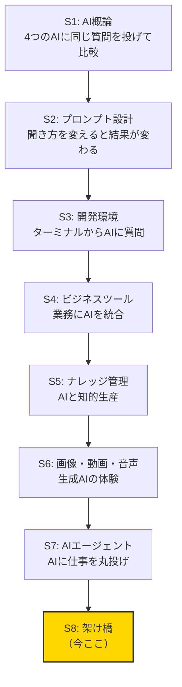
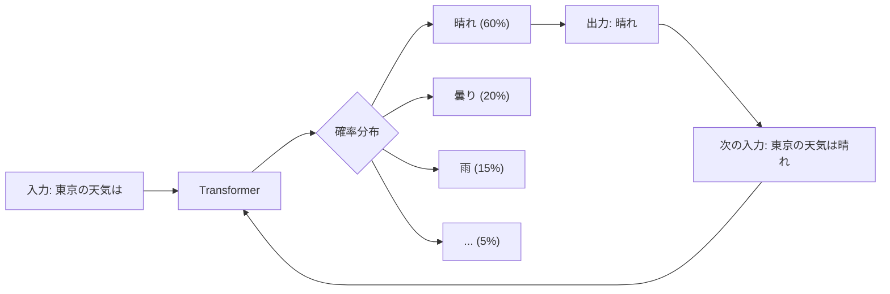
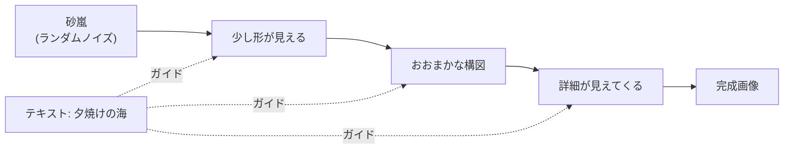
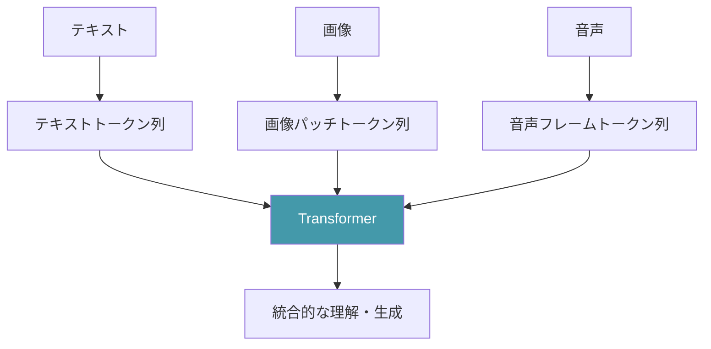
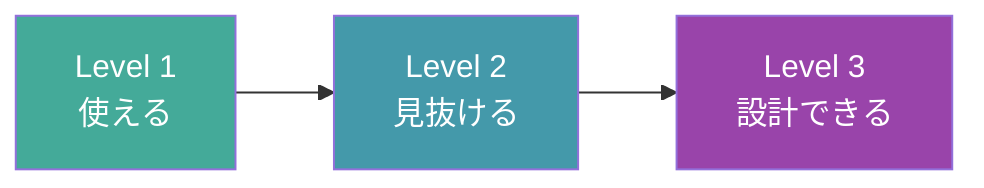
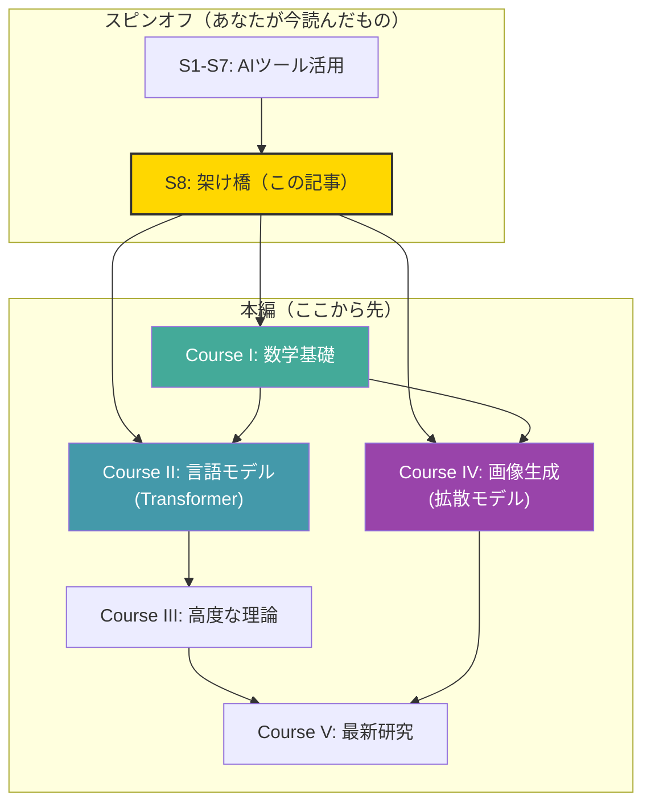
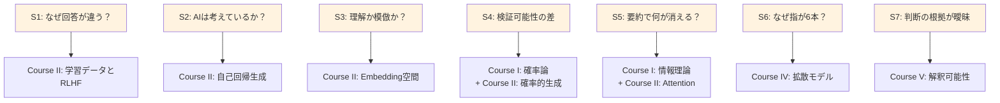

# S8: 架け橋 — ブラックボックスの中身を知りたくなったら

## 最後に、正直に話そう

S1からS7まで、いろいろなAIツールを一緒に触ってきた。

ChatGPTに質問して、Claudeと比較して、プロンプトの書き方を工夫して、Gemini CLIをインストールして、ビジネスツールにAIを組み込んで、Obsidianでナレッジ管理して、画像を生成して、AIエージェントにデータ分析を任せた。

正直なところ、ここまで読んでくれた人には、ただ「ツールの使い方」以上のものを伝えたかった。

実は、S1からS7の各記事には**仕掛け**がある。

毎回の記事の最後に、ちょっとした「問い」を残してきた。ツールの使い方を学ぶ流れの中で、「あれ、なんでだろう？」と感じる瞬間を意図的に作っていた。

今日は、その7つの「なぜ？」を回収する。

そして、S1-S7の全体を通して本当に伝えたかったことを、正直に話す。

:::message
**この記事のゴール**: 本編に進むかどうかを自分で判断できる状態にする。
:::

:::message
**この記事の読み方**: S1-S7を全て読んでいなくても大丈夫。ただし、少なくとも[S1](./ml-spinoff-01.md)と[S2](./ml-spinoff-02.md)を読んでいると、この記事のメッセージが何倍も深く響く。
:::

### この記事の構成

今日の話は大きく4つに分かれる。

1. **回収**: S1-S7の7つの「なぜ？」と7つの🔬考察を振り返って、答えの方向を示す
2. **概観**: AIの内側をざっくり覗く（文章生成と画像生成の仕組み — 数式なし）
3. **種明かし**: このシリーズ全体の裏の目的を正直に明かす
4. **導線**: 「もっと知りたい」人のために、本編への具体的な入口を示す

### まず、ここまでの旅を振り返る



7回の記事で、AIの「使い方」は一通りカバーした。でも、毎回「便利だね」で終わらせなかった。必ず「ちょっと待って、これどういうこと？」という引っかかりを残した。

あの引っかかりが、今日の記事の主題だ。

---

## 7つの「なぜ？」— S1からS7で蓄積してきた問い

| 回 | 💡 好奇心の種 |
|:--|:--|
| [S1](./ml-spinoff-01.md) | 同じ質問なのに3つのAIが違う回答を返す — 内部で何が起きている？ |
| [S2](./ml-spinoff-02.md) | 「ステップバイステップで考えて」と書くだけで精度が上がる — AIは本当に「考えて」いるのか？ |
| [S3](./ml-spinoff-03.md) | AIがコードを「書ける」— でも「理解」しているのか「模倣」しているのか？ |
| [S4](./ml-spinoff-04.md) | Excelの数式は検証できる、AIの回答は検証できない — この差はどこから来る？ |
| [S5](./ml-spinoff-05.md) | AIが要約した文章は「正確」か？ — 10ページを1段落にしたとき、何が残って何が消えた？ |
| [S6](./ml-spinoff-06.md) | 指が6本、文字が崩壊 — AIは「絵」を理解して描いているのか？ |
| [S7](./ml-spinoff-07.md) | AIが「自律的に判断した」— でもその判断の根拠を説明させると曖昧になる。なぜ？ |

7つの問い。バラバラに見えるかもしれない。

でも、**全てに共通する答えが1つある**。

これらの問いを1文にまとめるとこうなる:

> **「AIは何を『分かっていて』、何を『分かっていない』のか？」**

そしてその答えは:

> **これらの「なぜ？」の答えは、全てモデルの内部構造にある。**

---

## 🔬 振り返り — 7つの考察で感じた「違和感」の正体

各回の🔬考察を振り返ろう。

### S1 🔬: 4つのAI企業の設計思想

[S1](./ml-spinoff-01.md)では、OpenAI・Anthropic・Google・xAIの設計思想の違いを見た。

違和感: **同じ技術（大規模言語モデル）を使っているのに、なぜ回答がこんなに違うのか？**

答え: 学習データの選定、モデルサイズ、安全性チューニング（RLHF）の方針が違う。つまり、**モデルの「育て方」**が違う。

| AI の違い | 人間の例え |
|:--|:--|
| 学習データの違い | どんな本を読んで育ったか |
| モデルサイズの違い | 脳の容量（記憶力・処理速度） |
| RLHFの方針の違い | 「褒められたこと」「叱られたこと」で形成された性格 |
| temperatureの違い | 慎重派 vs 冒険派 |

育て方が違うから、同じ質問に対して違う答えを返す。**これは仕様であってバグではない**。

### S2 🔬: トークン予測の仕組み

違和感: **「考えて」と言ったら本当に考えるのか？**

答え: AIは「次に来る単語を確率的に予測する」ことで文章を生成している。「ステップバイステップで考えて」と指示すると、中間ステップのトークンが生成され、それが文脈として蓄積されることで最終回答の精度が上がる。**「考えている」のではなく、「思考の過程っぽいテキストを生成している」**。でも、結果として精度は確かに上がる。

この「考えているわけではないが、結果として賢くなる」という現象は、AIの最も興味深い特性の一つだ。こういう問いに答えるための道具は、直感ではなく理論だ。

### S3 🔬: インターフェースの進化

違和感: **AIは本当にコードを「理解」しているのか？**

答え: AIが見ているのは「トークンの並び」であって、「コードの意味」ではない。膨大なコードのパターンを学習しているので、予測は驚くほど正確。**理解なき模倣**。でも、その模倣の精度が高すぎて、理解と区別がつかなくなっている。

そして、この「理解なき正しさ」には限界がある。パターンにないコード、前例のない問題——こういう場面で「理解」の不在が露呈する。

### S4 🔬: プラットフォームロックイン

違和感: **Excelの数式は検証できるのに、なぜAIの回答は検証できないのか？**

答え: Excelの数式は**決定論的**（同じ入力→常に同じ出力）。AIは**確率的**（同じ入力→毎回微妙に違う出力になりうる）。

| | Excel | AI |
|:--|:--|:--|
| 同じ入力 | 常に同じ出力 | 毎回微妙に異なる出力 |
| 計算過程 | 全ステップ追跡可能 | 内部の計算は不透明 |
| 根拠の説明 | セル参照で完全に説明可能 | 「なぜそう答えたか」を聞くと後付けの説明が来る |

### S5 🔬: ローカル vs クラウド

違和感: **AIが「要約した」とき、何が残って何が消えたのか？**

答え: AIの要約は、人間の要約とは原理が違う。人間は「重要度」を理解して取捨選択する。AIは「元のテキストの情報を圧縮して再生成」している。**統計的に頻度の高い情報は残りやすく、稀少だが重要な情報は失われやすい**。

### S6 🔬: 「創造」とは何か

違和感: **なぜAIは指を6本描くのか？**

答え: 画像生成AI（拡散モデル）は、手の**構造的なルール**（指は5本、関節はこう曲がる）は明示的に学習していない。統計的なパターンとして「手っぽいもの」は作れるが、**物理的な制約**を理解していないので、ときどき破綻する。

ここには「パターン認識」と「構造理解」の決定的な違いがある。

### S7 🔬: エージェントの自律性トレードオフ

違和感: **AIが「判断した」と言うとき、その根拠はなぜ曖昧なのか？**

答え: AIの「判断」は、人間の判断とは本質的に異なるプロセスで生成されている。「なぜそう判断したか」を聞かれると、AIは**「それらしい説明」を後から生成する**。これは**「事後合理化」**（post-hoc rationalization）と呼ばれる現象だ。

ここに、S1-S7の全考察に通底するテーマがある。

**AIの「出力」は人間の「思考の結果」と外見上は区別がつかない。でも、内部のプロセスは根本的に異なる。**

人間は「根拠→推論→結論」。AIは「パターンマッチ→確率的サンプリング→出力」。出力は似ている。でもプロセスが違うから、**失敗のパターンも違う**。

---

## 🔬 違和感の言語化 — モヤモヤの正体

S1からS7を読んできて、こんな感覚を覚えたことはないだろうか。

- 「答えとしてはもっともらしいけど、なんか引っかかる」
- 「正しいかどうか、自分では判断できない」
- 「便利だけど、なんとなく不安」

この**「モヤッ」とした感覚**こそが、実は最も大事なものだ。

なぜなら、その違和感は**あなたの知性が正しく機能している証拠**だから。

問題は、**その違和感を言語化できるかどうか**だ。

### 「なんか変」を「具体的にどう変」に変える

例えば、ChatGPTに「日本の少子化対策を提案して」と聞いて、もっともらしい5つの提案が返ってきたとする。

「なんか変」の段階:
> 「悪くはないけど、なんか物足りない。けど何が足りないか分からない」

「具体的にどう変」の段階:
> 「この提案は全て既存の政策の焼き直しだ。AIは学習データにある情報を再構成しているだけなので、本当に新しいアイデアは出せない。また、予算制約やステークホルダーの利害関係など、現実の政治的要素が欠落している」

この2つの間には、**圧倒的な差**がある。後者ができるようになるために必要なのが、AIの仕組みに対する**構造的理解**だ。

### 違和感を言語化する道具が、数学

S1-S7で感じたモヤモヤを**精密に言語化する道具が、数学と理論**だ。

「AIは確率的にテキストを生成している」と聞いても、「ふーん」で終わるかもしれない。でも確率論を知っていれば、「条件付き確率分布からのサンプリングで、温度パラメータが高いほど分散が大きくなる」と理解できる。

数学は「難しいもの」ではなく、**「曖昧さを排除する道具」**だ。

「なんとなく賢い」→ 「パラメータ数1,750億、学習データ570GB、perplexityスコア15.3」
「なんとなく不安定」→ 「temperature=1.0でのtop-p=0.9サンプリングだから、低確率のトークンも出現する」

モヤモヤが数字に変わる。数字は議論できる。比較できる。改善できる。

### 「なんか変」を数式で言い換えてみる

S1-S7で感じた「なんか変」を、ごく簡単な数学的直感に置き換えてみよう。数式は使わない。言葉だけで。

| 「なんか変」 | 数学的に言うと |
|:--|:--|
| AIが毎回違う答えを出す | 確率分布からサンプリングしているので、出力は毎回揺らぐ |
| 自信満々に嘘をつく | 「もっともらしい」トークン列と「事実に合致する」トークン列は、別の基準 |
| 要約で大事な情報が消える | 統計的な頻度が低い情報は、モデルの「重心」から遠いため落ちやすい |
| 長い文章の途中の内容を忘れる | コンテキスト窓の中でも、中間の情報はAttentionの重みが薄くなりやすい |
| 画像の指が6本になる | ピクセルの統計パターンには「指は5本」という制約が明示的にない |

**全て、仕組みを知れば「当然」に変わる。** 「なんか変」→「こういう仕組みだから、こうなる」。この変換が、「Level 1: 使える」から「Level 2: 見抜ける」への跳躍だ。

### 「ブラックボックスが怖い」の正体

AIに対する漠然とした不安の正体は、**中身が分からないこと**だ。

中身を知らない人が怖がるもの:
- 「AIが人類を支配する」「AIが意志を持って暴走する」

中身を知っている人が怖がるもの:
- 「AIの学習データに偏りがあるまま、社会的に重要な判断に使われること」
- 「AIの出力を検証せずに信用する人が増えること」
- 「AIの『もっともらしさ』が、批判的思考を麻痺させること」

後者の方が、ずっと具体的で、ずっと切実だ。そして、**具体的だからこそ対策が打てる**。

「正しく怖がる」とは、**根拠のある懸念を持ち、根拠のない恐怖を手放す**こと。

### 違和感のカタログ — よくある「モヤッ」の整理

S1-S7で感じがちな違和感を、カタログとして整理しておこう。

**AIの出力に対する違和感:**
- AIが自信満々に嘘をつく（ハルシネーション）。なぜ「分からない」と言わないのか
- 同じ質問を2回しても、微妙に違う答えが返ってくる。どっちが正しいのか
- AIが「考えました」と言うが、本当に考えているのか分からない
- 画像生成で「それっぽい」画像が出てくるが、よく見ると構造が破綻している
- AIの要約が「嘘」ではないが、「大事なこと」が抜けている気がする

**AIとの関係に対する違和感:**
- AIの回答が正しいか判断できないのに、なんとなく信用してしまう自分がいる
- 「AIに仕事を奪われる」と不安になるが、具体的に何がどう奪われるか分からない
- 「AIを使っている」のか「AIに使われている」のか、よく分からなくなるときがある

これらの違和感の**全てに、構造的な理由がある**。

「ハルシネーション」は、確率分布からのサンプリングでは「もっともらしいが事実でない」トークン列が生成されうるから起きる。「毎回微妙に違う回答」は、temperatureパラメータによる確率的サンプリングが原因。

理由が分かれば、「モヤッ」は「なるほど」に変わる。そして「なるほど」の先に「じゃあ、こうすればいい」という**対策**が見えてくる。

**理解が行動を変え、行動が結果を変える。** これが「中身を知る」ことの実用的な価値だ。

### 「分からない」の3つのレベル

違和感にもレベルがある。

**レベル1: 何が分からないか、分からない**
> 「AIって結局何なの？ なんか色々すごいらしいけど...」

**レベル2: 何が分からないか、は分かる**
> 「AIが確率的に出力を生成しているのは分かった。でも、なぜこの確率分布になるのかが分からない」

**レベル3: 分からないことの境界が見える**
> 「Transformerの基本構造は理解した。でもスパースAttentionの効率化手法はまだ理解していない」

S1-S7を読んだあなたは、レベル1からレベル2に到達している。本編を進めると、レベル2からレベル3に移行する。

**レベルが上がるほど、「分からない」が怖くなくなる。** なぜなら、「何が分からないか」が分かっているから。対処法が見える。学ぶべきことが具体的に見える。

これが「学び」の本質だ。分からないことが減るのではなく、**分からないことの解像度が上がる**。

---

## ブラックボックスの裏側を30分で概観する

全ての答えに共通するのは、**「AIの内部で何が起きているかを知れば、不思議ではなくなる」**ということ。

では、その「内部」を少しだけ覗いてみよう。数式は使わない。直感的に掴めるレベルで。

### 文章生成の裏側 — Transformerとは

ChatGPT、Claude、Gemini。S1で使ったこれらのAIの中核にあるのが**Transformer**（トランスフォーマー）というアーキテクチャだ。2017年にGoogleの研究者が発表した論文「Attention Is All You Need」で提案された。

:::message
**Transformer（超簡略版）**: テキストを読んで、「次に来そうな単語」を予測するシステム。
:::

もう少し具体的に言うと:

1. あなたが「東京の天気は」と入力する
2. Transformerは「東京」「の」「天気」「は」という4つのトークンを受け取る
3. 各トークンの関係性を計算する（**Attention**=注意機構）
4. この関係性を基に、「次に来る確率が最も高い単語」を計算する
5. 「晴れ」が確率60%、「曇り」が20%、「雨」が15%……のような分布が出る
6. その分布からサンプリングして「晴れ」を出力
7. これを繰り返して文章が完成する



これが**自己回帰生成**（autoregressive generation）と呼ばれるプロセスだ。

:::details もう少し詳しく — Attentionとは何か
「Attention」は直訳すると「注意」。

人間が文章を読むとき、全ての単語に等しく注意を払うわけではない。Transformerも同じことをする。入力された全てのトークン間の関連性を数値化する。

具体例: 「彼女は**猫**を飼っていて、毎朝**それ**にエサをあげる」

この文で「それ」が「猫」を指していると理解するには、「それ」と「猫」の間に強い関連性があることを認識する必要がある。Attentionは、「それ」から「猫」に強い重みを付ける。

これを文中の**全てのトークンの組み合わせ**で計算する。これが、Transformerが長い文章を扱うのが得意な理由。
:::

:::details 🧮 数式で覗いてみる: Attentionの核心 — たった1つの式

$$
\text{Attention}(Q, K, V) = \text{softmax}\left(\frac{QK^T}{\sqrt{d_k}}\right)V
$$

| 記号 | 意味 | 直感 |
|:--|:--|:--|
| $Q$（Query） | 「何を知りたい？」 | 「それ」が何を指すか知りたい |
| $K$（Key） | 「何の情報を持っている？」 | 「猫」は「動物」の情報を持っている |
| $V$（Value） | 「実際の情報の中身」 | 「猫」の具体的な意味ベクトル |
| $QK^T$ | 「QとKの相性スコア」 | 「それ」と「猫」の関連度を計算 |
| $\sqrt{d_k}$ | スケーリング | スコアが大きくなりすぎないよう調整 |
| $\text{softmax}$ | 確率に変換 | S2で出てきた「確率分布への変換」と同じ |

**ChatGPTもClaudeもGeminiも、この1つの数式の上に成り立っている。**

この式の詳細は本編Course IIで扱う。今は「意外とシンプルな式が、あの賢い動きを生んでいるんだな」という感覚だけで十分。
:::

### トークンとは何か — AIが見ている世界

ここまで「トークン」という言葉を何度か使ったが、ちゃんと説明しておこう。

人間は文章を「単語」の並びとして読む。AIは文章を「トークン」の並びとして読む。

トークンは、だいたい単語の断片だ。英語では1単語が1-2トークン、日本語では1文字が1-3トークンに相当することが多い。

例えば:
- 「Hello, world!」→ 「Hello」「,」「 world」「!」の4トークン
- 「東京の天気」→ 「東京」「の」「天気」の3トークン（実装による）

なぜこれが重要か。AIが「文章を理解している」と感じるとき、実際にやっているのは**「トークンの並びから次のトークンを予測している」**だけだ。「理解」は一切していない。でも、この単純な操作を**十分に大きなモデル**で学習すると、「理解しているように見える」レベルに到達する。

:::details トークン数の直感的な目安
| テキスト | 概算トークン数 |
|:--|:--|
| 「こんにちは」 | 2-4トークン |
| この記事の1段落 | 50-100トークン |
| 短い小説（200ページ） | 約10万トークン |

GPT-4のコンテキスト窓（一度に処理できる量）は約12万8千トークン。つまり、短い小説1冊分をまるごと読んで処理できる計算だ。
:::

### なぜTransformerが「革命」だったのか

Transformer以前のAI（RNNやLSTM）は、文章を**前から順番に**読んでいた。長い文章では、最初の方の情報が後ろの方で「忘れられる」問題があった。

Transformerは**文章全体を一度に見る**。全てのトークン間の関係を同時に計算する。この発想が、2017年以降のAI研究のパラダイムを変えた。

もう1つ重要なのが**並列処理**。RNNは「前の単語が処理されるまで次の単語を処理できない」構造だったため、GPUで並列化しにくかった。Transformerは全ての位置を同時に処理できるため、GPUの大量の並列計算能力をフル活用できる。

つまりTransformerの革命は2つ:
1. **長距離の依存関係を扱える**（文章の最初と最後の関係も捉えられる）
2. **GPUで高速に計算できる**（大量のデータで学習できる）

この2つが揃ったことで、「データとGPUを増やせば賢くなる」というスケーリングの道が開けた。

### スケール則 — なぜ大きいモデルは賢いのか

2020年、OpenAIが「モデルを大きくすると、予測可能なペースで賢くなる」という経験則——**スケール則**（Scaling Laws）を発見した。

| モデル | パラメータ数 | 大まかな能力 |
|:--|:--|:--|
| 小型モデル | 数十億 | 文法は正しいが、知識が浅い |
| 中型モデル | 数百億 | まあまあ正確。簡単な推論はできる |
| 大型モデル | 数千億〜1兆+ | 複雑な推論、多言語、コード生成 |

ただし、スケール則にも限界がある。データの枯渇、計算コストの爆発、収穫逓減。2026年現在、「ただ大きくすればいい」から「効率的に賢くする」へと研究の方向が変わりつつある。

### Embedding — 「意味の空間」

Transformerは、各トークンを**高次元のベクトル**（数字の列）に変換する。これを**Embedding**（埋め込み）と呼ぶ。

意味的に近い単語は、ベクトル空間上で近い位置に配置される。

- 「犬」と「猫」のベクトルは近い
- 「犬」と「民主主義」のベクトルは遠い
- 「王」-「男」+「女」= 「女王」（有名な例）

つまり、AIは**「意味の地図」を持っている**。この数字の列だけで驚くほど「意味的に正しい」操作ができてしまう。これもまた「理解なき知性」の一側面だ。

:::details Embeddingの直感的な理解
2次元で考えると分かりやすい。

- X軸を「生物↔無生物」
- Y軸を「小さい↔大きい」

とすると:
- 「犬」→ (生物寄り、中くらい)
- 「猫」→ (生物寄り、小さい寄り)
- 「鯨」→ (生物寄り、大きい寄り)
- 「車」→ (無生物寄り、中〜大きい)

実際のAIでは、この「軸」が2つではなく**数千**ある。人間には可視化できないが、各トークンが数千個の数字の組（ベクトル）として表現されている。

このベクトルの「近さ」を計算するのが、[S3](./ml-spinoff-03.md)と[S5](./ml-spinoff-05.md)で登場した**コサイン類似度**だ。つまり、S3の考察とここがつながる。
:::

:::message
この「意味の空間」の詳細は、本編Course IIで解説する。線形代数の知識があると、この空間の操作が**直感的に**理解できるようになる。
:::

### ここでS1-S2-S5の問いが解ける

**S1**: ChatGPT、Claude、Geminiが違う回答を返す理由 — 全てTransformerベースだが、学習データ・モデルサイズ・RLHF方針・temperature設定が違う。**バグではなく、設計上の必然**。

:::details RLHFとは何か — 超簡略版
RLHF（Reinforcement Learning from Human Feedback）= 人間のフィードバックによる強化学習。

1. AIが複数の回答を生成する
2. 人間が「こっちの方がいい」と評価する
3. AIは「人間に好まれる回答」を生成する方向に調整される

つまり、**AIの性格は「どんな回答を良しとしたか」で決まる**。OpenAIとAnthropicでは「良い回答」の基準が違う。だから、同じ質問でも違う回答が返ってくる。

これがS1の「同じ技術なのに違う結果が出る」の、最も直接的な答え。
:::

**S2**: 「ステップバイステップで考えて」で精度が上がる理由 — 中間テキスト自体が新たな入力となり、最終回答を予測する際の文脈が増える。**AIが「考える」のではなく、「考える過程を生成する」ことで、自分自身に追加の文脈を与えている**。

:::message
これがChain of Thought（CoT）の原理。[S2](./ml-spinoff-02.md)で体験したテクニックの仕組みが、ここでつながる。
:::

**S5**: 要約で何が消えるか — AIにとって「重要な情報」とは、**Embedding空間上で文章全体の中心に近い情報**。重心から遠い「例外だが重要」な情報が落ちやすい。

これは実用上重要な知識だ。例えば10ページの報告書にたった1行だけ記載された「異常値の報告」は、AIの要約では落とされやすい。なぜなら、統計的に見て「10ページ中の1行」は重みが小さいから。でも、ビジネス上はその1行が最も重要かもしれない。

### 画像生成の裏側 — 拡散モデルとは

S6で体験した画像生成AIの多くは**拡散モデル**（Diffusion Model）を使っている。

:::message
**拡散モデル（超簡略版）**: きれいな画像にノイズを加えていく過程を学習し、逆再生する（ノイズから画像を復元する）システム。
:::

**学習時（前方拡散）:**
1. きれいな写真にノイズを少しずつ加える → 最終的に完全なノイズになる
2. 各ステップで「どうデノイズすれば元に戻せるか」を学習する

**生成時（逆方向拡散）:**
1. 完全なノイズから始める
2. 学習した「デノイズの方法」を少しずつ適用
3. テキストプロンプトの情報を各ステップに注入して方向性をガイド
4. ステップを重ねるごとに画像が浮かび上がる



拡散モデルは、**大理石の塊から彫刻を掘り出す**プロセスに似ている。最初は形のない塊（ランダムノイズ）から、少しずつ不要な部分を削っていく（デノイズ）。テキストプロンプトが彫刻家の設計図に相当する。

### ここでS6の問いが解ける

**なぜ指が6本になるのか？** — 拡散モデルは**画像全体の統計的パターン**を学習している。「人間の手」を構造的に理解しているわけではない。「指は常に5本」という**構造的制約**は統計パターンからは完全には学べない。統計的に5本が最も多いので、たいていは5本になる。でも確率的な揺らぎで6本になることがある。

**なぜ文字が崩壊するのか？** — 拡散モデルにとって文字は「画像パターン」であって「意味を持つ記号」ではない。

### ここでS3-S4の問いも解ける

**S3**: AIは本当にコードを「理解」しているのか？ — AIが見ているのは「トークンの並びのパターン」。膨大なコードの統計的パターンから「次に来るべきトークン」を予測している。文法的に正しいコードが出てくるのは、膨大な正しいコードを学習しているから。でも、**コードが「何をしているか」を論理的に追跡しているわけではない**。

だから、パターンに合致するコードは驚くほど正確に生成するが、前例のないロジック（新しいアルゴリズムの発明など）は苦手。

**S4**: なぜExcelは検証可能でAIは不透明か？ — Excelは**決定論的なプログラム**。`=SUM(A1:A10)` の計算過程は完全に追跡できる。AIは**確率的な生成モデル**。数十億のパラメータが複雑に相互作用した結果が出力になるため、「なぜこの出力になったか」を人間が追跡することは現状ほぼ不可能。

これが「説明可能AI」（Explainable AI, XAI）が重要な研究テーマである理由。本編Course Vで触れる。

### Transformerと拡散モデルの共通点

| | Transformer（文章） | 拡散モデル（画像） |
|:--|:--|:--|
| **やっていること** | 次の単語を予測 | ノイズを除去 |
| **学習方法** | 大量のテキストからパターン学習 | 大量の画像からパターン学習 |
| **「理解」しているか** | いいえ（パターンマッチ） | いいえ（パターンマッチ） |
| **なぜ賢く見えるか** | パターンの量と質が膨大 | パターンの量と質が膨大 |

どちらも**「理解なき知性」**。量が質に転化する——膨大なデータと計算資源によって、「理解しているように見える」レベルに到達した。

:::message
**ここが重要**: 「理解なき知性」は「劣った知性」ではない。人間とは**別の方法**で知的に振る舞っている。人間は少ない例から一般化する。AIは膨大な例からパターンを抽出する。どちらにも長所と限界がある。

「AIを正しく使う」とは、この**異なる特性を理解した上で、人間の得意領域とAIの得意領域を組み合わせること**。
:::

### マルチモーダルの時代 — テキストと画像の壁が消える

2025-2026年の大きなトレンドが**マルチモーダル**（multimodal）だ。テキスト、画像、音声、動画を1つのモデルが扱う。

これが可能になった理由は、Transformerの汎用性にある。Transformerは「トークンの列を処理する」システム。そして——**画像も音声も、「トークンの列」に変換できる**。

画像をパッチ（小さな四角形）に分割して各パッチをトークンとして扱う。音声を短い時間フレームに分割して各フレームをトークンとして扱う。こうすると、テキストと同じ仕組みで処理できる。



「全てをトークン列に変換する」という発想のシンプルさが、Transformerが2017年以降のAIを支配している理由の1つだ。

S1で使ったChatGPT（テキスト入力→テキスト出力）と、S6で使った画像生成AI（テキスト入力→画像出力）が、**本質的に同じ技術の上に成り立っている**。全く別物に見えたかもしれないが、中身を覗くと「トークンの処理」という共通基盤が見える。

これが「中身を知る」ことの面白さだ。表面的には別々のものが、内部では同じ原理で動いている。

### なぜ「概観」だけでも価値があるのか

数式は一切使っていない。厳密さは犠牲にしている。

でも、**この概観だけでも、あなたのAIに対する見方は既に変わっているはず**だ。

今なら:
- 「テキストがトークンに分解されて」
- 「Attention機構で文脈の関係性が計算されて」
- 「確率分布から次のトークンがサンプリングされて」
- 「それを繰り返して文章が生成される」

と、**大まかなプロセスのイメージ**がある。完璧な理解でなくていい。**概観があるだけで、世界の見え方が変わる。**

---

## 種明かし — AI時代に本当に必要なもの

ここまで来て、ようやく正直に言える。

S1からS7で伝えたかったのは、**AIの使い方ではない**。

### S1-S7の「仕掛け」の全貌

このスピンオフシリーズの本当の目的は「AIツールの使い方を教えること」ではなかった。

**裏の目的**は、**「なぜ？」を植え付けること**。

各記事で便利なツールを紹介しながら、必ず1つ「モヤッとする問い」を残した。その「モヤッ」が、AIの中身を知りたくなる**動機**になる。

動機なき学習は続かない。でも「なぜ？」から始まる学習は、放っておいても前に進む。

### 7つの考察が指し示す1つの方向

| 回 | 🔬考察テーマ | 本質的な問い |
|:--|:--|:--|
| S1 | 企業の設計思想 | **なぜ同じ技術で違うものが作れるのか？** |
| S2 | トークン予測 | **AIが「考えている」とはどういう意味か？** |
| S3 | インターフェースの進化 | **AIの「理解」は人間の「理解」と同じか？** |
| S4 | プラットフォームロックイン | **検証できないものをどう信頼するか？** |
| S5 | データの所有権 | **情報の「圧縮」で何が失われるか？** |
| S6 | 創造とは何か | **パターンの再構成は「創造」か？** |
| S7 | 自律性と制御 | **AIの「判断」を人間はどう評価するか？** |

7つの問いは、全て**同じ根を持っている**。

**「AIの内部で何が起きているか知らないから、判断できない」**。

### AIに「使われない」ための武器

> **AIの回答を、あなたは自分の頭で評価できるか？**

全ての問いに共通するのは、**「AIの出力を鵜呑みにしない判断力」**の必要性だ。

そしてこの判断力の源泉は——**AIの仕組みを知っていること**。

:::message
**ブラックボックスが怖いのは、中身を知らないから。**

中身を知れば怖くない。むしろ「ここが限界」「ここは信頼できる」と**自分で判断できるようになる**。
:::

### AIリテラシーの3段階



**Level 1: 使える（S1-S7で到達）**
AIツールを使って業務を効率化できる。プロンプトの書き方を知っている。用途に応じてツールを選べる。

**Level 2: 見抜ける（S8のこの概観で入口に立つ）**
AIの出力を鵜呑みにせず、正しいかどうかを判断できる。なぜ間違えたかの仮説を立てられる。

**Level 3: 設計できる（本編Course I-Vで目指す）**
AIシステムを評価・選定・カスタマイズできる。モデルの特性を理解して最適な構成を設計できる。

:::message
**あなたは今どこにいる？**

S1-S7を読んだあなたはLevel 1に到達している。S8を読んでいる今、Level 2の入口に立っている。Level 2に完全に到達するには、本編の学習が必要だ。
:::

**注意**: 多くの人が「Level 1で十分」と感じるだろう。実際、日常業務で使う分にはLevel 1で困ることはほとんどない。

Level 2が必要になるのは:
- AIの出力が正しいかどうか**判断を求められる**立場の人
- AI関連のプロジェクトで**意思決定に関わる**人
- 「なぜ？」が気になって**放っておけない**人

3つ目に当てはまる人は、止めても進む。それが好奇心の力だ。

### 思考力を最も鋭くする武器

数学と理論の理解が教えてくれるのは:

- **確率と統計**: AIが「確率的に」出力を選ぶとはどういうことか
- **線形代数**: Attention機構が「行列の掛け算」でどう実現されているか
- **微積分**: AIが「学習する」とは、具体的にどういう数学的操作なのか
- **情報理論**: AIが「要約」するとき、情報のどの部分が失われるのか

**全部一度にやる必要はない。** 高校数学からやり直せるようにCourse Iは設計されている。

「数学」と聞いて身構えた人もいるかもしれない。安心してほしい。ここで言う「数学」は、大学入試のような難問を解くことではない。**「数式の意味を直感的に理解すること」**だ。

例えば、$E[X] = \sum_i x_i P(x_i)$（期待値の式）を「計算できる」必要はない。「ああ、これはデータの重心を求めているんだな」と**意味が分かればいい**。

計算はコンピュータがやる。人間の仕事は「何を計算すべきか」を判断し、「計算結果が妥当か」を見抜くこと。

:::details 🧮 数式で覗いてみる: 勾配降下法 — AIの「学習」の本質

$$
\theta_{t+1} = \theta_t - \eta \nabla L(\theta_t)
$$

| 記号 | 意味 | 直感 |
|:--|:--|:--|
| $\theta_t$ | 今のパラメータ | 「今のAIの脳の状態」 |
| $L(\theta_t)$ | 損失関数 | 「今のAIがどれだけ間違えているか」 |
| $\nabla L(\theta_t)$ | 勾配（傾き） | 「間違いを増やす方向はどっち？」 |
| $\eta$ | 学習率 | 「一歩をどれだけ大きく踏み出すか」 |

**坂道を目をつぶって下りるようなもの**。足元の傾斜を感じて、最も低い場所（最小の誤差）を目指して一歩ずつ進む。

この「勾配の逆方向に少しずつ動く」だけの操作を膨大な回数繰り返すと、AIは「次の単語を予測する」能力を身につける。学習とは、結局のところ、**間違いの方向を知って、反対に動くこと**。

本編Course Iの微積分パートで、なぜこれが機能するのかを直感的に理解できるようになる。
:::

> **違和感を言語化する道具が、数学。**

---

## 「使う側」と「作る側」の世界

### 2つの世界

| | 使う側 | 作る側（の視点を持つ人） |
|:--|:--|:--|
| AIの回答に対して | 「合ってそう」or「間違ってそう」 | 「この条件なら確度が高い」「ここは要検証」 |
| AIが間違えたとき | 「なんで間違えたんだろう」 | 「このタイプのミスはTransformerの構造上起きやすい」 |
| 新しいAIツールを見たとき | 「便利そう」「怖そう」 | 「これはこの技術の派生で、こういう限界がある」 |

「使う側」でいることに何の問題もない。でも、「作る側」の視点を少しでも持つと、世界の見え方が変わる。

### 「中身を知る」ことの具体的な恩恵

**場面1: 上司が「AIを導入しよう」と言ったとき**

「使う側」のあなた: 「いいですね、ChatGPTが便利らしいですよ」

「作る側」の視点も持つあなた: 「我々のデータは機密性が高いので、クラウドAPI経由よりローカルLLMの方が適切かもしれません。ただし、我々のドメインの精度は汎用モデルでは不十分な可能性が高いので、ファインチューニングを検討すべきです」

**場面2: AIが間違った回答を出したとき**

「使う側」のあなた: 「AIってやっぱりダメだな」

「作る側」の視点も持つあなた: 「このタイプの質問は、学習データに類似の事例が少ない領域。AIのアーキテクチャ上、こういう場面では『もっともらしいが事実と異なる』出力をしやすい。検証手段を組み込む設計にすべき」

**場面3: 「AIに仕事を奪われる」と不安になったとき**

「使う側」のあなた: 「AIが進化したら自分の仕事はなくなるのかな...」

「作る側」の視点も持つあなた: 「現在のTransformerベースのモデルには原理的な限界がある。パターンマッチングであって因果推論は苦手。自分の仕事のうち、AIが代替可能な部分と困難な部分を具体的に切り分けられる」

### 使う側と作る側を隔てるもの

技術力でもプログラミングスキルでもない。**「仕組みに対する好奇心」**だ。

「作る側」の視点を持つだけで、「使う側」としても格段にうまくなる。テンプレートは1年で陳腐化する。原理の理解は10年持つ。

:::details 具体例: 原理を知っているとプロンプトが変わる
同じ「要約して」でも、原理を知っていると指示が精密になる。

**知らない人のプロンプト:**
> この文章を要約して

**知っている人のプロンプト:**
> この文章を要約してください。ただし:
> - 数値データは必ず残すこと（AIの要約は統計的に頻度の低い具体的数値を落としやすいため）
> - 元の文章で1回しか出てこないが重要な主張は明示的に残すこと
> - 要約後の文章が元の文章の何%程度の情報量になったか、概算を添えること

後者のプロンプトは、「AIが要約で何を落としやすいか」（S5の考察）と「なぜ落としやすいか」（Embedding空間の重心バイアス）を知っているから書ける。

**仕組みを知ること = より良いプロンプトが書けること = より良い結果が得られること。**
:::

### AIが「できること」と「できないこと」の境界線

この理解を基に整理しておこう。

**AIが得意なこと（原理的に強い）:**
- パターン認識・再生成（テキスト分類、翻訳、コード生成）
- 大量のデータ処理（分析、検索、要約）
- 一貫性のある出力（テンプレート的な文書生成）

**AIが苦手なこと（原理的に弱い）:**
- 因果推論（「なぜ売上が下がったか」の本質的原因の特定）
- 未知のパターン（真に革新的なアイデア、前例のない判断）
- 常識的推論（「当たり前すぎてテキストに書かれない」知識の欠落）
- 自己認識（ハルシネーションの自己検出）
- 価値判断（倫理的判断、美的判断）

AIが得意なことは「パターンの処理」、苦手なことは「パターンを超えること」。これはTransformerが「次のトークンを確率予測する」仕組みである以上、構造的な限界だ。

:::message
**この整理ができることが「Level 2: 見抜ける」の本質。**

「AIは万能」でもなく「AIはダメ」でもなく、「AIはここが強くてここが弱い。理由は〜」と具体的に言えること。
:::

---

## 🔬 種明かし — 全ての考察が指し示すもの

> **AI時代に本当に必要なのは、AIの進化ではない。**
>
> **人間がAIに頼り切らず、応答結果をどう判断し、どう解釈し、どう意思決定するか。**

S1: なぜ回答が違うか → **判断力**が必要
S2: なぜプロンプトで変わるか → **理解力**が必要
S3: AIは理解しているか → **見極め力**が必要
S4: 検証可能性の差 → **検証力**が必要
S5: 要約で何が消えるか → **批判的思考力**が必要
S6: AIは創造しているか → **評価力**が必要
S7: 判断の根拠が曖昧 → **監督力**が必要

これら全ての力の土台にあるのが、**「AIがどう動いているかの理解」**。

その理解を最も精密に手に入れるための道具が、**数学と理論**だ。

> **ツールは変わる。思考力は残る。**
>
> そして——その思考力を**最も鋭くする武器が数学と理論の理解**。

---

## 本編ロードマップ — 46回の旅の全体像



### 各Courseの概要

| Course | 内容 | S1-S7との接点 |
|:--|:--|:--|
| **I: 数学基礎（全10回）** | 確率・統計、線形代数、微分・最適化、情報理論 | S2: temperature / S1: モデルサイズ / S5: 情報圧縮 |
| **II: 言語モデル（全12回）** | Transformer本格理解、Attention数学、RLHF、スケーリング則 | S1-S2の全ての「なぜ？」 |
| **III: 高度な理論（全8回）** | MoE、Constitutional AI、長文脈処理、マルチモーダル | S7: エージェントの進化 |
| **IV: 画像生成（全10回）** | 拡散モデル数学、U-Net、CLIP連携、Latent Diffusion | S6の全ての「なぜ？」 |
| **V: 最新研究（全6回）** | 動画生成、World Model、効率的推論 | 最先端トピック |

### 3つの入口 — あなたのタイプ別ガイド

:::details 入口1: 「数学からちゃんと入りたい」タイプ → Course I
高校数学の復習から始めて、AIを理解するために必要な数学を積み上げる。数学が苦手でも大丈夫。
→ [Course I: 数学基礎](./00-index-theory.md)
:::

:::details 入口2: 「ChatGPTの中身が知りたい」タイプ → Course II
Transformerの構造を図解で理解。Attention機構、RLHF、プロンプトが効く数学的な理由。
→ [Course II: 言語モデル](./00-index-theory.md)
注: Course Iの数学知識を前提にしている部分がある。
:::

:::details 入口3: 「画像生成AIの仕組みが知りたい」タイプ → Course IV
拡散モデルの数学、なぜノイズから画像を作れるのか、テキストプロンプトがどう画像に反映されるか。
→ [Course IV: 画像生成](./00-index-theory.md)
:::

:::message
**迷ったら**: Course I（数学基礎）から始めるのが一番確実。S1-S7を読んだあなたは、読む「動機」を既に持っている。それが一番大事。

**時間がない人向け**: Course Iの第1-3回だけでも読む価値がある。確率の基礎だけで、AIの出力に対する見方が変わる。全46回を完走する必要はない。
:::

### 本編と今日の記事のつながり

| この記事で触れた概念 | 詳細は本編のどこで？ |
|:--|:--|
| 「次の単語を確率予測」 | Course I（確率論）+ Course II（言語モデル基礎） |
| Attention機構 | Course II（Transformerの解剖） |
| temperature と確率分布 | Course I（確率分布）+ Course II（サンプリング戦略） |
| 拡散モデル（ノイズ→画像） | Course I（確率論基礎）+ Course IV（拡散モデル） |
| 損失関数と勾配降下 | Course I（微積分）+ Course II（学習の仕組み） |

### 本編で最初に出会うもの — 予告編

「本編って何をやるの？」と気になる人のために、Course Iの最初の数回の雰囲気をプレビューする。

**第1回（確率の直感）:**
- サイコロを2つ振って、合計が7になる確率は？
- これと「次のトークンを予測する」は、数学的に同じ構造
- S1の💡「なぜ回答が違うのか」の数学的な答えが出る

**第2回（条件付き確率）:**
- 「Aが起きたとき、Bが起きる確率」= 条件付き確率
- ChatGPTの $P(\text{next} | \text{context})$ は、まさにこれ
- S2の💡「CoTで精度が上がる理由」が数式で説明できるようになる

**第3回（確率分布とtemperature）:**
- softmax（S2で登場）を数学的に理解する
- temperatureを変えると何が変わるのか、グラフで可視化
- 「創造的 vs 正確」のトレードオフが数値で見える

高校数学のレベルから始まる。怖くない。

### 「読まなくても生きていける」——でも

**本編を読まなくても、AIは使える。仕事もできる。問題なく生きていける。**

S1-S7の知識で、あなたは既に上位10%のAIユーザーだ。

ただ、1つだけ言えることがある。

**「中身を知っている人」と「知らない人」の差は、年々広がる。**

知識の半減期で考えると:
- 「ChatGPTのこのボタンの使い方」→ 半減期: 数ヶ月
- 「プロンプトの書き方のコツ」→ 半減期: 1-2年
- 「Transformerの仕組み」→ 半減期: 5年以上
- 「確率論・線形代数の基礎」→ 半減期: 事実上無限

**最も長持ちする知識は、最も基礎的な知識。**

:::details なぜ「数学」なのか — プログラミングでは代替できない理由
「AIを理解したいならプログラミングを学べばいい」という意見もある。半分正しく、半分足りない。

プログラミングで分かること:
- AIのAPI呼び出し方、パラメータの設定方法
- コードレベルでの動作確認（「こう書くとこう動く」）

プログラミングでは分からないこと:
- **なぜ**temperature=0.7にすると創造的になるのか（確率分布の分散の話）
- **なぜ**モデルが大きいと賢くなるのか（スケール則の数学的基盤）
- **なぜ**Attentionが長い文脈を扱えるのか（行列計算の性質）
- **なぜ**ハルシネーションが原理的に排除できないのか（確率的サンプリングの帰結）

「何が起きているか」を知るのがプログラミング。「**なぜ**起きているか」を知るのが数学。本編では後者を扱う。
:::

---

## まとめ — 中身を知る旅に出よう

ここまで読んでくれてありがとう。最後に、この8回の旅で歩いた道を振り返ろう。

### S1-S8で歩いた道のり

| 回 | テーマ | 手に入れたもの |
|:--|:--|:--|
| [S1](./ml-spinoff-01.md) | AI概論 | 4つのAIを全部触った。違いを体感した |
| [S2](./ml-spinoff-02.md) | プロンプト設計 | 「聞き方」で結果を変えるスキル |
| [S3](./ml-spinoff-03.md) | 開発環境 | Gemini CLIでターミナルからAIに質問 |
| [S4](./ml-spinoff-04.md) | ビジネスツール | 業務にAIを統合するスキル |
| [S5](./ml-spinoff-05.md) | ナレッジ管理 | AIと共に知的生産するワークフロー |
| [S6](./ml-spinoff-06.md) | 画像・動画・音声 | 生成AIの可能性と限界を体感 |
| [S7](./ml-spinoff-07.md) | AIエージェント | AIに仕事を任せるスキルと判断力 |
| **S8（この記事）** | **架け橋** | **AIの仕組みの概観と「中身を知る意味」** |

### S1-S7の数式を振り返る — 全てはつながっている

| 回 | 数式 | 何を表しているか |
|:--|:--|:--|
| S1 | $P(\text{next} \| \text{context})$ | 全ての始まり — 「次の単語の確率」（S8で数式化） |
| S2 | $\text{softmax}(z_i) = \frac{e^{z_i}}{\sum_j e^{z_j}}$ | 数値を確率に変換する魔法 |
| S3 | $\cos\theta = \frac{\vec{a} \cdot \vec{b}}{\|\vec{a}\| \|\vec{b}\|}$ | 意味の「近さ」を測る距離 |
| S4 | $H(X) = -\sum P(x) \log P(x)$ | 情報量と不確実性 |
| S5 | $\cos\theta$（再登場） | 要約の品質を測る道具 |
| S6 | $x_t = \sqrt{\bar{\alpha}_t}\, x_0 + \sqrt{1-\bar{\alpha}_t}\,\epsilon$ | ノイズと画像のブレンド |
| S7 | $R(s,a) = \sum \gamma^t r_t$ | エージェントの判断基準 |
| S8 | $\text{Attention}(Q,K,V) = \text{softmax}\!\left(\frac{QK^T}{\sqrt{d_k}}\right)\!V$ | Transformerの心臓 |

**これらの数式は全てつながっている。**

- S1の「次の単語の確率」→ S2のsoftmaxで具体的にどう計算されるか分かる
- S2のsoftmax → S8のAttention式の中にそのまま登場する
- S3/S5のコサイン類似度 → Attentionの$QK^T$が本質的に同じ計算をしている
- S6の拡散 → 確率分布からのサンプリング（S1-S2の確率の応用）

:::message
**これらの数式は全て、本編Course Iの最初の数回で理解できるレベルの数学。**
:::

### S1-S7の「好奇心の種」の回収 — 答えの地図

7つの💡好奇心の種の答えを、本編のどこで見つけられるかの地図。



全ての「なぜ？」に、具体的な答えがある場所がある。その場所への道が本編だ。

:::message
**この地図を保存しておこう。** 本編を読み進める中で、S1-S7の体験が「あのときの疑問はこういうことだったのか！」と腑に落ちる瞬間がある。その瞬間が、最も学びが深まるとき。
:::

### 8つの記事で伝えたかったこと

S1: **触れ。** まず使え。
S2: **聞き方を学べ。** 質問の質が結果の質を決める。
S3: **環境を整えろ。** ツールは道具だ。使い慣れろ。
S4: **業務に組み込め。** AIは特別なものじゃない。日常のツールだ。
S5: **知識を構造化しろ。** AIと一緒に知的生産を加速しろ。
S6: **創造を体験しろ。** AIの可能性と限界を、自分の目で確かめろ。
S7: **任せろ、でも検証しろ。** AIは優秀な部下だが、結果は自分で確認する。
S8: **中身を知れ。** ブラックボックスが怖いのは、中身を知らないからだ。

> **AIを使うだけでなく、理解しろ。理解した上で使え。**

### このシリーズが「ツール紹介」に留まらなかった理由

正直に言えば、S1-S7をただの「ツール紹介」にすることもできた。「ChatGPTの使い方」「Gensparkの使い方」と並べれば、もっと読みやすい記事になっただろう。

でも、あえて毎回「🔬考察」を入れた。あえて毎回「💡好奇心の種」を残した。

理由は1つ。**「使い方」だけの知識は、ツールが変わった瞬間にゼロになるから。**

2023年のChatGPTの操作方法は、2026年の今、もう半分以上が変わっている。Gensparkは2025年に登場したばかり。1年後に存在しているかすら分からない。

でも、「AIが確率的に出力を生成している」という理解は変わらない。「パターンマッチと理解は違う」という洞察は変わらない。

**変わるものの中に、変わらないものを見つける。** それがこのシリーズの裏テーマだった。

### 最後の数式 — このシリーズの全てを1行に

$$
\text{理解} = \lim_{n \to \infty} \text{好奇心}^n
$$

> **好奇心を持ち続ける限り、理解は深まり続ける。**

### 学び続ける人だけが見える景色

AIの世界を学ぶと、「学ぶほど分からないことが増える」という体験をする。最初は「AIって何？」だったのが、学ぶにつれて「Attentionのヘッド数はなぜ有効か」「拡散モデルのガイダンススケールの最適値は」……と、問いが具体的になり、深くなっていく。

これは怖いことではない。**成長の証だ**。

:::details 「学んで良かった」と思う3つの瞬間

**瞬間1: ニュースの見え方が変わるとき**

「GPT-5がリリースされました」というニュースを見たとき。学ぶ前は「お、すごそう」。学んだ後は「パラメータ数は？アーキテクチャの変更点は？ベンチマークは？」——ニュースの表面ではなく、**技術的な意味**を読み取れる。

**瞬間2: AIの失敗を予測できるとき**

同僚が「この長い文書をAIに要約させよう」と言ったとき。学んだ後は「この文書は20万トークンあるから、途中の情報が薄まる"Lost in the Middle"現象が起きやすい。チャンクに分割する方が精度が出る」——**失敗を事前に予測して回避**できる。

**瞬間3: 自分の判断に自信が持てるとき**

AIの出力に対して「これは学習データに豊富な領域だから精度が高い。この部分は最新のデータが必要だから、情報が古い可能性がある」——**根拠のある判断**ができる。
:::

### 「完璧に理解しなくていい」という安心感

**AIの仕組みを完璧に理解している人は、世界中にほとんどいない。**

2026年現在、Transformerの全てのメカニズムを完全に理解している人は、トップ研究者でも限られる。

目指すべきは「完璧な理解」ではなく、**「自分にとって十分な解像度」**だ。

- AIツールをより賢く使いたいなら → S8のこの概観で十分
- AIの限界を業務で見極めたいなら → 本編Course I-IIの概念理解で十分
- AIシステムを設計・評価したいなら → Course I-Vの数学まで必要

**自分にとって必要な深さまで学べばいい。**

### 最後のメッセージ

S1の冒頭で「AIは使ってみるのが最速の学び方」と書いた。それは今でも正しい。

でも、使い方を覚えた先には、もう1つの旅がある。**中身を知る旅。**

この旅は簡単ではない。数学が出てくる。理論が出てくる。

でも、S1-S7を最後まで読んだあなたには、最も大事なものが既にある。

**好奇心。**

「なぜ？」と思う力。これがあれば、どんな旅も続けられる。

AIの時代に、人間に求められるのは:

- **「何を聞くか」を決める力**（問いを立てる力）
- **「その答えは正しいか」を判断する力**（見極める力）
- **「だからどうする」を決める力**（意思決定力）

これらの力の土台にあるのが、**AIの仕組みを理解した上での思考力**だ。

変わらないものを理解した人は、変わるものに振り回されない。

> **ツールは変わる。思考力は残る。**
>
> **ブラックボックスの中身を知れば、もう怖くない。**

中身を知る旅に出よう。準備はできている。

S1で初めてAIに質問したとき、あなたは「使う人」になった。
S2-S7で使い方を磨いて、あなたは「使いこなす人」に近づいた。
S8でブラックボックスの外側から中を覗いて、あなたは「理解する人」の入口に立った。

次のステップは、あなたが決める。

ここで止まってもいい。S1-S7の知識だけで、十分に役に立つ。
でも、もし「もっと知りたい」と感じたなら——その感覚を大事にしてほしい。

それが、全てを学ぶための最強のエンジンだから。

行ってらっしゃい。

---

## よくある質問

:::details Q: 数学が苦手でも本編は読める？
**A: 読める。** Course Iは高校数学のゼロから始める設計。S1-S7で「なぜ？」を感じた人は、その「なぜ？」が推進力になる。
:::

:::details Q: 本編は全46回を全部読まないといけない？
**A: いいえ。** 興味のあるCourseから始められる。最短ルート: Course Iの前半→Course IIの前半。これだけで「ChatGPTがなぜこう動くか」の基本的な理解が得られる。
:::

:::details Q: エンジニアじゃなくても本編を読む意味はある？
**A: 大いにある。** マネジメントが「AIでこれできないの？」と聞いたとき、「原理的にこの部分は難しいです。理由は〜」と根拠付きで説明できる。非エンジニアがこの知識を持つことに大きな価値がある。
:::

:::details Q: TransformerとGPTの違いは何？
**A: TransformerはGPTの「エンジン」。** Transformer=アーキテクチャ（設計図）。GPT=Transformerを使って大量のテキストで事前学習したモデル。ChatGPT=そのモデルのユーザーインターフェース。
:::

:::details Q: ハルシネーション（幻覚）はなぜ起きる？
**A:** AIは「次に来る確率が最も高い単語」を出力する。「事実として正しい単語」を出力しているわけではない。パターンマッチの帰結であり、Transformerの構造に内在する問題。**原理的に完全には排除できない**。
:::

:::details Q: AIの進化が速すぎて、学んでも追いつけない気がします
**A:** ツールレベルの変化には追いつけない。でも原理レベルの変化は実はそこまで速くない。Transformerは2017年から原理は同じ。**一度学べば5-10年持つ**。原理を知っている人は、ツールの変化を上から俯瞰できる。
:::

:::details Q: このスピンオフシリーズだけで十分？本編まで読む必要ある？
**A: スピンオフだけでも十分使える。** S1-S7の知識で、あなたは既にAIツールを上位10%のレベルで使いこなせる。本編に進むべきなのは、AIの「なぜ？」が気になって仕方ない人、AI関連の仕事をしている/したい人、知的好奇心が止まらない人。「行かなきゃ」ではなく「行きたい」と思った人だけが行けばいい。
:::

:::details Q: 「AI」「機械学習」「深層学習」「LLM」— 用語が多すぎる
**A: 入れ子構造で整理できる。**

```
AI（人工知能）← 最も広い概念
└── 機械学習（ML）← データから学ぶAI
    └── 深層学習（DL）← 多層ニューラルネットを使うML
        ├── Transformer → LLM（GPT, Claude, Gemini...）
        └── 拡散モデル（DALL-E, Stable Diffusion...）
```

この構造を知っていると、「AIがすごい」と言われたとき「具体的にどの技術の話？」と問える。
:::

:::details Q: S1-S7を読まずに本編から入っても大丈夫？
**A: 本編は独立した教材として設計されているので学べます。** ただし、S1-S7を読んだ人には「動機」という圧倒的なアドバンテージがある。本編で数式が出てきたとき、「なぜこれを学ぶのか」が分かっている人と分かっていない人では学習の持続力がまったく違う。
:::

:::details Q: 独学でも本編は理解できる？
**A: できる。** Course Iは独学者を想定して書かれている。独学のコツ: 7割理解できたら次に進む。手を動かす（電卓でもExcelでもOK）。ペースを決めない。「分からない」の記録は後で最高の学習ログになる。
:::

:::details Q: この記事を読んで、AIに対する不安が増えたのですが...
**A: それは正しい反応。** 「知る前の漠然とした安心」よりも「知った後の具体的な不安」の方が、ずっと健全だ。漠然とした安心は思考停止を招く。具体的な不安は対策を生む。

不安を感じたら、「具体的に何が不安か」を書き出してみてほしい。言語化できた時点で、半分は解決している。言語化できない不安だけが怖い。
:::

---

## ライセンス

本記事は [CC BY-NC-SA 4.0](https://creativecommons.org/licenses/by-nc-sa/4.0/deed.ja)（クリエイティブ・コモンズ 表示 - 非営利 - 継承 4.0 国際）の下でライセンスされています。

### ⚠️ 利用制限について

**本コンテンツは個人の学習目的に限り利用可能です。**

**以下のケースは事前の明示的な許可なく利用することを固く禁じます:**

1. **企業・組織内での利用（営利・非営利問わず）**
   - 社内研修、教育カリキュラム、社内Wikiへの転載
   - 大学・研究機関での講義利用
   - 非営利団体での研修利用
   - **理由**: 組織内利用では帰属表示が削除されやすく、無断改変のリスクが高いため

2. **有料スクール・情報商材・セミナーでの利用**
   - 受講料を徴収する場での配布、スクリーンショットの掲示、派生教材の作成

3. **LLM/AIモデルの学習データとしての利用**
   - 商用モデルのPre-training、Fine-tuning、RAGの知識ソースとして本コンテンツをスクレイピング・利用すること

4. **勝手に内容を有料化する行為全般**
   - 有料note、有料記事、Kindle出版、有料動画コンテンツ、Patreon限定コンテンツ等

**個人利用に含まれるもの:**
- 個人の学習・研究
- 個人的なノート作成（個人利用に限る）
- 友人への元記事リンク共有

**組織での導入をご希望の場合**は、必ず著者に連絡を取り、以下を遵守してください:
- 全ての帰属表示リンクを維持
- 利用方法を著者に報告

**無断利用が発覚した場合**、使用料の請求およびSNS等での公表を行う場合があります。

---

### シリーズナビゲーション

**AIツール活用講座（全8回）— 完結**

| 回 | テーマ |
|:--|:--|
| [S1](./ml-spinoff-01.md) | AI概論 — 今のAIは何ができて何ができないか |
| [S2](./ml-spinoff-02.md) | プロンプト設計 — AIへの「頼み方」で結果が変わる |
| [S3](./ml-spinoff-03.md) | 開発環境・CLIツール — AIで開発環境を整える |
| [S4](./ml-spinoff-04.md) | AI × ビジネスツール — 業務にAIを統合する |
| [S5](./ml-spinoff-05.md) | AI × ナレッジ管理・執筆 — 知的生産を加速する |
| [S6](./ml-spinoff-06.md) | AI × 画像・動画・音声 — 生成AIを体験する |
| [S7](./ml-spinoff-07.md) | AIエージェント × データ分析 — AIに「やらせる」 |
| **S8（この記事）** | **架け橋 — ブラックボックスの中身を知りたくなったら** |

📚 [シリーズ全体の目次](./00-index-spinoff.md)
🎓 本編へ進む: [深層生成モデルシリーズ（全46回）](./00-index-theory.md)

---

## ライセンス

本記事は [CC BY-NC-SA 4.0](https://creativecommons.org/licenses/by-nc-sa/4.0/deed.ja)（クリエイティブ・コモンズ 表示 - 非営利 - 継承 4.0 国際）の下でライセンスされています。

### ⚠️ 利用制限について

**本コンテンツは個人の学習目的に限り利用可能です。**

**以下のケースは事前の明示的な許可なく利用することを固く禁じます:**

1. **企業・組織内での利用（営利・非営利問わず）**
   - 社内研修、教育カリキュラム、社内Wikiへの転載
   - 大学・研究機関での講義利用
   - 非営利団体での研修利用
   - **理由**: 組織内利用では帰属表示が削除されやすく、無断改変のリスクが高いため

2. **有料スクール・情報商材・セミナーでの利用**
   - 受講料を徴収する場での配布、スクリーンショットの掲示、派生教材の作成

3. **LLM/AIモデルの学習データとしての利用**
   - 商用モデルのPre-training、Fine-tuning、RAGの知識ソースとして本コンテンツをスクレイピング・利用すること

4. **勝手に内容を有料化する行為全般**
   - 有料note、有料記事、Kindle出版、有料動画コンテンツ、Patreon限定コンテンツ等

**個人利用に含まれるもの:**
- 個人の学習・研究
- 個人的なノート作成（個人利用に限る）
- 友人への元記事リンク共有

**組織での導入をご希望の場合**は、必ず著者に連絡を取り、以下を遵守してください:
- 全ての帰属表示リンクを維持
- 利用方法を著者に報告

**無断利用が発覚した場合**、使用料の請求およびSNS等での公表を行う場合があります。
